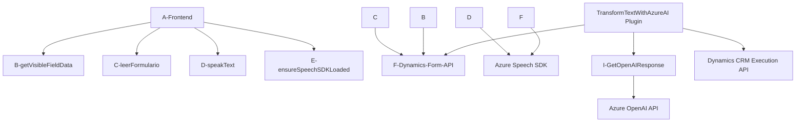

### Breve resumen técnico:
El repositorio forma parte de un sistema que interactúa con Microsoft Dynamics 365 y Azure services para realizar funciones basadas en voz y texto. Se divide principalmente en dos componentes: un frontend en JavaScript para manejar la interacción del usuario (vía entrada/salida de voz y manipulación de formularios), y un backend basado en un plugin de Dynamics 365 implementado en C#. Este último integra servicios avanzados de Azure OpenAI para procesamiento de texto.

--

### Descripción de arquitectura:
La arquitectura es **híbrida basada en SOA** (Service-Oriented Architecture). Esto significa que aprovecha servicios externos para necesidades especializadas como reconocimiento/síntesis de voz (Azure Speech SDK) y procesamiento de texto mediante IA (Azure OpenAI). Al mismo tiempo, implementa patrones de arquitectura de **plugins** para extender la funcionalidad de Dynamics 365, sobre un modelo de **n capas**. La separación entre frontend y plugin es clara, y las interacciones están definidas por controles y a través de la API de Dynamics 365.

- **Frontend (JavaScript)**: Se enfoca en la interacción del usuario con el formulario (datos visibles). Integra el SDK de voz de Azure y utiliza funciones para manejar la entrada de voz, síntesis y manipulación de datos en Dynamics 365. 
- **Backend (C# Plugin)**: Diseñado bajo el patrón de Plugins de Dynamics CRM para transformar texto con normas específicas, delegando la operación al sistema Azure OpenAI mediante solicitudes API.

--

### Tecnologías usadas:
1. **Frontend**:
    - **JavaScript**: Código estándar con funciones modulares.
    - **Azure Speech SDK**: Servicios de reconocimiento y síntesis de voz.
    - **Dynamics 365 Client API**: Para obtener/modificar formularios y datos en Dynamics CRM.

2. **Backend**:
    - **Microsoft Dynamics SDK**: Framework para desarrollar plugins de Dynamics CRM (`IPlugin`).
    - **Azure OpenAI API**: Servicio de procesamiento de texto con IA.
    - **C# (.NET Framework)**: Base del plugin implementado.
    - **JSON manipulación (System.Text.Json / Newtonsoft.Json)**: Serialización/deserialización de datos API.

3. **Otros**:
    - **HTTP APIs**: Interacción directa con servicios externos mediante solicitudes HTTP (`System.Net.Http` en Backend).

--

### Diagrama Mermaid válido para GitHub:

--

### Conclusión final:
El repositorio representa una solución híbrida que combina un frontend de usuario basado en JavaScript con integración a Dynamics 365 y servicios de voz y texto de Azure, junto con un plugin .NET para extender las capacidades del CRM con inteligencia artificial de Azure OpenAI. La arquitectura sigue el patrón de **n capas** con interacción cliente/servidor mediante APIs. Además, utiliza **SOA** al integrarse funcionalmente con servicios especializados de Azure. 

**Fortalezas**
- Modularización de frontend y backend con funciones claramente definidas.
- Uso adecuado de servicios SaaS especializados de Azure.
- Integración robusta con Dynamics CRM mediante Plugins y Custom APIs.

**Debilidades**:
- La codificación directa de las claves API en el plugin C# es una buena candidata para ser reemplazada por integraciones con Azure KeyVault o configuraciones externas para mayor seguridad.
- Aunque funcional, la extensión del código puede complicarse sin una mayor estructuración de los módulos (por ejemplo, en el frontend).

En conjunto, la solución está bien diseñada para cumplir su propósito: la interacción con formularios y la síntesis/transcripción de voz basadas en IA en el contexto de Dynamics 365. Sin embargo, podría beneficiarse de mejoras en seguridad y escalabilidad mediante técnicas de arquitectura avanzada.