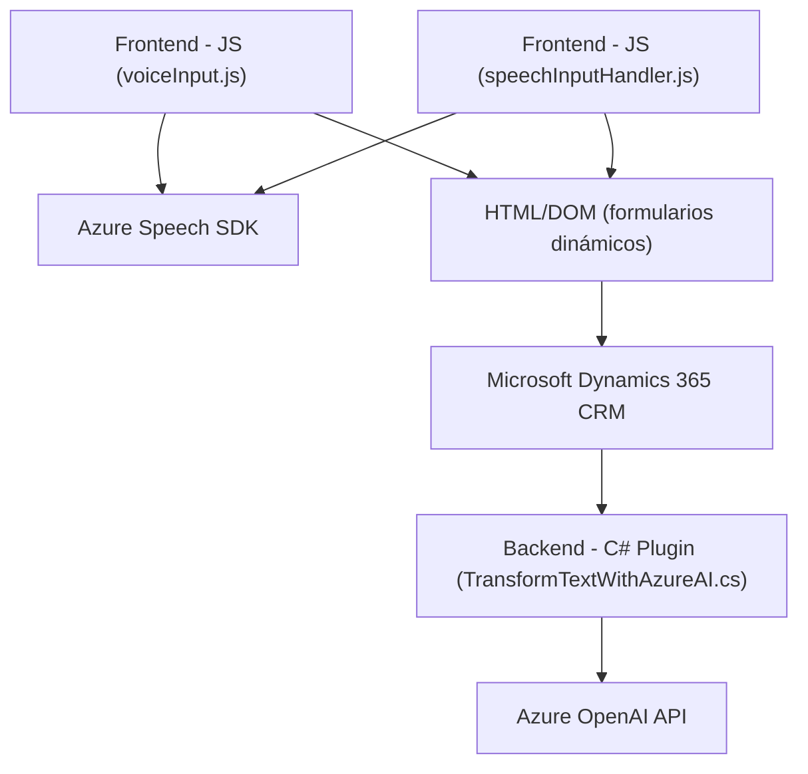

### Resumen Técnico
Los archivos proporcionados en el repositorio muestran que el proyecto integra capacidades avanzadas de reconocimiento de voz, síntesis de audio, procesamiento de texto por inteligencia artificial (AI) y manipulación de formularios en Dynamics 365. Combina funcionalidades del frontend (JavaScript) y backend (.NET/C#) con conexiones a servicios externos, particularmente Azure Speech SDK y Azure OpenAI.

### Descripción de Arquitectura
La arquitectura indicada se puede clasificar como **orientada a servicios** con elementos distribuidos. Los componentes individuales siguen una estructura modular con una fuerte integración hacia APIs externas. Mientras los scripts en JavaScript gestionan interacciones inmediatas y dinámicas del frontend (formularios y voz), el archivo `TransformTextWithAzureAI.cs` funciona como un plugin backend para Dynamics CRM.

Por lo tanto, la arquitectura se divide en dos capas principales:
1. **Frontend interactivo**, que utiliza JavaScript para manejar formularios y voz (procesos dinámicos).
2. **Backend de servicios**, encargado de lógica avanzada y procesamiento profundo del texto mediante Azure OpenAI.

### Tecnologías Usadas
1. **Frontend**:
   - **JavaScript (ES6)**: Manipulación de DOM, manejo de formularios, reconocimiento/síntesis de voz.
   - **Azure Speech SDK**: Usado para sintetizar voz y realizar reconocimiento de texto a partir de comandos hablados.
   - **Microsoft Dynamics Web API**: Integra datos y estructura de formularios en Dynamics 365.

2. **Backend**:
   - **C# (.NET Framework)**: Usado en los plugins del CRM para extender funcionalidad en el backend.
   - **Azure OpenAI (GPT-4)**: Procesa texto inteligente con normas definidas.
   
3. **Dependencias comunes**:
   - `Newtonsoft.Json` y `System.Text.Json`: Procesamiento JSON.
   - `System.Net.Http`: Envío de HTTP requests hacia APIs externas.
   - Integración con Dynamics 365 para manipulación de datos y estructura modular mediante `IPlugin`.

### Diagrama Mermaid

### Conclusión Final
Este repositorio implementa una solución **orientada a servicios** con integración directa hacia sistemas externos mediante APIs específicas de Azure. Se basa en una combinación de **frontend dinámico en JavaScript** (para voz/formularios) y plugins backend en C# que expanden las capacidades de Microsoft Dynamics CRM mediante el uso de Azure OpenAI. La modularidad y uso de servicios externos (Azure Speech y OpenAI) sugieren una arquitectura distribuida, pero sin alcanzar completamente un estilo de **microservicios**. Si se necesita escalar, el sistema podría evolucionar hacia un diseño más flexible basado en contenedores o microservicios.