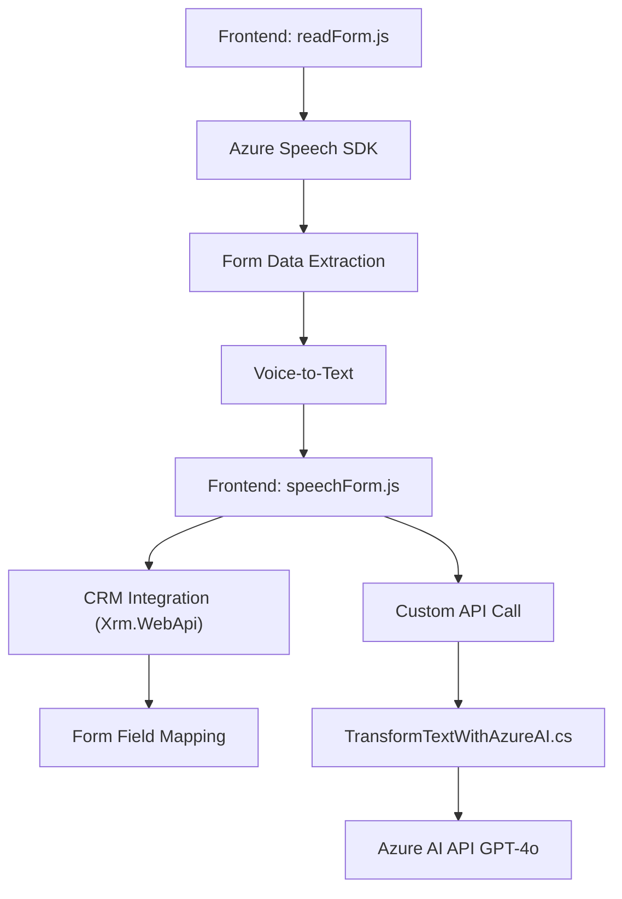

### Breve Resumen Técnico
Este repositorio contiene tres secciones principales que interactúan entre sí para ofrecer una solución de síntesis y reconocimiento de voz integrados con formularios CRM. Utiliza el **Azure Speech SDK** para la síntesis y reconocimiento de voz, y el **Azure OpenAI API** para transformar texto mediante inteligencia artificial. El sistema está dirigido a automatizar e integrar datos hablados en interfaces administrativas dinámicas, como formularios CRM.

---

### Descripción de la Arquitectura
La arquitectura general se puede clasificar como una solución **de capas orientadas a microservicios**. Se observa un enfoque modular, con partes definidas para frontend (JavaScript basado en navegador), integración directa con el CRM mediante plugins en C#, y comunicación con servicios de terceros (Azure Speech SDK y Azure AI).
La estructura del repositorio sigue un diseño desacoplado con:
1. **Capa de presentación:** Archivos en la carpeta `FRONTEND/JS`, que gestionan la interacción del usuario y la integración con el SDK de Azure Speech para la síntesis de voz y captura de datos de formularios. Evidentemente es un frontend ligero enfocado a la manipulación del DOM y SDK.
2. **Capa de negocio:**
   - **JavaScript (FRONTEND/JS/speechForm.js):** Procesa y transforma datos de voz en texto relacionado con campos CRM, con callbacks y promesas para eventos asíncronos.
   - **C# plugin (Plugins/TransformTextWithAzureAI.cs):** Interactúa con Azure OpenAI para transformar texto en estructuras JSON adaptadas para la lógica CRM.
3. **Capa de integración:** Comunicación con servicios externos como el **Azure AI REST API**, **Azure Speech SDK**, y **Dynamics CRM API (Xrm.WebApi)**.

El diseño sigue principios como modularidad, separación de responsabilidades y reutilización.

---

### Tecnologías Usadas
1. **Frontend:**
   - **JavaScript**: Con soporte para eventos asíncronos, Promise y manipulación dinámica del DOM.
   - **Azure Speech SDK**: Integración directa para síntesis de texto a voz y procesamiento de voz.
   - **Microsoft Dynamics CRM API** (`Xrm.WebApi`): Para la manipulación del contexto CRM.

2. **Backend (Plugins):**
   - **C#**: Código alojado como plugin en Microsoft Dynamics CRM.
   - **Azure AI REST API**: Servicio externo para transformar texto mediante el modelo GPT-4o.
   - **Bibliotecas .NET**: `System.Net.Http`, `Newtonsoft.Json`, y `System.Text.Json`.

3. **Arquitectura en Microservicios**:
   - Delegación de tareas complejas como transformación de texto y procesamiento de voz hacia servicios externos de Azure.

4. **Patrones:**
   - **Listener/Event-driven**: Para reconocimiento de voz y manejo de eventos del SDK.
   - **Adapter**: Mapeo entre resultados de voz, CRM y API externa.
   - **Plugin CRM**: Implementación de lógica en C# integrada mediante `IPlugin`.

---

### Diagrama Mermaid

---

### Conclusión Final
El repositorio representa una solución **integrada y modular** para interacción con formularios CRM mediante tecnologías de **síntesis y reconocimiento de voz**, incluyendo transformación de texto con Inteligencia Artificial. Los componentes están claramente divididos para facilitar mantenimiento y escalabilidad:
- **Frontend:** Ligero y dirigido directamente a eventos del usuario y rendimiento del navegador.
- **Backend/Plugins:** Servicios específicos como transformación de texto o mapeo de datos integrados con el CRM.
- **Microservicios externos:** Uso de Azure Speech SDK y Azure OpenAI para delegar tareas complejas.

El diagrama en Mermaid es completamente compatible con **GitHub Markdown** y proporciona una representación clara de la relación entre los elementos del sistema.