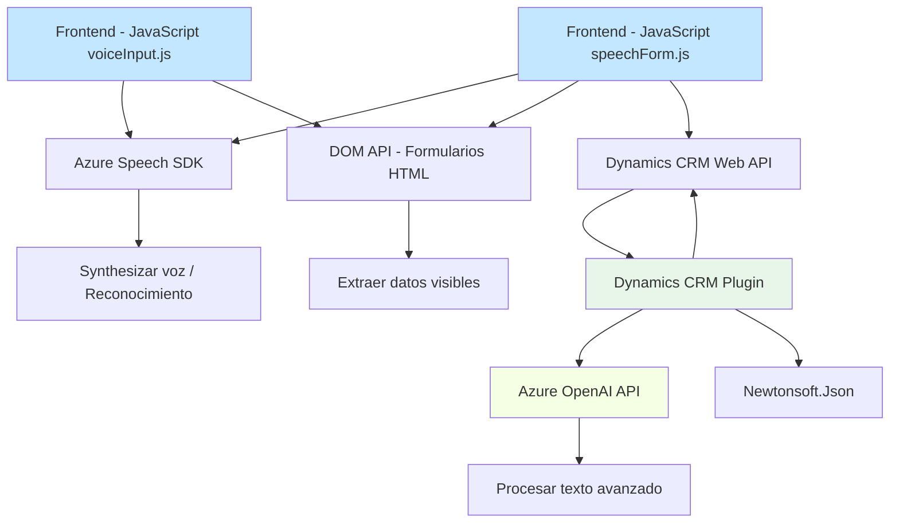

### Breve resumen técnico

La solución implementada en el repositorio combina varios componentes:
1. **Frontend basado en JavaScript**: Implementa funcionalidades para lectura de formularios, síntesis de texto a voz y reconocimiento de voz usando el Azure Speech SDK.
2. **Plugins en Dynamics CRM**: Proveen procesamiento de texto a través del uso de la API de Azure OpenAI para transformar los datos según reglas específicas definidas en el sistema.
3. **Integración con APIs externas**: Uso del Azure Speech SDK y Azure OpenAI API para funcionalidades de voz y transformación de texto.

### Descripción de arquitectura

La solución tiene una **arquitectura híbrida** que combina:
- **Frontend modular JavaScript**: Todas las funcionalidades relacionadas con voz y formularios se implementan como scripts desacoplados, lo que permite modularidad y separación de responsabilidades.
- **Plugin-based architecture para Dynamics CRM**: Utiliza el patrón `IPlugin` de Microsoft Dynamics CRM para modificar y procesar datos directamente en el backend.
- **Integración de servicios externos**: Combinación del Azure Speech SDK y API de OpenAI para proporcionar servicios avanzados como síntesis y conversión de texto.
- **Data flow client-server**: Flujo de datos desde el frontend hacia el backend con procesamiento en ambos lados e interacción con APIs externas.
- Dependencias externas importantes: Azure Speech SDK, Dynamics CRM Web API, y Azure OpenAI API.

### Tecnologías usadas

1. **Frontend**:
   - JavaScript como lenguaje principal (para procesar formularios y comunicación con el backend).
   - Azure Speech SDK para síntesis de texto a voz y reconocimiento de comandos de voz.
   - Browser DOM API para manipular elementos en el formulario.

2. **Backend**:
   - Microsoft Dynamics CRM SDK para extensiones mediante plugins (`IPlugin`).
   - Azure OpenAI API para procesamiento avanzado de texto.
   - Microsoft .NET Framework (posiblemente con C#) para ejecución del plugin.
   - Newtonsoft.Json y System.Net.Http para manipulación de JSON y comunicación HTTP.

3. **Patrones de arquitectura**:
   - Modularidad en el sistema: funciones y plugins estructurados en piezas separadas basadas en responsabilidad.
   - Plugin-based extensibilidad en Dynamics CRM.
   - Event-driven programming en el frontend para activación de procesos como síntesis o reconocimiento de voz.
   - Encapsulación en el plugin con separación de lógica de negocio y lógica de integración.

### Dependencias o componentes externos posiblemente presentes
1. **Azure Speech SDK**: Usado tanto para síntesis de voz como para reconocimiento de voz.
2. **Dynamics 365 Web API**: Establece comunicación por REST con la base de datos de CRM.
3. **Azure OpenAI API**: Permite transformar texto de entrada en JSON estructurado basado en modelos de IA.
4. **Browser DOM API**: Para manipular elementos HTML y formularios.
5. **Newtonsoft.Json**: Biblioteca para deserialización de datos JSON.
6. **System.Net.Http**: Biblioteca para comunicación con la API de Azure OpenAI.

### Diagrama Mermaid válido para GitHub

### Conclusión final

La solución combina frontend y backend con dependencias externas (Azure APIs) bajo una arquitectura híbrida que integra procesos de voz, reconocimiento y transformación de texto. Los scripts JavaScript son modulares y manejan formularios dinámicos con interacción directa hacia APIs y un plugin en Dynamics CRM. Sin embargo, algunas áreas podrían beneficiarse de mejoras, como mayor separación de configuración para APIs externas y manejo robusto de errores en la conexión externa a los servicios de Azure.