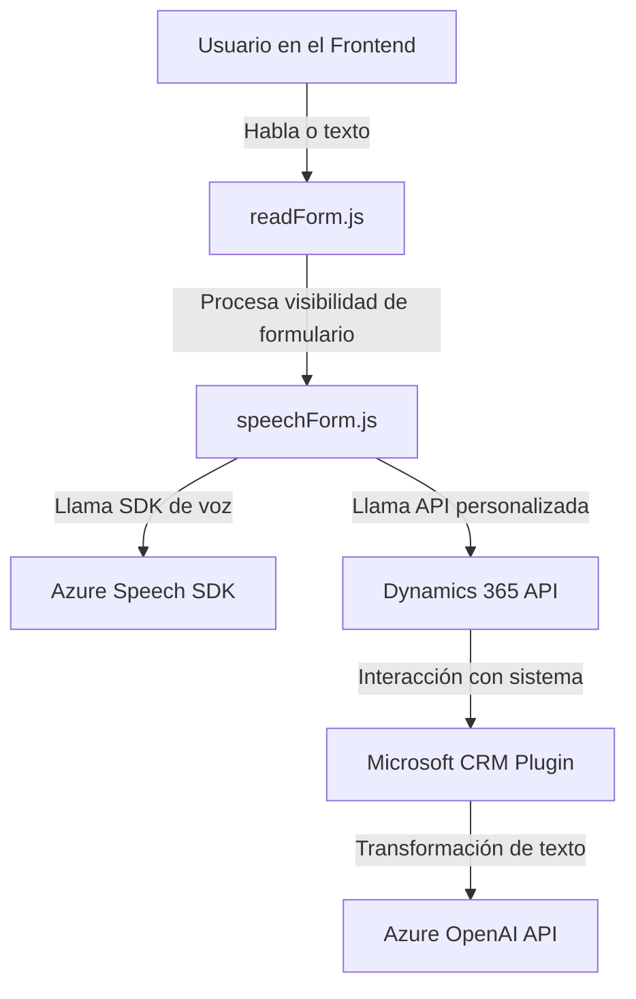

### Breve Resumen Técnico
El repositorio contiene código para integrar funcionalidades de reconocimiento de texto y voz con servicios de Microsoft Azure y Dynamics 365 CRM. La solución tiene elementos que enriquecen formularios (frontend) mediante entrada y salida de voz, además de un plugin personalizado que utiliza Azure OpenAI GPT-4 para transformar texto hablado en objetos JSON. La comunicación entre componentes se basa en APIs y SDKs.

---

### Descripción de la Arquitectura
La arquitectura del sistema parece estar diseñada alrededor de un **patrón de capas**:

1. **Capa de Presentación (Frontend):**  
   Se encarga de procesar datos de entrada y salida en formularios, interactuando directamente con el usuario.
   - Archivos clave: `readForm.js`, `speechForm.js`.
   - Funciones para la conversión de texto hablado en datos comprensibles y procesables por el sistema.

2. **Capa de Negocio:**  
   Representada por el plugin en C#, responsable de procesar la información utilizando lógica compleja, validación y la API de Azure OpenAI.
   - Archivo clave: `TransformTextWithAzureAI.cs`.

3. **Capa de Integración (Azure SDKs y APIs externas):**  
   Utiliza SDKs y APIs para manejar voz (Azure Speech SDK) y texto (Azure OpenAI), interactuando con servicios externos para realizar procesamientos avanzados.
   - Dependencias externas modulares.

El diseño muestra una interacción típica de un sistema CRM con servicios de Azure, pero aún dentro de un enfoque **modularizado y basado en capas**, no microservicios por completo.

---

### Tecnologías Usadas
1. **Frontend:**  
   - JavaScript (vanilla) para lógica de cliente.
   - Azure Speech SDK para reconocimiento y síntesis de voz.
   - Integración con Dynamics CRM API para gestionar datos.

2. **Backend:**
   - C# para construir plugins en Dynamics 365.
   - Integración con Azure OpenAI API para procesamiento de lenguaje natural.

3. **Servicios Integrados:**  
   - Microsoft Dynamics CRM para la lógica de negocio y APIs personalizadas.
   - Azure Speech SDK para voz.
   - Azure OpenAI (GPT-4) para procesamiento de texto.

4. **Patrones Usados:**  
   - Modularización funcional.
   - Capa de presentación con lógica desacoplada.
   - Plugin como capa de integración y negocio en Dynamics CRM.
   - Carga dinámica de SDKs (eficiencia de recursos).

---

### Diagrama Mermaid válido para GitHub

---

### Conclusión Final
La solución integra API de Azure con capacidades de Dynamics CRM para ofrecer un sistema robusto que procesa formularios con entrada y salida por voz, además de transformaciones avanzadas de datos mediante IA (OpenAI GPT-4). La arquitectura es principalmente **modular y de capas**, lo que permite desacoplar la lógica del frontend con servicios delegados al backend. Esto otorga flexibilidad y escalabilidad para futuras implementaciones.