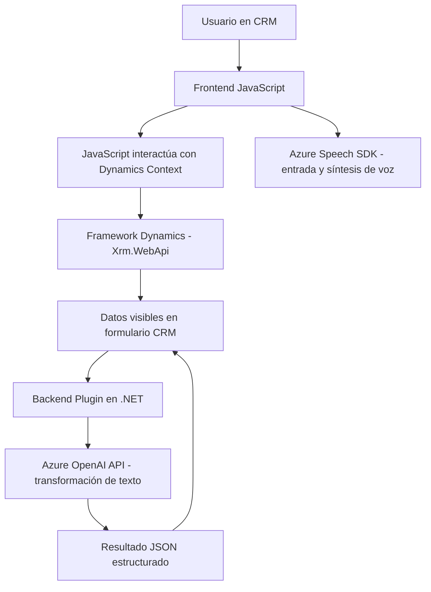

### Breve resumen técnico
Este repositorio alberga una solución compleja basada en una integración entre Microsoft Dynamics CRM, el Azure Speech SDK y Azure OpenAI. Incluye funcionalidades frontend (manipulación dinámica de formularios y síntesis/reconocimiento de voz) y extensiones backend mediante plugins para procesamiento avanzado de texto por IA. La solución está diseñada para potenciar un entorno CRM donde se automatizan tareas relacionadas con voz, transcripción y manipulación estructurada de datos.

---

### Descripción de arquitectura
La arquitectura es **híbrida**, con los siguientes componentes:
1. **Frontend SPA (Single Page Application)**: Encapsula la manipulación de datos del formulario y la interacción con Azure Speech SDK. Incluye funciones específicas para el procesamiento de datos visibles y activaciones por voz.
2. **Backend basado en Plugin Architecture**: Implementación de plugins en Dynamics CRM que procesan datos mediante **Azure OpenAI**, transformándolos en formato JSON para su uso en el CRM.
3. **Service-Oriented Architecture**: Conexión con servicios externos como:
   - Azure Speech SDK para reconocimiento de voz y síntesis de texto en tiempo real.
   - Azure OpenAI API para procesamiento avanzado de texto.
4. **N-Capas lógica**: Separación de responsabilidades entre frontend (interfaz de usuario y lógica de interacción con el CRM) y backend (gestión de datos, plugins asociados al CRM).

El repositorio combina local scripts de JavaScript asociados al frontend con una arquitectura de nube colaborativa que consume servicios externos.

---

### Tecnologías usadas
1. **Frontend**:
   - **JavaScript**: Lenguaje principal del frontend.
   - **Azure Speech SDK**: Para reconocimiento de voz y síntesis de texto en voz.
   - **Microsoft Dynamics CRM Context**: Interacción con formularios dinámicos en el CRM mediante JavaScript APIs (`executionContext` y `Xrm.WebApi`).
   
2. **Backend**:
   - **Azure OpenAI API**: Transformación automática de texto según reglas predefinidas.
   - **Microsoft Dynamics SDK**: SDK para desarrollo de extensiones y plugins en CRM.
   - **Newtonsoft.Json**: Para manejar datos JSON en plugins.

---

### Dependencias externas potenciales
1. **Azure Speech SDK**:
   - Necesario para reconocimiento y síntesis de voz en el frontend.
   - Cargado dinámicamente desde un paquete externo: `"https://aka.ms/csspeech/jsbrowserpackageraw"`.
2. **Azure OpenAI API**:
   - Servicio para convertir texto utilizando modelos IA avanzados.
3. **Microsoft Dynamics CRM**:
   - Requisitos de integración con formularios dinámicos en frontend y ejecución de plugins en el backend.
4. **Librerías .NET**:
   - `System.Net.Http`, `Newtonsoft.Json`, etc., utilizadas por los plugins.

---

### Diagrama Mermaid

---

### Conclusión final
Esta solución se puede clasificar como una arquitectura híbrida **SPA con plugins backend**:
1. El frontend implementa una interfaz dinámica con interacción continua con Microsoft Dynamics CRM (n-capas), potenciando la automatización mediante reconocimiento y síntesis de voz.
2. El backend amplía la funcionalidad del CRM mediante un **plugin oriented architecture**, donde Azure OpenAI ofrece capacidades inteligentes de transformación de texto.

La dependencia de servicios externos (Azure Speech SDK y OpenAI) le da características inherentemente orientadas a servicios (SOA). Es una solución ideal para entornos que priorizan automatizaciones avanzadas basadas en IA y voz, y demuestra un excelente uso de patrones organizados, como event-callback y facade, para interactuar con SDKs y APIs externas.