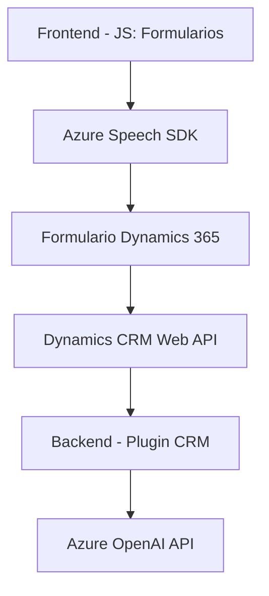

## Breve resumen técnico
El repositorio contiene archivos que implementan una solución basada en tecnologías de Microsoft (Dynamics CRM y Azure) con funcionalidades centradas en procesamiento de voz, reconocimiento de texto y transformación de datos utilizando IA. Los componentes principales incluyen un frontend para interactuar con formularios, varios métodos de generación/transformación de datos, y un plugin de procesamiento en el backend que integra Azure OpenAI.

---

## Descripción de arquitectura
La arquitectura del sistema parece seguir un modelo basado en N capas. Existe una capa de presentación (frontend) que interactúa con formularios de Dynamics CRM, una capa lógica que contiene métodos de procesamiento y mapeo de datos del formulario basado en voz, y una capa de integración con servicios externos como Azure Speech SDK y Azure OpenAI.

Por las dependencias descritas, también se emplea una arquitectura desacoplada mediante integración con microservicios API externos para tareas específicas como el reconocimiento de voz y transformación avanzada de texto. Esto facilita la extensibilidad, el mantenimiento y la integración de servicios avanzados como IA.

---

## Tecnologías usadas
1. **Frontend**:
   - **JavaScript**: Desarrollo y manejo de interactividad en los formularios.
   - **Azure Speech SDK**: Reconocimiento de voz y síntesis de texto a voz.
   - **DOM Manipulation**: Para cargar scripts externos y manejar formularios.

2. **Backend**:
   - **Dynamics CRM SDK**: Extensión de eventos en el CRM mediante `IPlugin`.
   - **C#**: Desarrollo de plugins en el entorno CRM.
   - **Azure OpenAI SDK/API**: Consumo de servicios de inteligencia artificial para procesamiento y transformación.

3. **Patrones**: 
   - **Integración con servicios externos**: Uso de APIs (Azure Speech y OpenAI).
   - **Pipeline de procesamiento**: Transformación de texto y asignación dinámica en formularios.
   - **Modularidad**: Funciones específicas como el mapeo de campos, carga de SDK, procesamiento de voz y transformación de datos.

---

## Diagrama Mermaid

---

## Conclusión final
El repositorio implementa una solución tecnológica integrada con Dynamics 365 y Azure. El frontend maneja interactividad en formularios mediante el uso del SDK de Azure Speech para convertir voz en texto y procesar los datos en la interfaz de usuario. Por otro lado, el backend emplea un plugin que conecta Dynamics CRM con la API de Azure OpenAI para transformación avanzada de texto. La arquitectura combina el enfoque de N capas con la integración a microservicios externos, logrando desacoplar operaciones complejas y simplificar la extensión de funcionalidades.

La solución es ideal para escenarios empresariales donde el procesamiento automatizado de datos mediante IA, reconocimiento de voz y asignación en formularios se requiere como parte del flujo de trabajo. Esto asegura escalabilidad y fácil integración con otros sistemas.