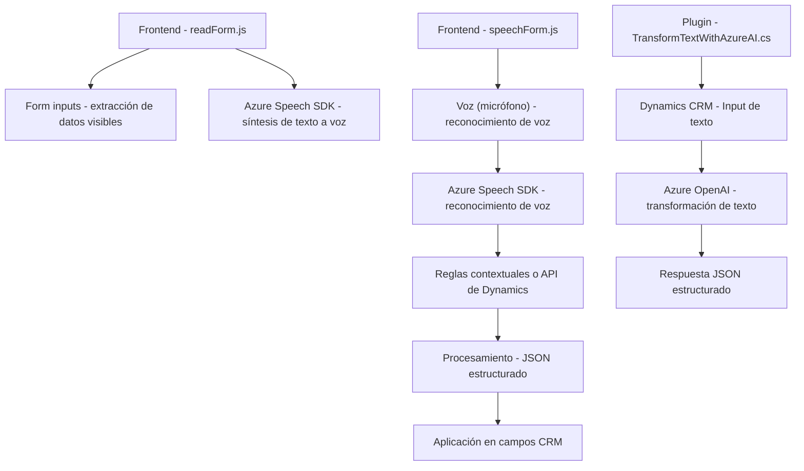

### Breve resumen técnico:
Los archivos presentados implementan una solución orientada a la interacción dinámica entre formularios web, input de voz, y servicios externos como Azure Speech SDK y Azure OpenAI. La funcionalidad principal reside en la manipulación de datos a partir de formularios y entrada de voz, para luego procesarlos mediante APIs externas que transforman o sintetizan información en distintos formatos (texto, audio, JSON).

---

### Descripción de arquitectura:
La solución implementa una arquitectura híbrida con los siguientes enfoques:
1. **Event-driven programming**: Operaciones desencadenadas por eventos de entrada (voz o interacción con formularios).
2. **N-capas**: Distinción clara entre presentación (frontend), procesamiento (middleware), e integración con servicios externos (plugins).
3. **Orientación a servicios**: Uso considerable de SDKs y APIs externas, particularmente Azure Speech y OpenAI.
4. **Modularidad y separación**:
   - Archivos del frontend (JavaScript) se dividen en módulos altamente específicos (voz, lectura de formularios).
   - Plugins en el backend (Dynamics CRM) procesan texto avanzado con estructura bien definida.

La solución, aunque modular, por el uso integrado de Dynamics CRM y un API única enlazada con Azure, tiene características cercanas a **monolitos especializados con integración externa**.

---

### Tecnologías usadas:
- **Azure Speech SDK**: Procesamiento de texto y voz (síntesis y reconocimiento).
- **Azure OpenAI (GPT-4)**: Para la transformación avanzada del texto en un formato JSON.
- **Microsoft Dynamics CRM SDK**: Integración y procesamiento de datos en formularios empresariales del CRM.
- **JavaScript**: Lenguaje para la lógica del frontend, con integración de SDK dinámico.
- **C#**: Lógica del backend para plugins, orientado a eventos.
- **REST API**: Comunicación con servicios Azure (OpenAI y Speech SDK).
- **Newtonsoft.Json y System.Text.Json**: Manejo avanzado de objetos JSON para transformación de datos.

---

### Diagrama Mermaid para GitHub Markdown:

---

### Conclusión final:
La solución muestra un diseño orientado a servicios, integrándose tanto con Dynamics CRM como con tecnologías avanzadas de procesamiento de texto y voz, como Azure Speech SDK y OpenAI. Aunque posee una fuerte modularización entre frontend y backend, su uso de un único API con Dynamics CRM sugiere una arquitectura de n-capas, sin llegar a ser una implementación completamente desacoplada como microservicios o arquitectura hexagonal. La utilización de Azure Speech SDK optimiza las funcionalidades relacionadas tanto en el frontend como en el backend.

Sin embargo, se recomiendan mejoras en la gestión de seguridad respecto a las API keys, probablemente implementando un mecanismo de manejo de secretos (Azure Key Vault).