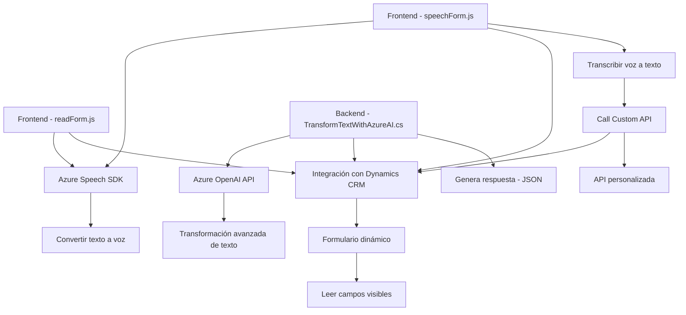

### Breve resumen técnico
Los archivos indicados implementan una solución que mezcla funcionalidad de reconocimiento y síntesis de voz basada en Azure Speech SDK junto con integración de API y servicios en Dynamics CRM (Dynamics 365). Estos archivos están ligados directamente a formularios dinámicos y sus datos, mejorando la accesibilidad y la interacción mediante tecnología basada en voz y transformación de texto a través de Azure OpenAI.

---

### Descripción de arquitectura
La arquitectura presenta un enfoque híbrido que combina:
1. **Arquitectura orientada a eventos:** 
   - Los archivos `readForm.js` y `speechForm.js` están diseñados para responder a eventos en el navegador y en Dynamics 365 (e.g., carga de formularios o acciones del usuario).
2. **Microservicios:** 
   - El archivo `TransformTextWithAzureAI.cs` actúa como un microservicio, encapsulando lógica de negocio específica para interactuar con Azure OpenAI y Dynamics CRM.
3. **Integración cloud-first:** 
   - Utiliza múltiples servicios externos (Azure Speech SDK, Azure OpenAI, Dynamics CRM).

Esta solución combina elementos de una **arquitectura n capas** para la lógica interna y una **arquitectura orientada a servicios** para la comunicación con SDKs y APIs externas.

---

### Tecnologías usadas
1. **Frontend (JavaScript):**
   - Azure Speech SDK (JavaScript).
   - `window.SpeechSDK`.
   - Dynamics 365 APIs (`Xrm.WebApi`).
2. **Backend (.NET/C#):**
   - Microsoft Dynamics SDK (`Microsoft.Xrm.Sdk`).
   - System.Text.Json/ Newtonsoft.Json para JSON.
3. **Servicios externos:**
   - Azure Speech Service y Azure OpenAI.

---

### Dependencias o componentes externos
1. **Azure Speech SDK:** Usado para reconocimiento y síntesis de voz.
2. **Dynamics 365 Web API:** Interacción con formularios y datos en Dynamics CRM.
3. **Azure OpenAI API:** Para transformación avanzada de texto basada en normas predefinidas.
4. **HTTP (System.Net.Http):** Manejador de solicitudes hacia servicios externos.

---

### Diagrama Mermaid válido para GitHub

---

### Conclusión final
La solución describe una implementación híbrida orientada principalmente a eventos y funcionalidad basada en servicios externos como Azure Speech y Azure OpenAI. Con la integración directa al entorno de Dynamics CRM, la arquitectura facilita procesos como accesibilidad mediante voz e inteligencia artificial, promoviendo modularidad en el frontend y extensibilidad en el backend mediante integración con APIs externas.