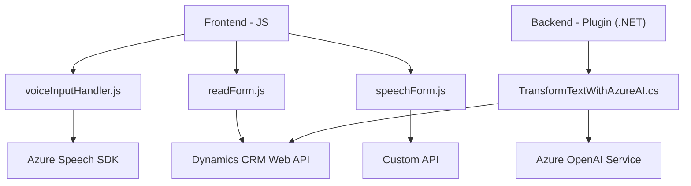

# Análisis Técnico del Repositorio

## **Breve Resumen Técnico**
Este repositorio parece contener una solución que implementa tanto una interfaz de entrada de voz basada en Azure Speech y Dynamics CRM como un plugin .NET que transforma texto con reglas específicas utilizando la API de Azure OpenAI. Es una combinación de una solución de frontend en JavaScript y un backend en .NET con integración de múltiples APIs y SDKs.

---

## **Descripción de la Arquitectura**
La solución utiliza una combinación de tecnologías para integrar servicios de procesamiento de voz, inteligencia artificial y interacción con sistemas CRM. La arquitectura implementada es **modular** y sigue el patrón de integración con servicios externos. Puede describirse como **n-capas**, donde los archivos de frontend manejan la presentación y están conectados al backend (que actúa como la capa de negocio y la capa de integración con otros servicios).

Principalmente, esta es una **arquitectura híbrida**, ya que combina el diseño de un sistema de frontend ligero con características de monolito plugin en el backend para CRM, mientras que se conecta a servicios API externos (Azure OpenAI y Azure Speech).

---

## **Tecnologías Usadas**
### **Frontend**
- **Lenguaje**: JavaScript.
- **Framework**: Dynamics CRM SDK (Xrm).
- **Servicios Externos**:
  - Azure Cognitive Services Speech SDK: síntesis y reconocimiento de voz.
  - Dynamics CRM Web API: integración directa con el CRM para manipulación de datos.
  - Custom API Dynamics: extensibilidad mediante servicios externos.

### **Backend**
- **Lenguaje**: C# (.NET).
- **Framework**: Microsoft Dynamics CRM SDK.
- **Servicios Externos**:
  - Azure OpenAI Service (GPT-4).
  - HTTP Client para interacción con APIs.
  - JSON handling libraries (Newtonsoft.Json, System.Text.Json).
- **Patrón de Plugins**: estándar para la integración en el flujo de eventos de Dynamics.

### **Otros Patrones y Metodologías**
- **Loader dinámico**: Carga condicional de SDK en el frontend (Azure Speech SDK).
- **Event-Driven Design**: Uso de disparadores de eventos dentro del CRM y el frontend para iniciar flujos específicos.
- **API Integration Pattern**: Comunicación del backend con la API de Azure OpenAI, y del frontend con Azure Speech SDK.
- **Single Responsibility Principle**: Tanto frontend como backend establecen funciones o métodos con tareas específicas.

---

## **Dependencias o Componentes Externos**
1. **Azure Speech Service SDK**: Usado en el frontend para síntesis y reconocimiento de voz.
2. **Dynamics CRM Web API**: Interacción directa con los formularios del CRM y los datos almacenados en la plataforma.
3. **Azure OpenAI API**: Usado en el backend para realizar transformaciones de texto mediante el modelo GPT-4.
4. **Custom API en Dynamics CRM**: Es posible que se implemente para manejar integración específica más allá del repositorio.
5. **Newtonsoft.Json y System.Text.Json**: Para la manipulación y transformación del formato JSON en la capa backend.

---

## **Diagrama Mermaid**

---

## **Conclusión Final**
La solución integra un sistema híbrido conformado por una capa de presentación (frontend) y una capa de negocio/plugin (backend en .NET) conectados con soluciones externas para reconocer voz, realizar síntesis de textos y transformar datos. Se basa en servicios de nube de Azure (Azure Speech, Azure OpenAI) y en el esquema de plugins y API de Dynamics CRM.

En términos de diseño, muestra una clara separación de responsabilidades, modularidad y comunicación mediante APIs externas, lo que facilita la escalabilidad. Sin embargo, una mejora sería estructurar el entorno en una arquitectura de microservicios para descentralizar la lógica del plugin y mejorar su desacoplamiento.