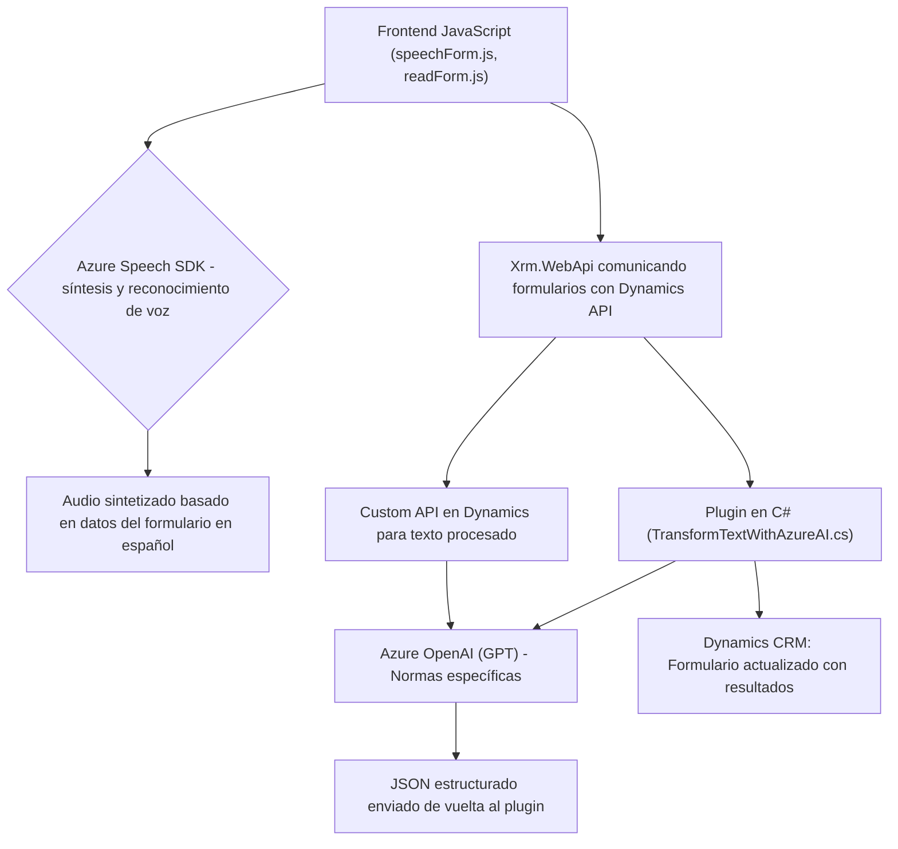

### **Análisis técnico del repositorio**

#### **Breve resumen técnico**
El repositorio contiene una solución orientada a convertir datos entre texto y voz, integrar procesamiento basado en inteligencia artificial (IA), y extender funcionalidades de Dynamics CRM mediante APIs. La solución incluye archivos que trabajan con Azure Speech SDK para síntesis y reconocimiento de voz, integración con Azure OpenAI para transformación de texto, y desarrollo de un plugin específico para Dynamics CRM.

---

### **Descripción de arquitectura**
La arquitectura observada combina tres enfoques:
1. **Orientación hacia APIs y Microservicios**: Cada archivo o módulo se relaciona con un servicio externo (Azure Speech SDK, Dynamics API, Azure OpenAI) para cumplir funciones específicas. Esto evidencia que gran parte de la lógica reside en APIs externas.
2. **Arquitectura extensible basada en plugins**: La integración con Dynamics CRM mediante el plugin también demuestra un enfoque modular que expande las capacidades estándar del CRM.
3. **N capas**: En los archivos relacionados con el frontend, se observa una separación lógica entre:
   - Lógica de negocio del reconocimiento/síntesis de voz.
   - Conexión o comunicación con APIs y SDKs externos.
   - Manipulación del contexto del formulario en Dynamics.

---

### **Tecnologías usadas**
1. **Azure Speech SDK**: Para síntesis y reconocimiento de voz.
2. **Azure OpenAI**: Usado para transformar textos mediante modelos GPT.
3. **Microsoft Dynamics CRM**:
   - SDK (`Microsoft.Xrm.Sdk`) para extender funcionalidades.
   - Custom API para interactuar con estructuras del CRM.
   - Métodos como `Xrm.WebApi` para comunicación desde el frontend.
4. **Front-End con JavaScript**: Para manipulación de formularios y comunicación asíncrona (`Promise`).
5. **Librerías auxiliares**:
   - `System.Net.Http`: Para solicitudes a APIs externas (C# plugin).
   - `Newtonsoft.Json.Linq` y `System.Text.Json`: Manejo y deserialización de objetos JSON.
   - Dinámico en el cargado de scripts de librerías (ejemplo: carga de Azure Speech SDK al requerirlo).

---

### **Diagrama Mermaid**

---

### **Conclusión final**
La solución presentada en el repositorio es una integración avanzada que combina capacidad de síntesis/reconocimiento de voz, procesamiento de texto e interacción con formularios de Dynamics CRM. La arquitectura tiene características de microservicios, integraciones externas bien organizadas y modularidad que favorece la escalabilidad. Esta estructura puede ampliarse fácilmente para incluir nuevas APIs o funcionalidades relacionadas con IA o automatización.