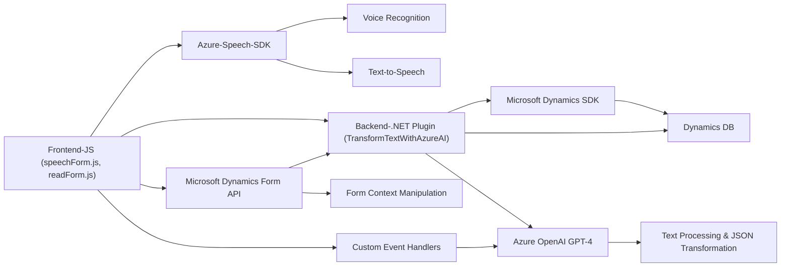

### Breve resumen técnico:
Este repositorio implementa un sistema basado en Azure Speech SDK y Azure OpenAI para interacción con formularios en Microsoft Dynamics. Contiene soluciones para entrada y salida de voz (en archivos frontend) y procesamiento de texto mediante inteligencia artificial (en backend). La arquitectura se enfoca en integración cliente-servidor y comunicación con servicios externos como Dynamics y Azure AI.

---

### Descripción de arquitectura:
1. **Arquitectura general:**  
   La solución combina una arquitectura de cliente/servidor con una **orientación modular**. El frontend permite procesamiento de voz y entrega texto o comandos, mientras el backend maneja la lógica avanzada y conecta dinámicamente con servicios de inteligencia artificial.  
   El código base del frontend tiene una estructura dividida en diferentes funciones individuales (patrón de separación por responsabilidad), y el backend (plugin .NET) aplica patrones de extensibilidad basados en Microsoft Dynamics.

2. **Capas:**  
   - **Frontend:** Modular, enfocado en la interacción de voz con el usuario.  
   - **Backend (.NET Plugin):** Procesamiento externo con reglas específicas, integrado directamente con Dynamics CRM.

3. **Tipo de arquitectura:**  
   - **Frontend:** Modular con orientación funcional.  
   - **Backend:** Modelo de plugin + arquitectura n-capas dentro del ecosistema Dynamics.  
   - La naturaleza de las dependencias externas lo convierte en un sistema en parte **hexagonal**, donde los servicios externos (Azure, Dynamics) interactúan como "adaptadores".

---

### Tecnologías usadas:
1. **Frontend (JavaScript):**
   - Azure Speech SDK para síntesis y reconocimiento de voz.
   - Integración con formularios de Dynamics mediante `formContext`.
   - Modularización del código en funciones reutilizables.

2. **Backend (.NET):**
   - Microsoft Dynamics SDK (`Microsoft.Xrm.Sdk`) para extensibilidad y manipulación de datos.
   - Azure OpenAI GPT-4 para procesamiento avanzado de texto.
   - Librerías de JSON (Newtonsoft.Json y System.Text.Json) para manejar datos estructurados.

3. **Dependencias clave:**
   - **Servicios externos:** Azure Speech SDK, Azure OpenAI Service, Microsoft Dynamics Web API.
   - **Gestión del frontend y backend:** Modularización con dinámicas de eventos y patrones de inyección de dependencias (`IServiceProvider`).

4. **Patrones de diseño utilizados:**
   - Modularidad para dividir funcionalidad en piezas reutilizables.
   - Integración cliente-servidor mediante APIs y SDK.
   - Uso de callbacks y eventos que reflejan un enfoque orientado a eventos.
   - Plugin extensible en el backend basado en Microsoft Dynamics.

---

### Diagrama Mermaid:
El siguiente diagrama refleja la interacción entre módulos clave y dependencias externas:

---

### Conclusión final:
Esta solución es una **arquitectura modular híbrida cliente/servidor** que utiliza servicios avanzados de Azure para ofrecer funcionalidades de reconocimiento de voz, modificación de texto basada en inteligencia artificial y generación de audio. Se aplica principalmente en sistemas de interacción dinámica, como formularios en Microsoft Dynamics.

- **Puntos destacados:**
  - Uso eficiente de SDK externos y modulares para evitar sobrecarga del sistema.
  - Modularización del código para facilitar su extensibilidad y pruebas.
  - Factibilidad para escalar como un microservicio o componente dentro de un ecosistema mayor (e.g., Dynamics Integration).

El diseño es sólido para aplicaciones que necesitan interfaces accesibles y procesamientos avanzados con servicios como Azure AI y Dynamics CRM. Sin embargo, la gestión de API keys y el control de errores en el backend podrían mejorarse para garantizar robustez y seguridad.