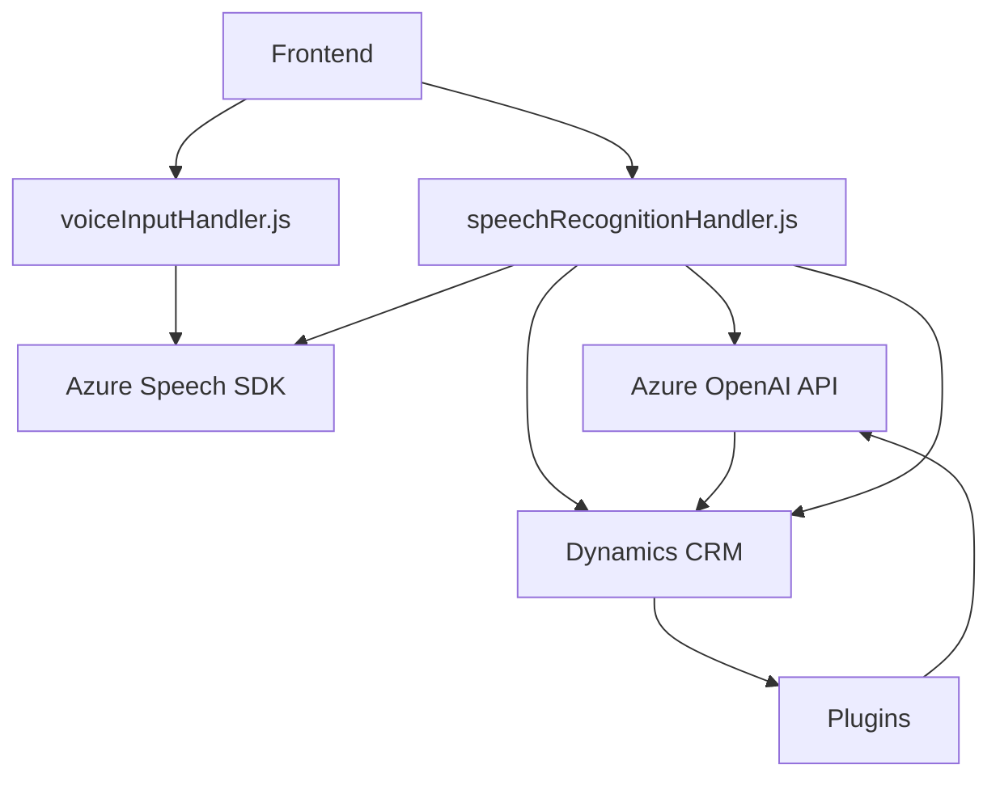

### Breve resumen técnico

El repositorio descrito parece ser parte de una aplicación corporativa integrada con Microsoft Dynamics CRM. Los archivos mencionados ilustran tres áreas principales de funcionalidad:
1. **Frontend:** Interacción entre la interfaz web/formularios y servicios externos (Azure Speech SDK).
2. **Backend:** Extensibilidad mediante plugins en Dynamics CRM que utilizan servicios de Azure OpenAI para procesamiento avanzado de texto.
3. **Dependencias externas:** Uso de SaaS (Azure) para voz y texto junto con APIs internas/externas.

---

### Descripción de la arquitectura

La arquitectura general parece seguir una integración estrecha con Dynamics CRM bajo un diseño **n-capas**, donde:
- **Capa de presentación (Frontend):**
  - Manejo de formularios y datos usando la integración del navegador con Azure Speech SDK.
  - Interfaz modular basada en funciones específicas para lectura y procesamiento de voz.
- **Capa lógica de negocio (Plugins):**
  - Transformación de texto con Azure OpenAI dentro de Dynamics CRM utilizando plugins que encapsulan la lógica de negocio.
- **Capa de acceso a datos (Dynamics CRM):**
  - Manipulación directa de datos del sistema mediante servicios como `Xrm.WebApi` y mapeo de entidades.

Además, puede observarse el uso de servicios externos (AWS SaaS), lo que aporta un patrón de **arquitectura híbrida**, donde servicios locales (CRM) se mezclan con integraciones externas (Azure Speech/OpenAI).

---

### Tecnologías usadas

Las tecnologías y frameworks más relevantes en este caso incluyen:
1. **Azure Speech SDK**: Reconocimiento de voz en frontend.
2. **Azure OpenAI Services**: Procesamiento de lenguaje (via GPT) para transformar texto en JSON.
3. **Microsoft Dynamics CRM SDK**: Extensibilidad mediante modelos de plugins.
4. **Newtonsoft.Json**: Procesamiento de respuestas JSON en la capa de lógica.
5. **JavaScript/HTML5/DOM APIs**: Used for dynamic SDK loading and interaction with forms.

Patrones arquitectónicos aplicados:
- **SaaS Integration:** Uso de servicios en la nube (Azure Speech y OpenAI).
- **Plugin Pattern:** Extensibilidad en CRM mediante plugins con lógica encapsulada.
- **Modularidad:** Organización del código en funciones desacopladas por roles específicos.
- **Adaptador de datos:** Traducción entre estructuras externas e internas en Dynamics CRM.

---

### Diagrama Mermaid válido para GitHub

---

### Conclusión final

El repositorio forma parte de una solución integrada con Microsoft Dynamics CRM y usa servicios de Azure para extender las funcionalidades del sistema. La arquitectura es **n-capas**, con separación clara entre presentación (formulario en frontend), lógica de negocio (plugins, SDK, y procesamiento de texto), y almacenamiento de datos en CRM.

Este diseño evidencia una sólida modularidad e integración SaaS mediante Azure Speech y OpenAI, lo que permite uso avanzado de síntesis y reconocimiento de voz, así como transformaciones procesadas por IA para enriquecer flujos de trabajo empresariales.