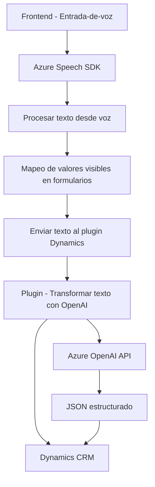

### Breve resumen técnico:

Este repositorio parece estar relacionado con la integración de servicios de Microsoft Dynamics CRM con el almacenamiento en la nube de Azure para ofrecer funcionalidades basadas en reconocimiento de voz y transformación de texto. Está compuesto de tres elementos principales:

1. **Frontend (JavaScript)**: Implementa la captura de datos y comandos vía entrada/salida de texto y voz, además de interactuar con los formularios de Dynamics CRM.
2. **Backend (C# Plugin)**: Extensión que se ejecuta en el contexto de Dynamics CRM y utiliza Azure OpenAI para procesar y estructurar la información textual del usuario.
3. **Servicios externos**: El código utiliza Azure Speech SDK y Azure OpenAI para reconocimiento de voz y transformación avanzada de texto respectivamente.

---

### Descripción de arquitectura:

La arquitectura es híbrida, combinando:

- **Monolítica**: El código de backend sigue una estructura tradicional de plugins unificados para Dynamics CRM.
- **Orientada a servicios externos**: El sistema orquesta solicitudes y comunicaciones con servicios externos como Azure Speech y Azure OpenAI, lo que introduce un enfoque desacoplado en ciertas responsabilidades.
- **N-Capas**: Los diferentes componentes del backend y frontend se dividen claramente:
  - **Presentación**: Representada por los archivos JavaScript en el frontend para interactuar con formularios y usuarios.
  - **Lógica de negocio**: Distribuida entre las funciones JavaScript (que gestionan las transcripciones de voz y procesamiento de datos) y las clases del plugin (gestión avanzada y transformación de texto).
  - **Datos**: El almacenamiento de información y su manipulación ocurre en Dynamics CRM, usando interfaces como Xrm y mapeos del modelo CRM.

---

### Tecnologías usadas:

1. **Frontend**:
   - **JavaScript**: Lenguaje utilizado para la manipulación de formularios y gestión de reconocimiento de voz y síntesis.
   - **Azure Speech SDK**: Para el reconocimiento y síntesis de voz en tiempo real.
   - **Dynamics CRM APIs (`Xrm`)**: Para manipulación de formularios y datos asociados a Dynamics CRM.

2. **Backend**:
   - **C#** (ASP.NET): Lenguaje usado para el plugin.
   - **Microsoft Dynamics CRM SDK**: Framework empresarial para extensibilidad en entornos Dynamics.
   - **Azure OpenAI API**: Para procesamiento avanzado y transformación de texto a través de modelos GPT.
   - **Newtonsoft.Json**: Biblioteca para manipulación de JSON.
   - **HttpClient**: Para la comunicación RESTful con servicios externos.

---

### Dependencias y componentes externos:

1. **Azure Speech SDK**:
   - Proporciona reconocimiento de voz y síntesis en el frontend.
   - Dinámicamente cargado desde su fuente oficial (`https://aka.ms/csspeech/jsbrowserpackageraw`).

2. **Azure OpenAI API**:
   - Realiza procesamiento avanzado de texto (GPT/AI) desde el backend.
   - Integración directa con Dynamics CRM vía plugins.

3. **Dynamics CRM**:
   - Uso del servicio Xrm para la manipulación de formularios y datos CRM.

4. **Browser APIs**:
   - Manipulación del DOM para insertar dinámicamente el SDK y extraer información visible de formularios.

---

### Diagrama Mermaid:

---

### Conclusión final:

Este repositorio implementa funcionalidades avanzadas de reconocimiento de voz y procesamiento de texto en el contexto de Microsoft Dynamics CRM. Combina frontend (JavaScript) y backend (C# Plugin) para la gestión de interacción usuario-inteligencia artificial. Los servicios externos como Azure Speech SDK y Azure OpenAI son fundamentales en esta arquitectura.

La idea de integrar capacidades de IA y reconocimiento de voz en aplicaciones CRM es útil para mejorar la accesibilidad, la automatización de tareas en formularios y el procesamiento de datos basado en texto. Sin embargo, es crucial verificar el manejo adecuado de errores en la conexión con servicios externos y, además, garantizar que la carga dinámica del SDK no cause ralentizaciones en la experiencia del usuario.