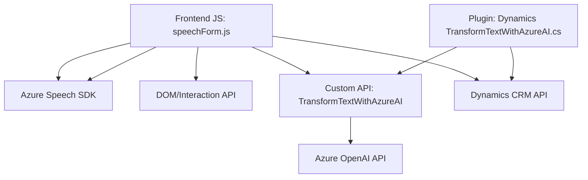

### Breve resumen técnico

El repositorio está enfocado en la integración entre un frontend para formularios dinámicos, un backend con lógica de procesamiento basada en un *plugin* de Dynamics CRM, y servicios de inteligencia artificial proporcionados por Azure OpenAI y Azure Speech SDK. La solución permite tanto síntesis de voz como reconocimiento de voz, con procesamiento de datos mediante un enfoque modular.

---

### Descripción de arquitectura

La arquitectura general reflejada en los archivos sigue un enfoque híbrido:
1. **Frontend Modular**: 
   - Organiza funciones específicas para la interacción del usuario (lectura/escritura de formularios).
   - Procesa datos con servicios externos (Azure Speech SDK y APIs personalizadas).
   - Maneja eventos (`callbacks`) para la carga dinámica de SDKs y la ejecución de tareas básicas.
   
2. **Backend SOA (*Service-Oriented Architecture*)**: 
   - Implementa *plugins* en Dynamics CRM que interactúan con servicios REST externos para procesamiento con IA.
   - Toda la lógica de backend es event-driven basada en los servicios de Dynamics CRM.

3. **Integración con servicios externos**: 
   - Integración directa con APIs de Azure Speech SDK para funcionalidad de reconocimiento/síntesis.
   - Uso de Azure OpenAI API desde el backend para manipulación y transformación avanzada de datos.

La naturaleza modular del frontend y la reutilización del *plugin* sugieren un enfoque en desacoplar funcionalidades, aunque el sistema no se implementa como microservicios completos. Es una arquitectura intermedia entre **monolito extendido orientado a eventos** y **SOA**.

---

### Tecnologías usadas

**Frontend**:
- **Azure Speech SDK**: Capacidad para realizar síntesis y reconocimiento de voz.
- **JavaScript**: Principal lenguaje para manejar lógica de formularios y conexiones con servicios externos.
- **Dynamics CRM APIs**: Para acceder, actualizar y buscar datos en formularios (e.g., Xrm.WebApi).

**Backend (plugin)**:
- **Microsoft Dynamics CRM SDK**: Para la integración y ejecución de *plugins*.
- **Azure OpenAI**: Procesamiento avanzado de texto con reglas predefinidas usando modelos de lenguaje (GPT API).
- **C# (.NET)**: Para la implementación del *plugin*, manejo de datos y conectividad con Azure Services.
- **Newtonsoft.Json.Linq**: Facilitación de procesamiento JSON.

**Patrones implementados**:
- **Event-driven**: Carga de SDKs, activación de métodos según eventos específicos en Dynamics CRM.
- **Modular**: Dividido en funciones específicas tanto en el frontend como el plugin backend.
- **SOA**: Uso de servicios externos (Azure) y funcionalidad de *plugins* de Dynamics para desacoplar lógica.
- **Callback-driven logic**: Control del flujo según callbacks en el frontend.

---

### Diagrama Mermaid para GitHub

A continuación, un **Mermaid** que describe oficinas clave y flujo entre los componentes:

---

### Conclusión final

La solución es un **sistema híbrido frontend-backend** basado en Dynamics CRM, Azure Speech SDK y Azure OpenAI que realiza procesamiento automatizado de formularios con reconocimiento y síntesis de voz. La arquitectura muestra una integración cercana de servicios externos siguiendo principios de modularidad y servicio orientado, sin alcanzar completamente una arquitectura de microservicios.

Este enfoque maximiza la eficiencia en entornos empresariales que requieren capacidades dinámicas basadas en formularios, automatización de entrada de datos y tecnología de voz avanzada. Sin embargo, varios componentes dependen excesivamente de infraestructura y servicios específicos (Dynamics y Azure), lo que podría limitar portabilidad a otros entornos.