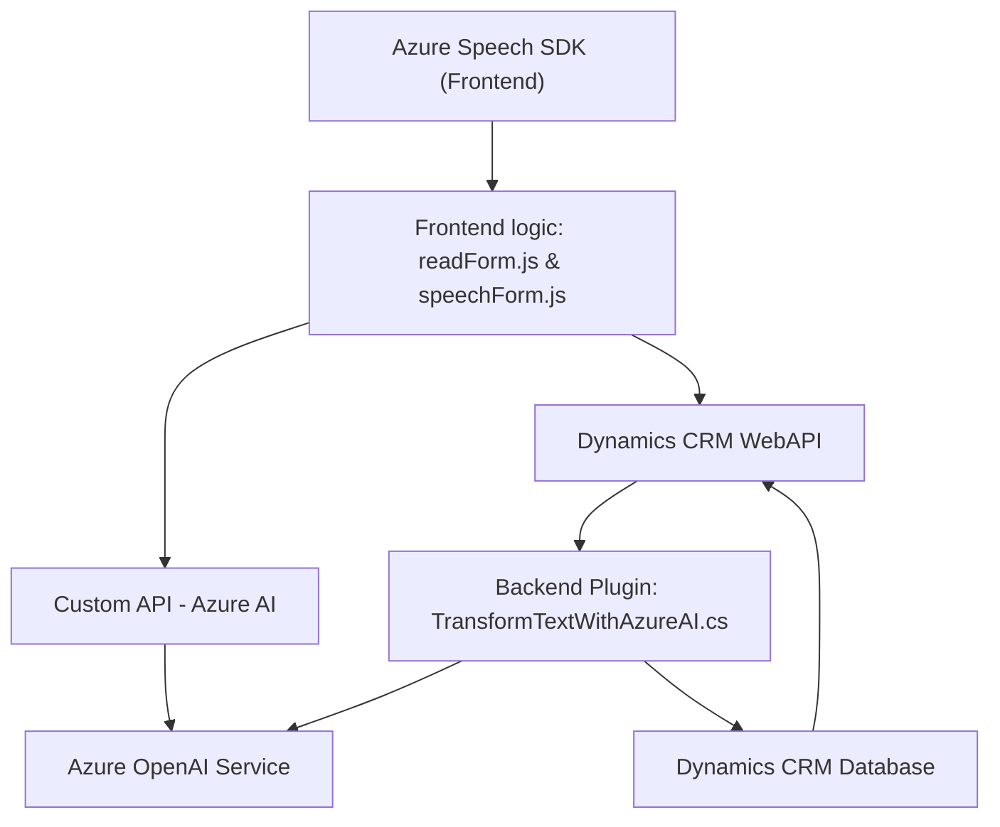

### Breve resumen técnico
El repositorio en cuestión tiene una fuerte orientación hacia la interacción de un frontend con servicios de fuerza avanzada como Azure Speech SDK y Azure OpenAI. La arquitectura combina procesamiento asincrónico, modularidad y patrones internos bien definidos para manejar tanto la lógica cliente (frontend) como procesos de servidor (plugins).

---

### Descripción de arquitectura
La solución es una **aplicación de varias capas (n-capas)** basada en un modelo de integración entre Dynamics CRM y servicios avanzados de Azure. La arquitectura es híbrida:
- El **frontend** delega tareas de procesamiento al cliente y consume APIs para comunicación con otros servicios.
- Los **plugins del lado del servidor** manejan operaciones específicas como transformaciones de texto mediante Azure OpenAI y pushean lógica hacia Dynamics CRM.

Los componentes están altamente modularizados, creando funciones individuales para tareas específicas como mapeo de campos, procesamiento de texto, o asignaciones en formularios. La comunicación entre la capa de frontend y la capa de datos es asíncrona, lo que reduce acoplamientos y favorece extensibilidad.

---

### Tecnologías usadas
1. **Frontend:**
   - **Azure Speech SDK**: Utilizado en reconocimiento y síntesis de voz, tanto para entrada como para salida.
   - **JavaScript ES6**: Implementación de funciones asincrónicas y manejo del DOM para formularios.
   - **Dynamics 365 SDK - Xrm.WebApi**: Comunicación entre frontend y backend mediante Web APIs personalizadas.

2. **Backend (plugins):**
   - **Azure OpenAI Service**: Integración a través de solicitudes REST para el procesamiento avanzado de lenguaje.
   - **Microsoft Dynamics SDK**: Integración directa con la API de Dynamics CRM para manipular entidades del sistema.
   - **Newtonsoft.Json.Linq**: Para trabajar con respuestas JSON.
   - **.NET Framework** y librerías estándar como `System.Net.Http`, `System.Text.Json`.

---

### Diagrama **Mermaid**

---

### Conclusión final
Este repositorio implementa una solución **híbrida orientada a n-capas**, donde un **frontend JavaScript** consume servicios de voz mediante **Azure Speech SDK** y un conjunto de **plugins en C#**, integrados con **Dynamics CRM**, extiende la funcionalidad del sistema con servicios avanzados como **Azure OpenAI**.

El diseño modular y la clara separación de responsabilidades entre frontend, backend y servicios externos aseguran buena escalabilidad, extensibilidad, y mantenimiento a largo plazo. Este enfoque es adecuado para entornos empresariales que requieren interacciones avanzadas con datos estructurados y no estructurados.