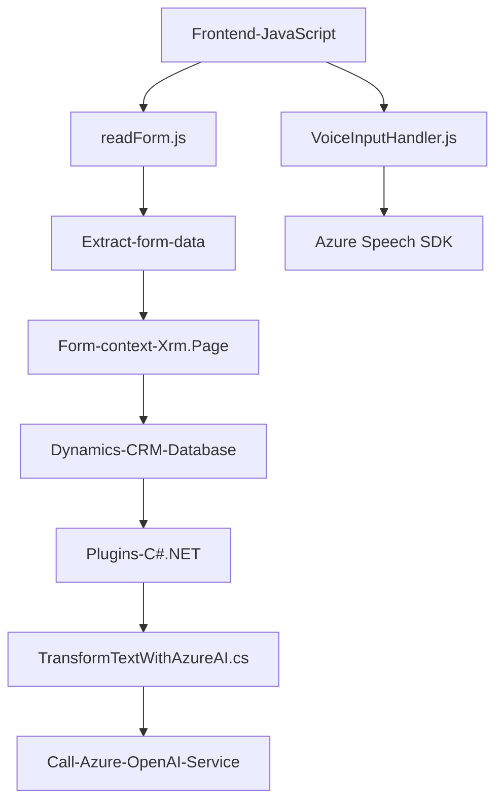

### Breve resumen técnico
El repositorio es una solución que integra APIs y SDKs de Azure con Dynamics CRM para brindar accesibilidad y funcionalidad avanzada a formularios, como síntesis de voz, reconocimiento de voz y procesamiento de datos mediante inteligencia artificial. La implementación se divide en un frontend escrito en JavaScript, un plugin desarrollado en .NET para Dynamics CRM, y servicios de Azure (Speech SDK y OpenAI API) para funcionalidades avanzadas.

---

### Descripción de la arquitectura
El repositorio implementa una **modelo de arquitectura N capas**, donde cada capa (frontend, lógica de negocio como plugins, integración con APIs externas) está organizada para cumplir roles definidos y modularizados. Asimismo, emplea integración con servicios de Microsoft Azure, como Speech SDK y OpenAI, lo que introduce elementos propios de los microservicios.

En el contexto de Dynamics CRM:
1. **Frontend (JavaScript)**: Proporciona interacción con usuarios mediante manejo de formularios, representación visual y interconexión con funciones relacionadas a reconocimiento y síntesis de voz.
2. **Plugins (C#)**: Amplían las capacidades de Dynamics CRM, transformando datos mediante el servicio Azure OpenAI y conectándose con la API de la plataforma.
3. **Servicios de Azure**: Azure Speech SDK permite el manejo de voz como input y output, mientras que Azure OpenAI transforma mensajes en formatos JSON estructurados.

---

### Tecnologías usadas
1. **Frontend**:
   - JavaScript (ES6+): Para procesamiento dinámico de datos relacionados con formularios.
   - Azure Speech SDK: Para sintetizar texto a voz y reconocer transcripciones.
   - Dynamics CRM JavaScript APIs: Manejo del contexto del formulario (`Xrm.Page` o similar).

2. **Backend**:
   - Microsoft Dynamics 365 SDK: Extensiones como `IPlugin` para activar funciones en eventos del CRM.
   - C#: Plugin implementado en .NET.
   - Azure OpenAI Service: Procesamiento de texto mediante GPT.
   - Libraries:
     - `Newtonsoft.Json` y `.NET System.Text.Json`: Manipulación de datos JSON.
     - `System.Net.Http`: Para enviar solicitudes HTTP al servicio externo de Azure OpenAI.

---

### Diagrama **Mermaid**

---

### Conclusión final
1. **Tipo de solución**: La estructura del repositorio corresponde a un sistema complejo con componentes de frontend, estricta integración a través de Dynamics CRM, y servicios externos (Azure Speech SDK, Azure OpenAI API), orientado a procesar formularios de manera accesible, eficiente y automatizada.
2. **Arquitectura**: Diseñada como un sistema de N capas, donde cada capa cumple un rol específico. La interacción con servicios externos como Azure introduce un matiz de microservicios, pero depende de Dynamics CRM como núcleo central.
3. **Patrones y tecnologías usadas**: Se destacan patrones de diseño como el Service Layer, Adapter Pattern, Lazy Loading y Event-Driven Architecture. Las herramientas incluyen JavaScript, Azure Speech SDK, Azure OpenAI, Dynamics CRM SDK, y C#.

Es una solución extensible y modular que combina la accesibilidad de voz, reconocimiento de voz y tecnologías de inteligencia artificial para mejorar la experiencia de los usuarios en contextos donde se requiera interacción eficiente y accesible con formularios.