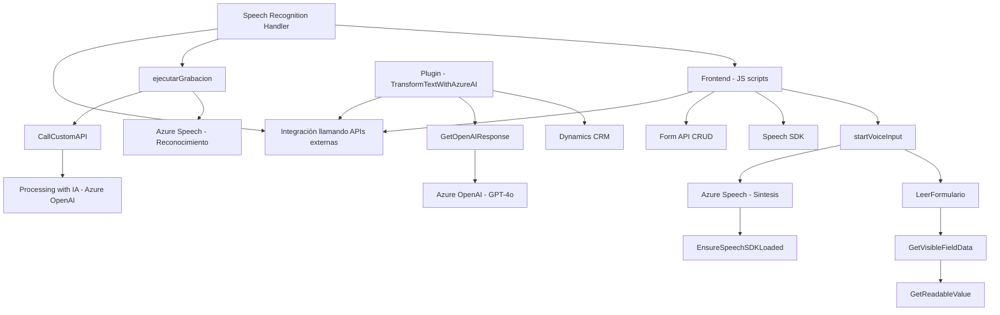

### Breve resumen técnico
El repositorio presenta una solución heterogénea formada por archivos independientes que se enfocan en:
- Interacción y manipulación de formularios dinámicos con reconocimiento de voz (frontend).
- Utilización de servicios de Azure como Speech SDK y OpenAI para reconocimiento/síntesis de voz y transformación de texto mediante inteligencia artificial.
- Extensión de Dynamics CRM mediante un plugin desarrollado con C# para integrar funcionalidades basadas en IA, especialmente mediante la API de Azure OpenAI.

---

### Descripción de arquitectura
La arquitectura del repositorio combina los siguientes conceptos:
1. **Frontend modular**:
   - Lógica distribuida en scripts dedicados para manejo de voz (entrada, transcripciones, síntesis).
   - Modularidad estructurada por funciones específicas (gestión de SDK, lecturas de formularios, transcripción y procesamiento).
   - CAD (CRUD aplicado dinámicamente a formularios).
2. **Backend orientado a servicios**:
   - El plugin es un servicio de extensión de Dynamics CRM configurado como un componente que expone lógica mediante la interfaz `IPlugin`.
   - Realiza peticiones RESTful al modelo `gpt-4/IA` alojado en Azure OpenAI para procesamiento de texto.
3. **Dependencias Externas**:
   - Azure Speech SDK (para reconocimiento y síntesis de voz).
   - Azure OpenAI (para procesamiento avanzado de texto con inteligencia artificial).

La arquitectura general es **híbrida**:
- **N capas**, con separación clara entre frontend y backend.
- Integración con servicios externos, como SDK y APIs, siguiendo un enfoque orientado a servicios (SOA).

---

### Tecnologías usadas
1. **Frontend**:
   - **JavaScript**: Principal lenguaje para scripts de la capa de cliente.
   - **DOM Manipulation**: Gestión directa de DOM para lectura/escritura de datos en la interfaz de usuario.
   - **Azure Speech SDK**: Reconocimiento y síntesis de voz.

2. **Backend/Plugins**:
   - **C#**: Lenguaje para desarrollo de plugins de Dynamics CRM.
   - **Dynamics CRM SDK**: Extensión del punto de acción mediante `IPlugin`.
   - **Azure OpenAI SDK** (vía `HttpClient`): Transformación de texto con soporte de IA.
   - **Newtonsoft.Json y System.Text.Json**: Manejo de serialización/deserialización JSON.

3. **Infraestructura**:
   - Integración con servicios en la nube: Azure Speech y Azure OpenAI.
   - REST APIs para comunicación con el modelo `GPT-4o`.

---

### Diagrama **Mermaid**

---

### Conclusión final
La solución está diseñada para integrar capacidades avanzadas de reconocimiento y síntesis de voz, junto con procesamiento inteligente basado en un modelo de IA. Utiliza un entorno estructurado modularmente en frontend para interactuar con formularios dinámicos y aplicar lógica de negocio. El backend, ligado a Dynamics CRM, usa un plugin extensible que invoca capacidades de Azure OpenAI mediante RESTful. Esto refleja un enfoque híbrido de arquitectura basada en módulos y orientada a servicios (SOA), con soporte para tecnologías en la nube. La consideración de dependencias externas como Azure fortalece las capacidades de la solución, haciéndola escalable y preparada para integraciones futuras en el ecosistema Microsoft.