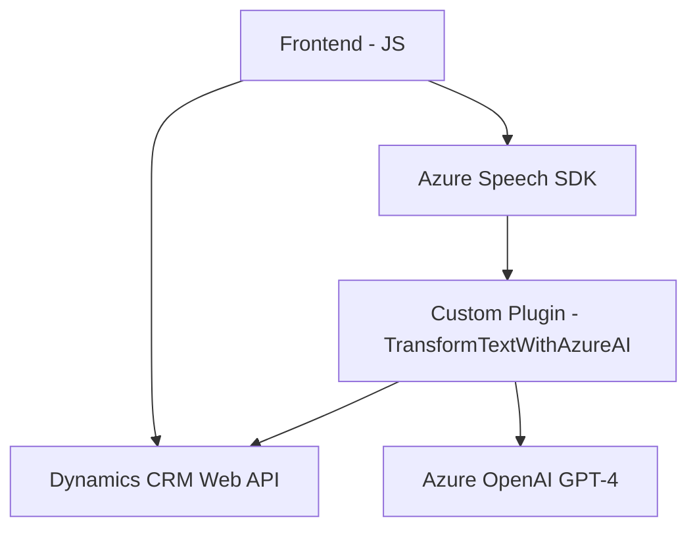

## Resumen técnico

La solución descrita en los archivos proporcionados contiene elementos de software que operan en un entorno basado en Microsoft Dynamics CRM. Los componentes principales son un **frontend** basado en JavaScript para interactuar dinámicamente con formularios, una API personalizada en C#, y dependencias en servicios externos como **Azure Speech SDK** y **Azure OpenAI GPT-4**.

---

## Descripción de Arquitectura

La arquitectura propuesta parece ser una **híbrida** entre **n capas** y **orientada a servicios (SOA)**. Los elementos de frontend están separados claramente de los servicios backend que incluyen el plugin C# y las dependencias en servicios de terceros como Azure Speech SDK y Azure OpenAI. Además, los archivos de JavaScript sugieren manejo de datos dinámicos en el frontend con actualización continua de formularios a través de eventos, mientras que el plugin en C# se ocupa de transformar los datos en el backend a través de una interacción con Azure OpenAI.

Los siguientes módulos son identificables en la solución:
1. **Frontend/JS**: Scripts que integran Azure Speech SDK con la interfaz de usuario del CRM (formulario) para lectura de datos y entrada de voz.
2. **API personalizada**: Plugin que utiliza el Azure OpenAI GPT-4 para transformar texto y devolver un resultado procesado.
3. **Servicios externos**: Azure Speech SDK para síntesis y reconocimiento de voz, Azure OpenAI para inteligencia artificial generativa.

---

## Tecnologías usadas
1. **JavaScript (Frontend)**:
   - Dinámico en el navegador.
   - Uso de Azure Speech SDK.
   - Eventos relacionados con formularios en un contexto CRM.
   - Promesas y programación asincrónica.
   
2. **C# (Backend)**:
   - Plugin para Dynamics CRM con integración personalizada.
   - Uso de `HttpClient` para realizar solicitudes HTTP a Azure OpenAI API.
   - Manejo de datos JSON con `JsonSerializer`.
   
3. **Frameworks y APIs**:
   - Dynamics CRM Web API (`Xrm.WebApi.online`) para la interacción con los datos del sistema.
   - Azure Speech SDK para síntesis y reconocimiento de voz.
   - Azure OpenAI GPT-4.

4. **Patrones de diseño**:
   - Separación de responsabilidades: Cada archivo contiene estructuras organizadas para tareas específicas (voz en frontend, transformación en backend).
   - Carga dinámica de dependencias: Se carga el SDK de Azure Speech solo si es necesario.
   - Event-Driven Architecture: Uso de callbacks y eventos en el procesamiento del frontend.
   - Plugin-based y SOA en el backend.

---

## Diagrama Mermaid válido (minimalista para reflejar arquitectura)

---

## Conclusión Final

La solución es una integración específica entre un frontend basado en JavaScript, el entorno de formulario de Dynamics CRM y servicios externos de Microsoft Azure. La arquitectura es híbrida y combina un enfoque de n capas en frontend y backend con una orientación hacia servicios (SOA) al integrar APIs externas como Azure Speech SDK y Azure OpenAI GPT-4. Se observa una buena separación de responsabilidades, modularidad y uso eficiente de patrones como la carga dinámica y el evento-condicional.