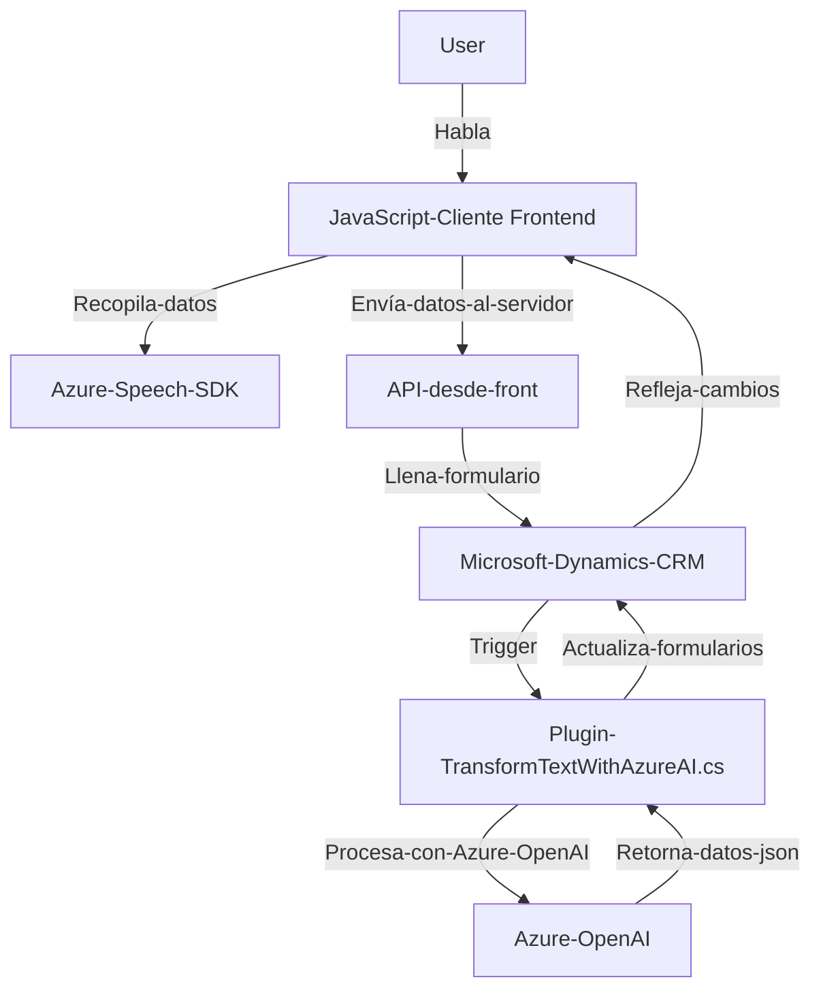

### **Breve resumen técnico**
El repositorio parece ser parte de una solución orientada a interacción vocal con formularios en un entorno Microsoft Dynamics CRM. Utiliza el Azure Speech SDK, procesa texto mediante voz (entrada y salida), y puede transformar el texto con Azure OpenAI donde sea necesario. La solución integra eventos del cliente (JavaScript en el frontend) con un plugin .NET en el backend, comunicándose posiblemente con Microsoft APIs externas.

---

### **Descripción de la arquitectura**
La arquitectura parece ser de un **modelo de múltiples capas**, con al menos dos componentes claros:
1. **Frontend dinámico con JavaScript**: Responsable de habilitar y manejar la interacción vocal, recolectando datos del formulario y transformándolos en interfaces amigables para el usuario mediante el Azure Speech SDK. 
2. **Backend con Plugins para procesar en servidor (Dynamics CRM)**: Utiliza los puntos de extensión de Dynamics CRM mediante un plugin en .NET para procesar texto con inteligencia artificial (Azure OpenAI).

Este enfoque resalta una interacción **cliente-servidor**, donde el cliente maneja tareas relacionadas con la UX y la recopilación de datos, mientras que el servidor actúa en el procesamiento organizado de datos y la integración con IA.

Además, integra principios de la **arquitectura de servicios externos**, con una fuerte dependencia en plataformas como Azure Speech SDK y Azure OpenAI para tareas específicas.

---

### **Tecnologías usadas**
1. **Frontend**
   - Lenguaje principal: **JavaScript**
   - SDK: **Azure Speech SDK** (para reconocimiento y síntesis de voz)
   - Entorno: **Microsoft Dynamics CRM** (formContext y entidad Xrm)

2. **Backend**
   - Desarrollo en: **C# (Microsoft .NET Framework)**
   - Usos:
     - **Microsoft Dynamics CRM SDK** para integración nativa como plugin.
     - **System.Net.Http** para realizar solicitudes HTTP (API REST).
     - **Newtonsoft.Json.Linq** para manipulación JSON.
     - **Azure OpenAI API** para procesamiento de textos y reglas naturales.

3. **Información adicional**
   - Comunicación remota: Llamadas a APIS externas vía HTTP (Azure).

---

### **Diagrama Mermaid válido para GitHub**

---

### **Conclusión final**
El repositorio descrito muestra una solución tecnológica enfocada en procesamiento por voz y transformación de texto mediante inteligencia artificial, orientada al manejo de formularios en un entorno Microsoft Dynamics CRM. 

La arquitectura utilizada se define como una combinación de **Frontend dinámico** con **Azure Speech SDK** para interacción directa con el usuario y un **Backend organizado en capas**, donde los datos son procesados y transformados utilizando herramientas como el plugin `TransformTextWithAzureAI` y conexiones con Azure OpenAI.

La integración con Microsoft APIs (Dynamics y Azure) demuestra un **diseño funcional basado en servicios externos**. Sin embargo, sería recomendable implementar mejores prácticas de manejo de datos sensibles (API keys) y validar el recubrimiento de la lógica con pruebas unitarias para garantizar su robustez en operaciones críticas.