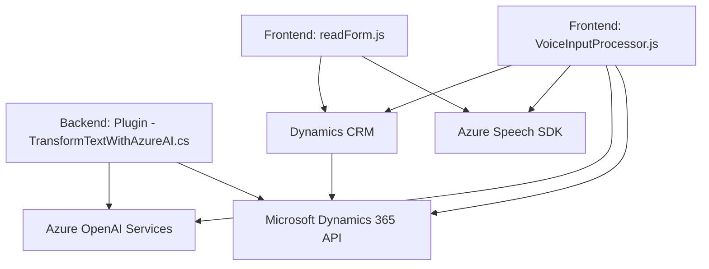

## Breve resumen técnico

El repositorio contiene una solución que combina componentes de frontend en JavaScript y plugins en C# enfocados en integrar servicios de procesamiento y síntesis de voz, así como transformación de texto, mediante tecnologías de Microsoft Azure (Speech SDK y OpenAI Services). Está orientada a interactuar con Dynamics CRM para automatizar procesos de formularios y entrada de datos, utilizando técnicas avanzadas de reconocimiento de voz y generación de información estructurada.

---

## Descripción de arquitectura

La solución opera bajo una **arquitectura híbrida,** combinando las siguientes características:
1. **Plug-in Design Pattern**: En el archivo `TransformTextWithAzureAI.cs`, adoptando el patrón de extensibilidad típico de Dynamics CRM con la implementación de la interfaz `IPlugin`.
2. **Event-Driven Architecture**: Los módulos de frontend están diseñados para reaccionar a eventos de usuario, por ejemplo, grabaciones de voz o interacciones con la interfaz.
3. **Service-Oriented Architecture (SOA)**: Se realiza integración con servicios externos como **Azure Speech SDK** para reconocimiento y síntesis de voz, y **Azure OpenAI Services** para procesamiento avanzado de texto.
4. **Modularización (N-capas)**: Cada funcionalidad está encapsulada en módulos bien estructurados: frontend para interacción de usuario, procesamiento por API y un plugin CRM para ejecutar integración lógica del lado del backend.

---

## Tecnologías usadas

- **Frontend:**
  - Lenguaje: **JavaScript**
  - Framework/SDK: **Azure Speech SDK** para reconocimiento y síntesis de voz.
  - Sistema externo: Microsoft Dynamics 365 CRM.
  
- **Backend:**
  - Lenguaje: **C#**
  - Framework/SDKs: **Microsoft.Xrm.Sdk**, para integración directa con CRM y ejecución de eventos como parte de la lógica del plugin.
  - Librerías: **Newtonsoft.Json**, **System.Net.Http**, etc., para el consumo de APIs externas y manejo de JSON.

- **Servicios Externos:**
  - **Azure Speech SDK**: Utilizado tanto en el frontend (para reconocimiento y síntesis de voz) como en el backend (plugin).
  - **Azure OpenAI**: Utilizado por el backend para procesamiento avanzado de texto.

- **Patrones:**
  - **Modularización**: Separación de responsabilidades en funciones dedicadas en el frontend y métodos en el plugin.
  - **Cargador dinámico de dependencias**: SDKs cargados bajo demanda en tiempo de ejecución.
  - **API Gateway**: Interacción entre frontend/plugins y los servicios externos (Azure Speech SDK y OpenAI).
  - **Event-Driven Design**: Procesos desencadenados por interacciones en formularios y grabación de voz.
  - **Service-Oriented Architecture (SOA)**: Utilización de servicios externos integrados.

---

## Diagrama Mermaid válido para GitHub

---

## Conclusión final

La solución presentada cuenta con una sólida integración entre un sistema CRM (Microsoft Dynamics) y servicios avanzados de reconocimiento, síntesis y procesamiento de texto mediante tecnologías de Microsoft Azure (Speech SDK y OpenAI). Su arquitectura modular permite una clara separación de responsabilidades y aprovecha efectivamente la interacción con servicios externos, como APIs de terceros, aplicando patrones de diseño como SOA, event-driven y plugin architecture. Con refinamientos en la seguridad de las credenciales y optimización del manejo de dependencias y errores, esta solución es escalable y adecuada para tareas de automatización basadas en voz y texto.