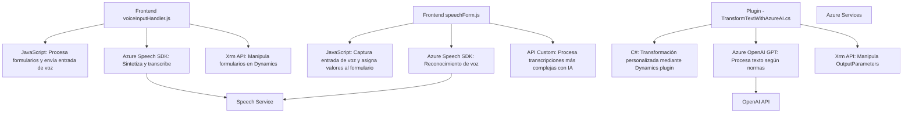

### Breve Resumen Técnico

El repositorio parece ser una solución orientada a la construcción de herramientas que integran inteligencia artificial (IA) y APIs de Azure en un entorno de Dynamics 365. Los archivos tratan dos aspectos principales: 

1. **Frontend (JavaScript)**: Con módulos que manejan la síntesis de voz y entrada de datos en formularios.
2. **Backend (C#)**: Complementado con un plugin que usa Azure OpenAI GPT para transformar texto en formato JSON.

---

### Descripción de la Arquitectura

Este repositorio implementa una arquitectura híbrida cliente-servidor con integración de servicios externos:

1. **Frontend**: Una arquitectura de capa única, con módulos JavaScript que interactúan directamente con servicios externos (Azure Speech SDK) y el ambiente de Dynamics 365. La lógica está fragmentada en funciones para modularidad y escalabilidad.
   
2. **Backend**: El plugin en C# sigue el **Plugin Pattern**, siendo parte de la arquitectura orientada a servicios (SOA). Se comunica con Azure OpenAI GPT API para enriquecer las funcionalidades del CRM.

La solución refleja un enfoque de **microservicios ligeros** en términos de dependencia con APIs externas para tareas específicas como síntesis de voz, texto y transformación IA.

---

### Tecnologías Usadas

1. **Frontend**:
   - **JavaScript**: Manejo dinámico del DOM y llamadas asincrónicas a Azure SDK.
   - **Azure Speech SDK**: Para síntesis y entrada de voz.
   - **Xrm API (Dynamics 365)**: Integración directa con formularios en Dynamics.

2. **Backend**:
   - **Microsoft Dynamics CRM SDK**: Para implementar un plugin que transforma texto.
   - **Azure OpenAI GPT API**: Implementación basada en servicios REST para procesamiento inteligente.
   - **JSON Libraries**:
     - Newtonsoft.Json para estructuración y manipulación de datos JSON.
     - System.Text.Json para rendimiento en procesamiento de respuestas.

3. **Patrones aplicados**:
   - Separación de responsabilidades: Código organizado por contexto y funcionalidad.
   - Callback Pattern y Promises en JavaScript: Para manejar procesos dependientes del SDK y APIs.
   - Service-Oriented Architecture (SOA): Azure Speech y OpenAI gestionan funciones específicas como servicios.

---

### Diagrama Mermaid

---

### Conclusión Final

Este proyecto es una integración avanzada de servicios en Azure y Dynamics 365, que busca mejorar la accesibilidad y el procesamiento de datos en formularios mediante IA y entrada de voz. La solución sigue patrones modernos como SOA y la segmentación de responsabilidades. Sin embargo, algunas preocupaciones destacan:
   
1. **Seguridad**: La exposición de claves API sugiere una vulnerabilidad crítica y debe ser manejada.
2. **Mantenibilidad**: Aunque el diseño modular es robusto, el impacto de una dependencia alta con servicios como Azure OpenAI podría dificultar su adaptabilidad a otros entornos.

El diseño arquitectónico está orientado al cliente con funcionalidad delegada en servicios externos, lo cual lo hace eficiente y escalable en contextos de negocio, pero debe manejarse cuidadosamente para no quedar restringido por estas dependencias.