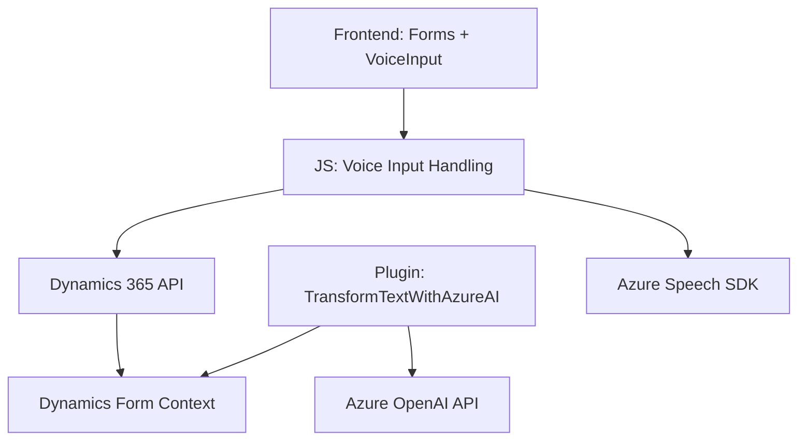

# Breve Resumen Técnico

Este repositorio parece ser parte de una solución Dynamics CRM personalizada para administrar formularios dinámicos y funciones relacionadas con entrada de voz, síntesis, y procesamiento de texto usando servicios de Azure (Speech SDK, OpenAI API). La solución incluye un frontend desarrollado con JavaScript, conectado con múltiples APIs y plugins para trabajar sobre el contexto CRM.

---

# Descripción de Arquitectura

La arquitectura es **modular con integración de servicios externos**. Esto es evidente por:
- Frontend: Capacidades para gestionar entrada por voz y datos de formularios en tiempo real.
- Plugins: Extensión mediante Dynamics CRM para transformar texto usando Azure AI, interactuando con el contexto CRM.
- Patrones Service/Repository: Uso de técnicas que encapsulan el acceso a API externas y objeto formulario.
- Microservicios: Integración directa con Azure Speech y Azure OpenAI refleja una arquitectura orientada a servicios (aunque no completamente un sistema de microservicios).

---

# Tecnologías Usadas

1. **Frontend:**
   - **JavaScript:** Funcionalidades dinámicas en el navegador.
   - **Azure Speech SDK:** Para entrada de voz y síntesis de texto hablado.
   - **Dynamics 365 APIs:** Interacciones con formularios y datos del sistema.

2. **Backend Plugin:**
   - **Microsoft Dynamics CRM SDK:** Desarrollo del plugin para extender capacidades en Dynamics 365.
   - **Azure OpenAI API:** Procesamiento de texto con modelos como GPT.
   - **.NET Framework/Core (C#):** Implementación del plugin mediante el estándar de Dynamics CRM.

3. **Entorno Externo:**
   - **Azure Hosting**: Servicios escalables y de IA para Speech y OpenAI.
   - **JSON Libraries:** `Newtonsoft.Json` para estructuración y serialización JSON.

---

# Diagrama Mermaid (Válido para GitHub Markdown)

---

# Conclusión Final

La solución combina capacidades avanzadas de reconocimiento de voz y procesamiento de texto mediante Azure servicios y Dynamics CRM. Su arquitectura modular facilita la integración, separación de responsabilidades, y escalabilidad. No obstante, hay áreas que podrían beneficiarse de mejoras, como asegurar la configuración segura de claves API y optimizar el flujo de datos entre las partes.

Este repositorio resulta ideal para escenarios en los que la interacción del usuario requiere procesamiento de voz y automatización dinámica de formularios, integrándose fuertemente con servicios de Microsoft.