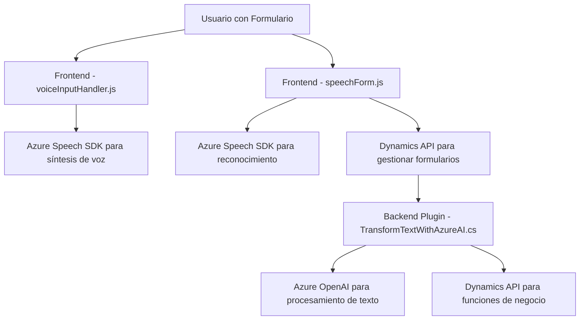

### Análisis del Repositorio

#### 1. Breve resumen técnico:
El repositorio presenta módulos de software con funcionalidades relacionadas con la captura, transformación y síntesis de datos en aplicaciones empresariales que interactúan con formularios de Dynamics 365. Los componentes principales son un frontend basado en JavaScript que implementa procesamiento de entrada de voz y un plugin de servidor en C# que transforma texto utilizando el servicio Azure OpenAI.

---

#### 2. Descripción de arquitectura:
La solución utiliza una **arquitectura de capas** donde cada capa tiene un propósito específico:
- **Frontend**: Proporciona interacción con el usuario, centrándose en la captura y procesamiento de entrada de voz.
- **Backend Plugin**: Actúa como intermediario entre el Dynamics CRM y Azure OpenAI, transformando datos textual según configuraciones dinámicas.
- **API/SaaS Services** (Azure Speech SDK y Azure OpenAI): Incorporación de servicios cloud para externalizar el procesamiento de lenguaje y síntesis de voz.

Adicionalmente, el código utiliza patrones típicos del desarrollo empresarial como:
- **Callback Design**: Para garantizar la carga de dependencias en el frontend.
- **ETL**: Integración de datos de formularios en el frontend mediante extracción, transformación y carga hacia un formato procesable.
- **Plugin Pattern**: Para ejecutar reglas de negocio en Dynamics CRM desde el backend, integrado con servicios Azure.

---

#### 3. Tecnologías usadas:
En el proyecto se identifican diversas tecnologías y librerías:
- **Frontend**:
  - JavaScript/ECMAScript: Lenguaje principal.
  - Azure Speech SDK (via `https://aka.ms/csspeech/jsbrowserpackageraw`): Para síntesis de voz y reconocimiento de audio.
  - Dynamics 365 API (`Xrm.WebApi`): Para interactuar con datos del CRM en tiempo real.
- **Backend**:
  - C#: Lenguaje para el desarrollo de Plugins en Dynamics CRM.
  - Dynamics CRM SDK: Realiza integraciones con el sistema CRM.
  - HTTP Client y JSON Libraries:
    - `System.Net.Http`
    - `System.Text.Json` y `Newtonsoft.Json.Linq`: Tratamiento de datos estructurados.
  - Azure OpenAI: Integración API para procesamiento de texto via IA.
- **Infraestructura cloud**:
  - Azure Speech (SDK) y OpenAI como servicios fuera de este conjunto de módulos.

---

#### 4. Dependencias o componentes externos:
Este sistema depende de:
- **Microsoft Azure Speech SDK**: Usado en frontend para síntesis y reconocimiento de voz.
- **Microsoft Dynamics 365 API**: En el frontend para acceso al modelo de datos de formularios CRM y en el plugin como acceso de alto nivel a `IOrganizationService`.
- **Azure OpenAI Service**: Para procesamiento avanzado en plugins.
- **HTTP & JSON Libraries**: Realizan operaciones de red y procesan datos (principalmente en plugins).
- **JavaScript**: En frontend para la integración dinámica con el usuario.

Potenciales dependencias externas basadas en contexto:
- Idiomas y configuraciones personalizados en Azure Speech/OpenAI para mejorar integración.
- API personalizada dentro del sistema CRM.

---

#### 5. Mermaid Diagram válido para GitHub Markdown:

---

### Conclusión final:
Este repositorio implementa una solución híbrida para automatización de procesamiento de datos en entornos empresariales de Dynamics CRM. Su arquitectura de capas separa las responsabilidades entre frontend para interacción directa del usuario y un plugin backend que delega lógica más avanzada a servicios externos como Azure OpenAI y Dynamics API. Los patrones utilizados, como integración API y procesamiento ETL, son idóneos para maximizar la eficiencia de un sistema altamente conectado. Para mejorar la seguridad, se recomienda gestionar claves de API mediante configuraciones en un sistema de almacenamiento seguro como Azure Key Vault.