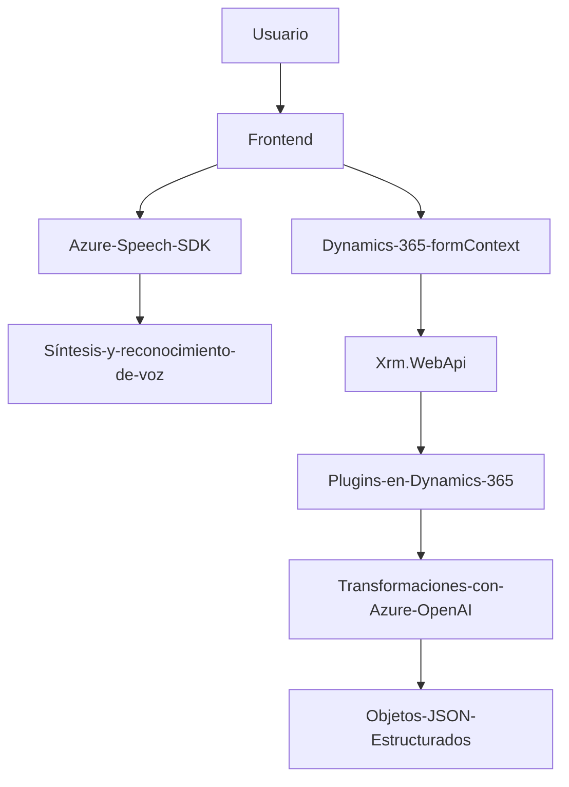

## Breve resumen técnico

El repositorio contiene tres artefactos principales: **lógica frontend** (JavaScript), **lógica del cliente Dynamics CRM** (plugin en C#), y una integración con servicios externos (**Azure Speech SDK** y **Azure OpenAI**). El sistema está diseñado para interactuar tanto con usuarios (procesamiento de voz y formularios) como con servicios cloud (IA y síntesis de voz). 

---
## Descripción de arquitectura

La solución parece ser un **sistema de integración híbrido de n capas**, donde las capas frontend y backend están interconectadas mediante servicios externos como **Azure Speech SDK** (procesamiento de voz) y **Azure OpenAI**. Estas capas se estructuran como sigue:

1. **Frontend**:
   - Implementación de interacción usuario-formulario. Usando el Azure Speech SDK para sintetizar y reconocer voz en tiempo real.
   - Funcionalidad basada mayoritariamente en eventos y ejecución dinámica del SDK.

2. **Backend**:
   - Plugins de CRM creados en .NET (C#).
   - Extienden la lógica de Microsoft Dynamics 365 mediante el uso de `IPlugin` y gestionan transformaciones de texto avanzado con **Azure OpenAI API**.
   - Dependencias en librerías estándar como `Newtonsoft.Json` para operaciones JSON.

3. **Servicios Externos**:
   - Dependencia estrecha hacia **Azure Speech SDK** para procesamiento de voz y síntesis.
   - Uso de **Azure OpenAI API** en el backend para transformaciones y enriquecimiento de datos.

La arquitectura del sistema es **n capas** pero utiliza principios y capacidades propias de microservicios (especialmente en la interacción con Azure). Las capas se conectan mediante APIs y SDKs para garantizar modularidad y escalabilidad.

---
## Tecnologías usadas

1. **Frontend**:
   - **JavaScript**: Programación asíncrona, manipulación DOM, eventos, promesas.
   - **Azure Speech SDK**: Síntesis y reconocimiento de voz (NLP).

2. **Backend**:
   - **C# (.NET)**: Desarrollo de plugins para Dynamics CRM basado en `IPlugin`.
   - **Newtonsoft.Json**: Serialización y deserialización avanzada de JSON.
   - **API de Dynamics 365**: `Xrm.WebApi` para operar datos del CRM.

3. **Servicios externos**:
   - **Azure Speech SDK**: Procesamiento de voz.
   - **Azure OpenAI API**: Transformación de texto avanzada e integración IA en el CRM.

4. **Otros conceptos**:
   - **APIs REST**: Comunicación con servicios externos mediante `fetch` y `HttpClient`.
   - **Evento Callback**: En frontend para manejo asíncrono de SDK.
   - **Plugin CRM estándar**: Extensión modular dentro de Dynamics CRM.

---
## Diagrama Mermaid válido para GitHub

---
## Conclusión final

La solución descrita representa una **aplicación multicapa orientada a servicios externos**. Está diseñada para interactuar con los usuarios mediante síntesis de voz y procesamiento de formularios, a la vez que extrae datos de estos para incorporarlos en un sistema CRM como Dynamics 365 y aplica transformaciones avanzadas con modelos de inteligencia artificial (IA).

La arquitectura está bien separada:
1. **Frontend**: Responsable de la interfaz y procesamiento de voz (cliente).
2. **Backend (Dynamics Plugins)**: Encargado del procesamiento avanzado y modificación del estado de formularios.
3. **Servicios Externos**: Apoyan capacidades específicas como IA y procesamiento de voz.

### Puntos fuertes:
- Modularización.
- Uso inteligente de SDK (Azure Speech y OpenAI).
- Adherencia a principios de arquitectura n-capas.

### Recomendaciones:
1. Externalización de configuraciones sensibles (por ejemplo, claves API).
2. Validación de entradas para evitar errores de mapeo o desbordamiento en llamadas de API.
3. Optimizar la invocación de SDK y IA en base a cargas dinámicas y capacidad de servicio Azure.