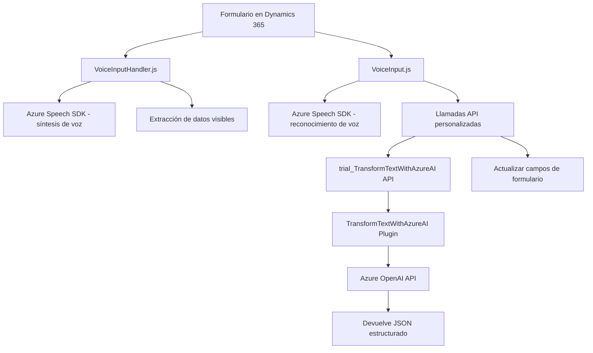

### Breve resumen técnico
El repositorio contiene varios componentes relacionados con la interacción entre formularios y procesamiento de voz, así como integración con servicios externos para inteligencia artificial. Los archivos principales son utilizados en un entorno basado en Dynamics 365, Azure Speech SDK, y Azure OpenAI API para habilitar funcionalidades avanzadas como:
- Conversión de datos de formulario en texto hablado.
- Reconocimiento de entrada por voz para completar formularios.
- Transformación y procesamiento de texto por IA en formato JSON.

---

### Descripción de arquitectura
La arquitectura del sistema combina **patrones de n capas** y elementos asociados a **microservicios**:
1. **Frontend (JavaScript)**:
   - Funcionalidades como extracción de datos visibles, síntesis de voz, y reconocimiento de voz están organizadas de forma modular.
   - Integración con APIs externas (Azure Speech y Dynamics 365).
   - Uso de servicios de transcripción y datos dinámicos por medio de patrones de modularización y callbacks.
   
2. **Backend (Dynamics 365 Plugin)**:
   - La lógica empresarial se encapsula en un plugin que opera como cliente de un servicio AI externo.
   - Opera bajo el modelo de microservicio al consumir la API OpenAI para transformar datos textuales.

La arquitectura integra capas de presentación (formulario en Dynamics), lógica de aplicación (JavaScript que procesa datos/transcripciones) y servicios (API externa de Azure/OpenAI), manteniendo una separación clara de responsabilidades.

---

### Tecnologías usadas
1. **Frontend**:
   - **JavaScript**: Lenguaje principal para la ejecución en navegador y cliente Dynamics 365.
   - **Azure Speech SDK**: Para transcripciones de voz y síntesis en tiempo real.
   - **Dynamics 365 SDK**: Integración con formulación de datos y APIs definidas por el desarrollador.

2. **Backend**:
   - **Microsoft Dynamics 365**: Framework que aloja el plugin para la lógica empresarial.
   - **Azure OpenAI API**: Servicio para procesamiento de texto con inteligencia artificial.
   - **Microsoft.Xrm.Sdk**: Dependencia estándar para desarrollo de plugins en Dynamics 365.
   - **Newtonsoft.Json** y **System.Text.Json**: Manejo de serialización y deserialización JSON.

---

### Diagrama Mermaid

---

### Conclusión final
El repositorio engloba una solución híbrida que combina componentes de frontend (JavaScript en Dynamics 365) y backend (plugin C# en Dynamics) conectados eficientemente con servicios en la nube como Azure Speech SDK y Azure OpenAI API. La arquitectura implementada sigue principios de diseño modular e integración con microservicios externos para procesamiento avanzado de voz y texto, adaptándose bien al patrón de n capas y escalabilidad en aplicaciones empresariales modernas. Recomendaciones futuras incluyen mejorar la seguridad mediante externalización de claves API y ampliar la documentación en procesos críticos.