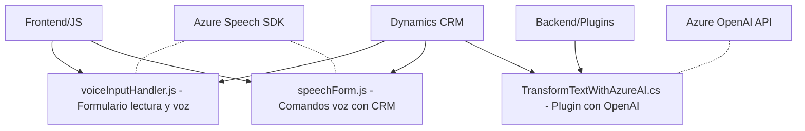

### Breve resumen técnico
El repositorio presenta una solución enfocado en la interacción entre un sistema Dynamics CRM y servicios externos de IA (Azure OpenAI y Azure Speech SDK). Los archivos proporcionados implementan tanto funcionalidad frontend como extensiones plugin para procesos CRM. La solución destaca por habilitar comandos de voz, lectura de formularios y procesamiento de texto utilizando IA.

---

### Descripción de arquitectura
La arquitectura se puede clasificar en un enfoque **n capas**, dividida principalmente en:
1. **Capa de presentación (Frontend)**: Funciones en JavaScript para habilitar lectura de formularios y comandos de voz. Actúa sobre el contexto del formulario en Dynamics CRM.
2. **Capa de negocio/servicios (Plugins)**: Contiene lógica del backend para procesar datos y llamadas a APIs (Azure Speech/Azure OpenAI) en formato JSON.
3. **Capa de integración**: Interactúa con APIs externas (Azure Speech SDK, Azure OpenAI) desde dinámicas del frontend y backend.

---

### Tecnologías usadas
1. **Frontend (JavaScript)**:
   - Uso del SDK de **Azure Speech** para síntesis y reconocimiento de voz.
   - Manejo de eventos en un **modelo basado en formulario** con APIs de Dynamics (`Xrm.WebApi`).
   - Patrones: delegación de eventos, segregación de responsabilidades. 

2. **Backend (C#)**:
   - **Microsoft Dynamics SDK** para integración CRM.
   - **Azure OpenAI** para transformación avanzada de texto en objetos JSON estructurados.
   - Frameworks utilizados:
     - `Newtonsoft.Json.Linq`: Para manejo avanzado de datos JSON.
     - `HttpClient`: Para comunicación con APIs externas.
   - Patrones: desacoplamiento, abstracción de cliente REST.

---

### Diagrama Mermaid válido para GitHub

---

### Conclusión final
La solución representa una arquitectura bien segmentada con componentes frontend y backend definidos, integrados con servicios IA de Azure y APIs de Dynamics CRM. El diseño n capas asegura flexibilidad y escalabilidad al dividir responsabilidades en presentación, negocio y datos. La implementación de reconocimiento de voz, lectura accesible de formularios y procesamiento por IA refleja un enfoque modernizado para CRM orientado a la integración de tecnologías inteligentes.