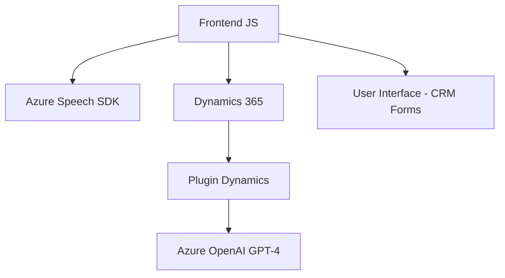

### Resumen Técnico

El repositorio parece ser parte de una solución compleja enfocada en la gestión de formularios empresariales, procesamiento de datos, y uso de capacidades avanzadas de AI y reconocimiento de voz. Se observa que hay una integración profunda entre Azure Cognitive Services, Dynamics CRM y plugins basados en .NET, lo que indica que la solución está orientada a tecnologías empresariales y automatización de procesos.

---

### Descripción de la Arquitectura

La arquitectura combina diferentes paradigmas:
1. **Cliente-Servidor (Frontend y backend):** El frontend (JavaScript) interactúa con APIs remotas para Dynamics CRM y servicios de Azure (Azure Speech y Azure OpenAI). La ejecución dinámica de SDKs en el frontend centraliza la lógica de procesamiento de formularios y genera datos estructurados que son enviados al backend.
2. **Estructura Modular:** En el frontend y backend, las funciones y clases están organizadas por responsabilidades específicas, siguiendo el principio de separación de preocupaciones.
3. **Microservicio:** El procesamiento avanzado (como transformación de texto mediante AI en Azure OpenAI) está desacoplado y diseñado con comunicación directa pero independiente del backend principal.
4. **Plug-ins:** El uso de `TransformTextWithAzureAI.cs` muestra el patrón de plugins empresariales típico de Dynamics CRM.

---

### Tecnologías Usadas

1. **Frontend (JavaScript):**
   - Azure Speech SDK: Reconocimiento de voz, sintentización de texto a audio.
   - Dynamics 365 API (`Xrm.WebApi`): Manipulación de datos de Dynamics CRM.
   - JavaScript nativo: Procesamiento del DOM y manejo de datos.

2. **Backend (.NET):**
   - **C#.NET:** Construcción del plugin.
   - **Microsoft Xrm SDK:** Para interacción con Dynamics CRM.
   - **Dynamics Web API:** Punto de conexión entre el plugin y CRM.
   - **Azure OpenAI GPT API:** Utilizada para el procesamiento avanzado de lenguaje natural.
   - **JSON Libraries:** Manejo y formato de datos JSON (`System.Text.Json`, `Newtonsoft.Json`).

3. **Patrones utilizados:**
   - SDK dinámico con carga condicional.
   - Patrón funcional en el frontend.
   - Delegación de responsabilidades a microservicios externos.
   - Procesamiento modular y orientado a servicios.

---

### Diagrama Mermaid Válido para GitHub Markdown
El diagrama refleja la interacción entre las capas principales y las dependencias.

---

### Conclusión Final

1. **Tipo de solución**: La estructura está diseñada para desarrollar una plataforma empresarial híbrida que facilita el procesamiento de datos en formularios dinámicos, integrando capacidades de reconocimiento de voz y procesamiento avanzado de lenguaje natural, adaptada específicas a Dynamics 365.
2. **Arquitectura**: Implementa varios patrones, principalmente cliente-servidor, estructura modular en el frontend, diseño de plugins para CRM, y una arquitectura basada en microservicios externalizados a Azure OpenAI (GPT-4).
3. **Dependencias externas**:
   - Alto uso de SDKs (Azure Speech).
   - APIs de Dynamics CRM y plugins personalizados.
   - Dependencia en el servicio externo de Azure OpenAI para procesamiento de texto avanzado.

Esta solución podría ser parte de una integración interna o empresarial que automatice procesos, mejorando la experiencia de captura y análisis de datos en formularios dinámicos interconectados.