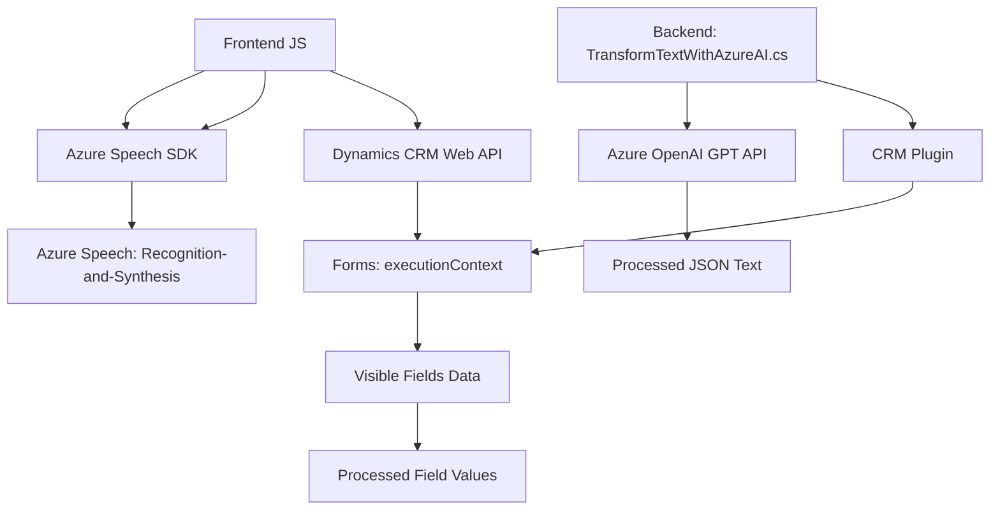

### Breve Resumen Técnico
El repositorio contiene archivos orientados a la gestión de formularios mediante reconocimiento y síntesis de voz, así como un plugin que transforma texto utilizando Azure OpenAI en un entorno Dynamics CRM. La funcionalidad principal consiste en integrar capacidades de reconocimiento de voz, síntesis de voz y transformación de texto a través de APIs externas y servicios de Azure en un sistema CRM.

### Descripción de Arquitectura
La arquitectura destaca los siguientes elementos:
1. **Frontend Modular**: Archivos JavaScript (`readForm.js`, `speechForm.js`) que proporcionan interacción directa con formularios y gestionan el reconocimiento/síntesis de voz en el navegador. 
2. **Backend en Plugins**: El archivo `.cs` es un plugin diseñado para Microsoft Dynamics CRM que utiliza Azure OpenAI para transformar texto proporcionado por el usuario.
3. **Servicios Externos**: Integración de SDK de Azure Speech y Azure OpenAI para capacidades específicas (voz y procesamiento de texto respectivamente).
4. **Arquitectura SOA**: Cada funcionalidad está ensamblada como módulos independientes que interactúan con APIs externas y el entorno CRM mediante comunicación asincrónica.

### Tecnologías Usadas
1. **Frontend**:
   - **Azure Speech SDK**: Realiza reconocimiento y síntesis de voz.
   - JavaScript (ES6+).
   - Dynamics CRM Web API: Gestión de llamadas y datos del CRM.
   - ECMAScript Promises: Para manejar procesos async como llamadas a API personalizadas.
   
2. **Backend**:
   - **Azure OpenAI (GPT Models)**: Capacidad de procesamiento y transformación de texto.
   - Microsoft Dynamics CRM SDK (`Microsoft.Xrm.Sdk`) para interacción y extensión del entorno CRM.
   - C# con patrones orientados a servicios.
   - HTTP Client (para consumir Azure OpenAI).
   - Manipulación JSON (`System.Text.Json`, `Newtonsoft.Json.Linq`).

### Diagrama Mermaid
El diagrama representa los componentes principales y sus interacciones:

### Conclusión Final
El repositorio presenta una solución híbrida con enfoque SOA. La arquitectura del sistema está segmentada en dos principales capas:
1. **Frontend**: Manejo de reconocimiento y síntesis de voz ligado dinámicamente al contexto de formularios en Dynamics CRM.
2. **Backend**: Transformación avanzada de texto mediante Azure OpenAI, administrado como un plugin basado en Dynamics CRM.

El uso extensivo de SDKs y APIs externas garantiza capacidades avanzadas, mientras que la modularización del código promueve la mantenibilidad. La integración del reconocimiento de voz y de capacidades OpenAI en un sistema CRM maximiza herramientas de inteligencia artificial en aplicaciones empresariales.