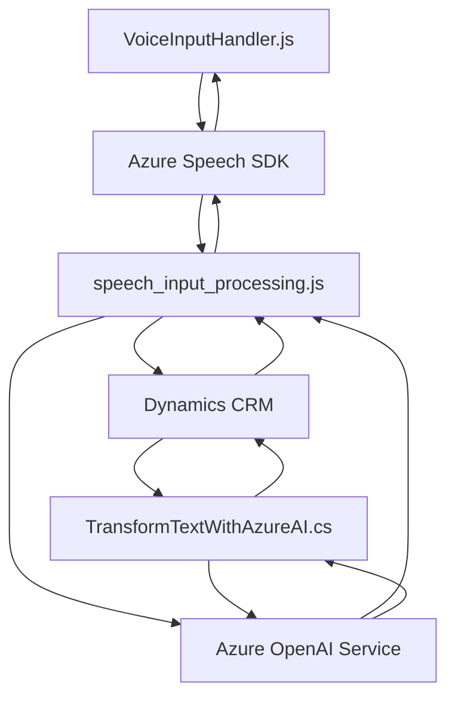

### **Breve resumen técnico**
El repositorio presentado contiene tres archivos que componen una solución orientada al manejo de datos en formularios con inclusión de tecnología de reconocimiento y síntesis de voz, así como la integración con modelos de Inteligencia Artificial de Azure. Esta solución está destinada principalmente a trabajar dentro del ecosistema Dynamics CRM y Azure, combinando funcionalidad frontend (JavaScript) e integración con un backend basado en plugins (.NET).

---

### **Descripción de arquitectura**
La solución está estructurada como una arquitectura híbrida. Integra elementos de una arquitectura multicapa, donde el frontend en JavaScript interactúa con el sistema desde el cliente, ejecutando lógica tanto local como en el navegador (reconocimiento y síntesis de voz mediante Azure Speech SDK), mientras que el backend usa patrones de microservicio y plugin para extender la funcionalidad del CRM a través de Azure OpenAI.

#### Componentes mayores:
1. **Frontend**:
   - Archivos de JavaScript diseñados para interactuar con formularios en Dynamics CRM.
   - Lógica distribuida entre captura de datos de formularios, reconocimiento de voz y síntesis.
   - Integración dinámica con el SDK de Azure Speech.

2. **Backend**:
   - Plugins en .NET para extender la funcionalidad de Dynamics CRM.
   - Integración directa con Azure OpenAI para procesamiento avanzado de texto.

#### Patrones:
- **Facade Pattern**: Simplificación de la interacción con multiples servicios en el frontend utilizando funciones como punto de entrada (`startVoiceInput` y `startVoiceInput/executionContext`).
- **Microservicio/Service-Oriented Architecture (SOA)**: Integración de múltiples servicios (Azure Speech SDK, Azure OpenAI, Dynamics Web API).
- **Lazy Loading**: Uso de elementos como `ensureSpeechSDKLoaded` para eficientar las dependencias externas y optimizar el rendimiento.

---

### **Tecnologías usadas**
1. **Frontend (JavaScript):**
   - Azure Speech JavaScript SDK: Reconocimiento y generación de audio.
   - Dynamics CRM Form API: Para interactuar con los objetos y campos del formulario.
   - ECMAScript 2015+ (funciones asíncronas, promesas).

2. **Backend (C#):**
   - Microsoft.Xrm.Sdk: SDK para el desarrollo de plugins en Dynamics CRM.
   - Newtonsoft.Json: Manejo y procesamiento de datos en formato JSON.
   - Azure OpenAI Service: Uso de modelos de lenguaje avanzado (GPT APIs) para transformación de texto.
   - System.Net.Http / HTTP Client: Llamadas al API de Azure OpenAI.
   - System.Text.Json: Serialización y manejo de JSON en .NET.

---

### **Dependencias o componentes externos**
- **Azure Speech SDK**: Reconocimiento y síntesis de texto y voz.
- **Azure OpenAI Service**: Integración con modelos de lenguaje como GPT.
- **Dynamics CRM API** (`Xrm.WebApi`): Manipulación de formularios y accesos a datos del CRM.
- **Entity Framework/Dynamics SDK**: Uso en el desarrollo backend de plugins mediante C#.
- **Newtonsoft.JSON/JObject**: Procesamiento de JSON en el backend.

---

### **Diagrama Mermaid**

---

### **Conclusión final**
La solución forma parte de un sistema integrado que utiliza el procesamiento de voz y texto en combinación con un CRM (Dynamics) y servicios de inteligencia AI de Azure. Está diseñada para facilitar la interacción dinámica entre el usuario y los formularios del CRM, empleando módulos para carga y procesamiento eficiente (lazy loading, modularidad). 

Esta arquitectura es adecuada para soluciones que se integran con servicios externos como Azure y garantiza la flexibilidad para futuras extensiones. Sin embargo, la práctica de almacenar configuraciones críticas, como las claves de accesos a APIs, directamente en el código fuente podría presentar riesgos de seguridad y mantenimiento. La recomendación para entornos productivos sería usar un sistema de configuración más robusto, como Azure Key Vault o variables de entorno.