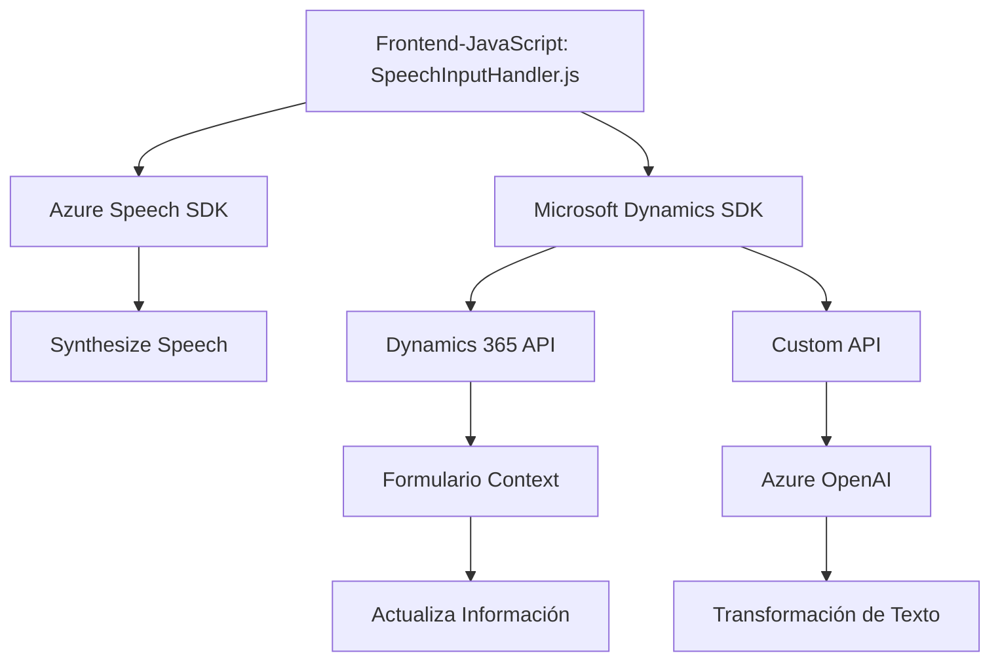

### Breve Resumen Técnico
El repositorio está compuesto por tres archivos que interactúan entre ellos y con servicios externos. Su propósito principal es habilitar un flujo de entrada y salida de voz, procesamiento de texto, y transformación de datos en Microsoft Dynamics utilizando servicios de Azure. A partir de la estructura y contenido del código proporcionado, se puede deducir que esta solución combina un **frontend basado en JavaScript** con integración a servicios **cloud** de Azure y un backend representado por un **plugin de Dynamics CRM**.

---

### Descripción de Arquitectura
La arquitectura parece ser **multicapa híbrida**, ya que incluye:
1. **Frontend**: Script en JavaScript responsable de captura y síntesis de voz usando el **Azure Speech SDK**. Contiene lógica modular y directa para interactuar con formularios del cliente.
2. **Backend**: Implementación de un plugin **Dynamics 365 CRM** que utiliza servicios de **Azure OpenAI** para transformar datos textuales en objetos estructurados.
3. **Servicios Externos**:
   - Servicios cloud proporcionados por Azure, como Speech SDK y OpenAI para análisis y generación de voz.
   - API personalizada para procesamiento adicional.

La arquitectura sigue un modelo de **integración mediante APIs** y muestra separación de responsabilidades entre captura de voz, procesamiento y almacenamiento de datos.

---

### Tecnologías Usadas
1. **Frontend (JavaScript)**:
   - **Azure Speech SDK** para síntesis de voz y reconocimiento de voz.
   - Modularidad basada en funciones segregadas por propósito (transformación de datos, llamadas a API, etc.).
   - Condicionales para la carga dinámica de SDKs (patrón de carga bajo demanda).

2. **Backend (C# y Dynamics CRM)**:
   - **Microsoft Dynamics SDK** para interacción con el sistema CRM.
   - **Azure OpenAI** para transformación avanzada de texto.
   - **HTTP Client** (via `System.Net.Http`) y JSON manejo (`System.Text.Json`, `Newtonsoft.Json.Linq`) para comunicación y parser de respuestas API.

3. **Patrones**:
   - **Middleware:** El plugin actúa como capa intermediaria en el pipeline de Dynamics CRM para interceptar datos y procesarlos.
   - **Modularidad:** Cada función tiene una responsabilidad aislada, como captura de voz, mapeo de datos, transcripción o llamada a APIs.
   - **Integración con microservicios:** Uso de endpoints de Azure Speech SDK y OpenAI para delegar tareas especializadas.

---

### Diagrama Mermaid válido para GitHub Markdown

---

### Conclusión Final
La solución implementa una interacción avanzada entre **servicios de voz y texto en Azure** junto con **Microsoft Dynamics CRM** para habilitar la captura y procesamiento de datos mediante formularios. La arquitectura demuestra una combinación de **carga dinámica**, **modularidad**, y una **arquitectura multicapa híbrida**, utilizando servicios externos como **Speech** y **OpenAI** de Azure para lograr funcionalidades avanzadas.

Aunque los componentes parecen estar bien estructurados, podría mejorarse la reutilización de código mediante refactorización para evitar duplicidad en funciones similares. La solución es altamente dependiente de servicios de Azure, lo que podría limitar opciones en entornos sin conexión o con requisitos de alta portabilidad. Sin embargo, el diseño general está orientado hacia integraciones cloud modernas con un enfoque modular y escalable.