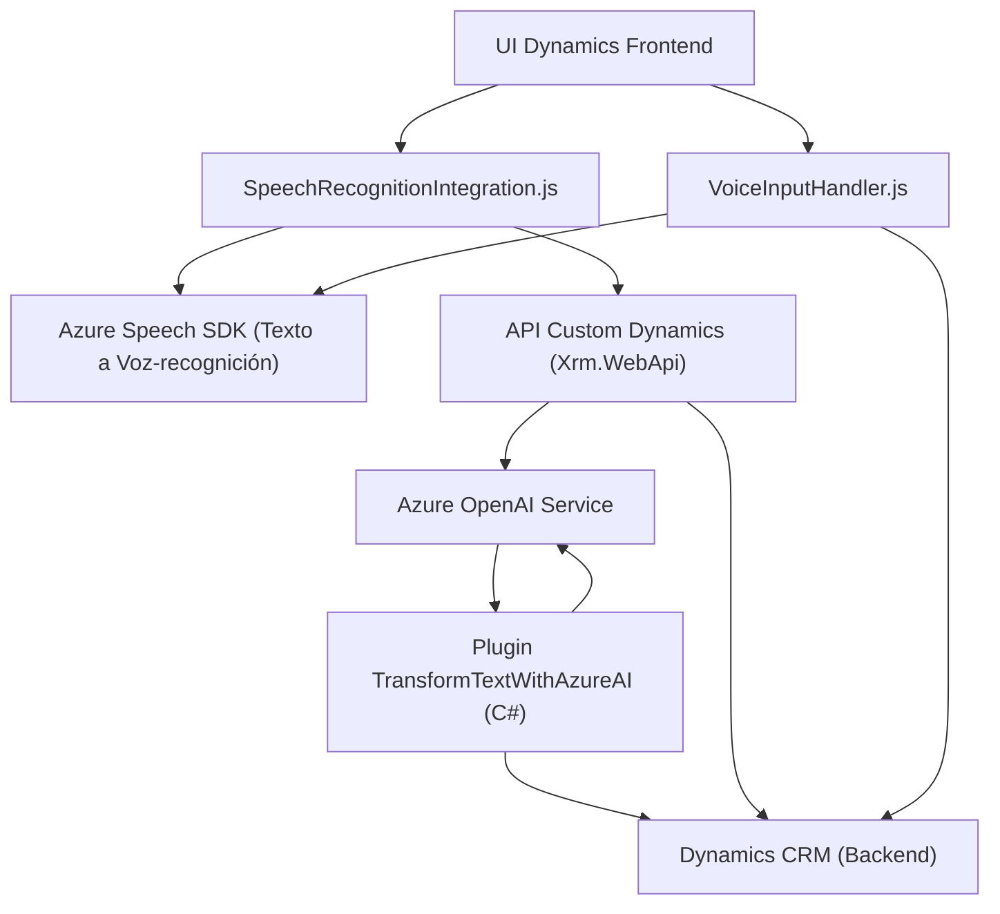

### Resumen técnico
El repositorio combina funcionalidades frontend (JavaScript) y backend (.NET C#). Está diseñado para integrar servicios de Microsoft Dynamics CRM/Dynamics 365 con servicios de Azure mediante SDK y APIs. Se enfoca en la interacción basada en voz y la inteligencia artificial para mejorar la experiencia de usuario en la gestión de formularios y datos.

### Descripción de arquitectura
La arquitectura observada es **n-capas**, con distinción entre el frontend (que interactúa directamente con el entorno Dynamics y el navegador) y el backend (que actúa como un plugin de Dynamics y consulta APIs externas como Azure Speech y Azure OpenAI). Se observa un alto nivel de integración con servicios de terceros, lo que lo orienta hacia una **arquitectura basada en servicios**.

### Tecnologías usadas
1. **Frontend:**
   - **JavaScript**
   - **Azure Speech SDK:** Para síntesis y reconocimiento de voz.
   - **Dynamics API (Xrm.WebApi):** Uso para integración directa con el entorno de Dynamics.
   - **Promesas/Asynchronous JavaScript:** Para manejo eficiente de las operaciones con SDK y APIs.
   - **Modularidad:** Organización funcional de métodos.

2. **Backend:**
   - **C# y .NET Framework:** Estructura del plugin basada en Microsoft Dynamics CRM.
   - **Azure OpenAI Service:** Para transformación de texto con IA usando reglas específicas.
   - **Newtonsoft.Json:** Para manejo de datos JSON estructurados (plugin Dynamics).
   - **System.Net.Http:** Para realizar solicitudes HTTP al servicio de Azure OpenAI.

### Patrones identificados
1. **Integración con API de terceros:** Uso extensivo de Azure SDK y APIs.
2. **Modularización:** Métodos separados por responsabilidades y funciones bien definidas.
3. **Command Pattern:** Procesamiento de comandos de voz y texto para accionar en formularios.
4. **Carga dinámica de dependencias:** (en frontend) para reducir el tiempo de carga inicial y optimizar recursos.
5. **Plugin-Based Architecture:** Uso del patrón específico de Dynamics CRM para abstracción y extensibilidad en el backend.
6. **Async/Await:** Para manejo de operaciones asíncronas en multitud de casos.

### Diagramas Mermaid
El siguiente diagrama muestra la interacción y los flujos entre los diferentes componentes y servicios del proyecto.

### Conclusión final
El repositorio está diseñado como una solución **integrada** de Dynamics 365, habilitando funciones innovadoras de reconocimiento de voz y procesamiento de texto mediante IA y capacidades cloud ofrecidas por Azure. La arquitectura es n-capas, con elementos descentralizados (como SDK externos de Azure) adaptados a las necesidades de Dynamics. Es un modelo que facilita escalabilidad y extensibilidad.

El diseño modular, la estructura n-capas y la integración con servicios externos permiten que esta solución sea altamente adaptable y escalable en entornos empresariales en busca de automatización basada en IA. Además, el uso estratégico de patrones como la delegación a servicios externos (Azure Speech y OpenAI) contribuye a mantener la separación de responsabilidades y la eficiencia del sistema.