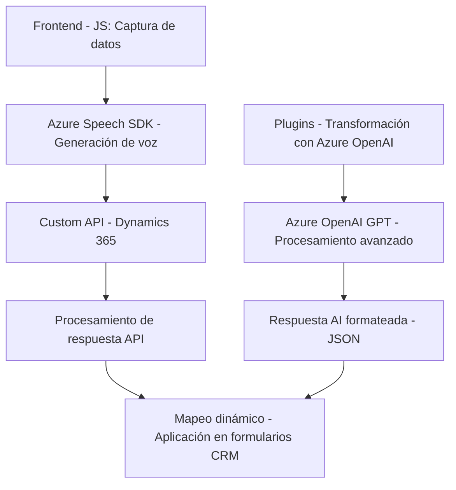

### Breve Resumen Técnico
El repositorio presentado implementa una solución que integra un **frontend dinámico con funciones de procesamiento de voz** mediante el **Azure Speech SDK** y servicios CRM como **Microsoft Dynamics 365**. El back-end incluye un **plugin para interacción con Azure OpenAI GPT**, usado para transformar datos textuales en objetos JSON estructurados, enviables y procesables dentro de la instancia CRM.

---

### Descripción de la Arquitectura
La arquitectura del proyecto está basada en el uso de **módulos funcionales** en el frontend para gestionar eventos, servicios externos y la interacción dinámica con formularios en Dynamics 365. Por otro lado, el código backend (plugin para Dynamics CRM) sigue un patrón **SOA (arquitectura orientada a servicios)**. La separación de funciones entre procesamiento de datos en el frontend y generación de objetos transformados en el backend indica una solución **n capas**:

1. **Frontend (capa de presentación):**
   - Implementa funcionalidad para capturar datos de formularios y procesar interacciones con voz utilizando el **Azure Speech SDK**.
   - Los datos capturados o procesados son enviados a servicios externos como **Custom APIs** y al backend para transformación adicional y normalización.

2. **Backend (capa de lógica de negocio):**
   - Define plugins que envían datos a Azure OpenAI para aplicar reglas y normalizaciones.
   - Devuelve los resultados al contexto CRM en forma de objetos estructurados.

---

### Tecnologías y Frameworks Usados
1. **Frontend:**
   - **Azure Speech SDK**: Para el reconocimiento y síntesis de voz.
   - **Event-driven programming**: Callbacks y el método `recognizer.recognizeOnceAsync` para gestionar eventos de procesado de voz.

2. **Backend:**
   - **Microsoft CRM SDK**: Para interacción con Dynamics 365.
   - **Azure OpenAI GPT API**: Dedicado al procesamiento de texto (transformación a JSON estructurado).
   - Lenguajes y librerías:
     - **C#**: Lenguaje de programación.
     - **System.Net.Http** para la comunicación con el servicio Azure OpenAI.
     - **Newtonsoft.Json.Linq** y **System.Text.Json** para procesamiento de datos JSON.

3. **Patrones de diseño:**
   - **Modular Programming**: Se implementan funciones autónomas y reutilizables dentro del código.
   - **SOA (Service-Oriented Architecture)**: El sistema depende de servicios externos (Azure Speech SDK, OpenAI API, Custom APIs de Dynamics).
   - **Plugin Pattern**: En el backend para personalizar el comportamiento de Dynamics CRM.

---

### Diagrama Mermaid
A continuación, se presenta un diagrama **Mermaid** que describe la interacción entre los componentes del sistema:

---

### Conclusión Final
El repositorio representa una solución basada en **JS para el frontend** y **C# para el backend**, con integración profunda de servicios en la nube como Azure Speech SDK y Dynamics CRM. Utiliza patrones modernos como **n capas** y **SOA** para garantizar modularidad y escalabilidad. La dependencia externa clave (Azure Speech y OpenAI) facilita el acceso a tecnologías avanzadas de IA y voz, pero introduce el desafío de manejo de costos y disponibilidad en estos servicios. Una recomendación sería mejorar la asynchronía en el backend para evitar bloqueos durante llamadas HTTP.