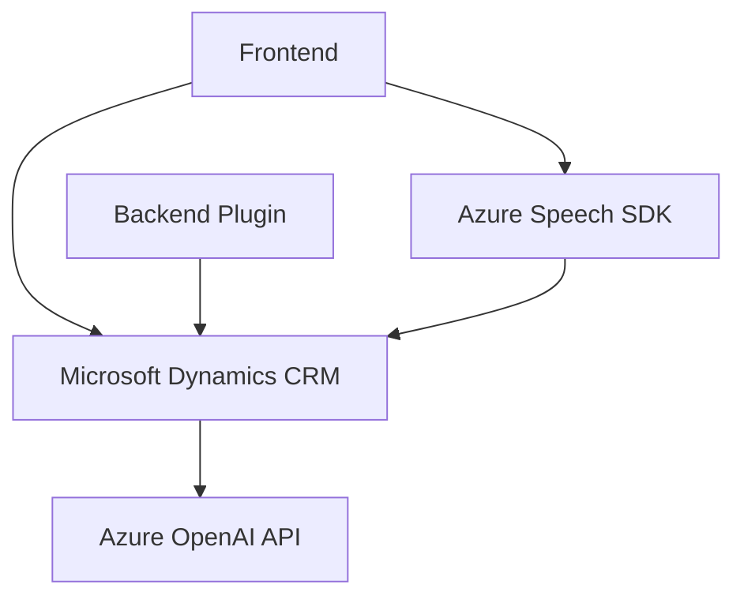

## Breve resumen técnico:

Este repositorio contiene una solución híbrida compuesta por componentes para frontend y backend. El frontend maneja procesos relacionados con formularios y síntesis/entrada de voz, utilizando el Azure Speech SDK en un entorno JavaScript. El backend incluye un plugin para Microsoft Dynamics CRM que realiza transformaciones de texto hacia estructuras JSON mediante la API de Azure OpenAI.

---

## Descripción de arquitectura:

La arquitectura básica parece seguir un modelo de **n capas** para gestionar la separación lógica de los componentes frontend y backend. La solución integra servicios externos (principalmente Azure Speech SDK y Azure OpenAI API) como parte fundamental del procesamiento y síntesis de datos.

El frontend maneja interacción del usuario con formularios personalizados y conecta con APIs como parte de un flujo que involucra interpretación de datos. El backend se integra con Microsoft Dynamics CRM y sirve como un punto de interacción entre el sistema CRM y el servicio de inteligencia artificial de Azure.

---

## Tecnologías usadas:

1. **Frontend:**
   - **JavaScript**: Implementación de lógica para procesar formularios y trabajar con Azure Speech SDK.
   - **Azure Speech SDK**: Un SDK para trabajar con servicios de síntesis y reconocimiento de voz.
   - **Dynamics CRM Web API**: Plataforma de datos para formularios y entidades CRM.

2. **Backend:**
   - **C#**: Desarrollo del plugin para integrarse con Dynamics CRM.
   - **Microsoft.Xrm.Sdk**: Interacción directa con el modelo de datos de Dynamics CRM.
   - **Azure OpenAI API**: Usada para transformar texto en JSON estructurado mediante modelos de lenguaje.
   - **System.Net.Http**: Para realizar solicitudes HTTP a la API de Azure.
   - **Serialization frameworks**: `System.Text.Json` y `Newtonsoft.Json` para serialización y manejo de JSON.

3. **Integraciones externas:**
   - `Azure Speech Service` y `Azure OpenAI Service`: Por medio de SDK y API.

---

## Diagrama Mermaid GitHub Markdown:

---

## Conclusión final:

El repositorio hace uso de una arquitectura de **n capas** con implementación híbrida (frontend y backend) donde el frontend actúa como cliente de los servicios externos para el procesamiento y síntesis de voz. El backend, por su parte, opera dentro del ecosistema de plugins de Dynamics CRM y utiliza el servicio de Azure OpenAI para realizar operaciones avanzadas de conversión de texto.

Los aspectos positivos incluyen:
- **Modularidad:** Las funciones en el frontend están bien organizadas según roles, y el backend utiliza el patrón estándar de plugins.
- **Integración de servicios en la nube:** Se aprovecha Azure para proporcionar capacidades de voz y inteligencia artificial a la solución.
  
Sin embargo, puede haber riesgos relacionados con:
- **Seguridad:** Las configuraciones sensibles (como claves de Azure) no deben estar codificadas directamente.
- **Escalabilidad:** La arquitectura depende exclusivamente de servicios externos, lo que podría ser una limitación ante fallos en alguno de ellos.