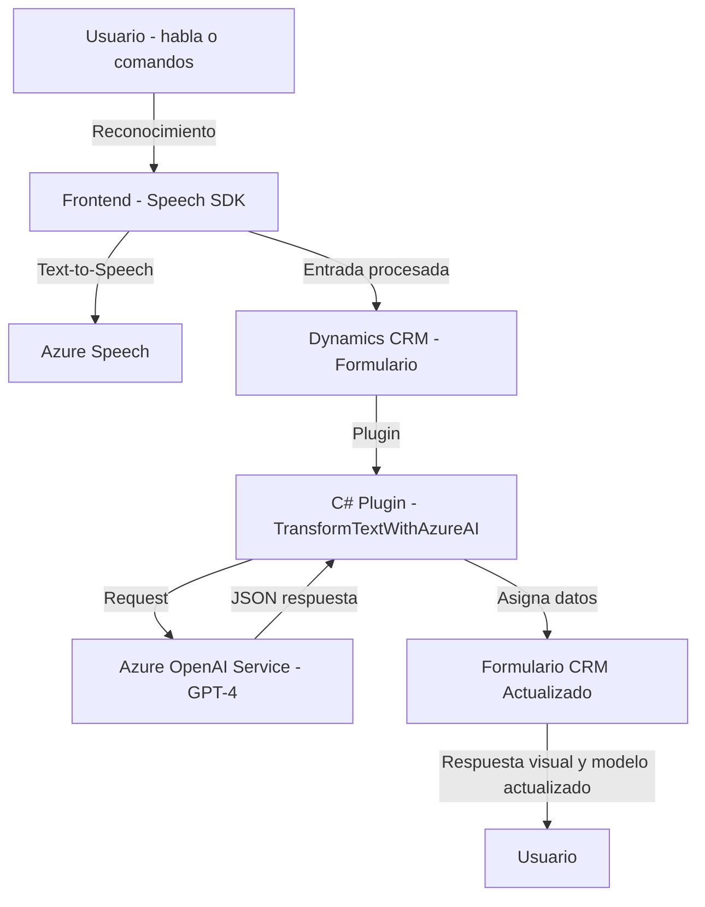

### Breve Resumen Técnico
El repositorio describe una solución que integra reconocimiento y síntesis de voz con un sistema CRM (probablemente Microsoft Dynamics), utilizando el Azure Speech SDK. Además, incluye un plugin para transformar texto mediante Azure OpenAI, lo que indica capacidades avanzadas de IA. Por tanto, la solución está orientada a interacción con formularios por voz y procesamiento cognitivo del texto asociado.

---

### Descripción de Arquitectura
1. **Arquitectura General**: La solución sigue una arquitectura de componentes desacoplados basada en eventos y comunicación API, lo que la posiciona dentro de un modelo de **n capas**:
   - **Capa Frontend**: Maneja interacción con el usuario y el Speech SDK en un entorno dinámico.
   - **Capa Backend/CRM**: Implementa plugins y APIs para integración con sistemas ricos en datos y procesamiento basado en IA.
   - **Capa Externa/Servicios**: Altamente dependiente de servicios en la nube como Azure Speech y Azure OpenAI.
   
2. **Modelo de diseño del código**:
   - Modular: Las funciones están bien segmentadas para procesar tareas específicas.
   - Basado en SDK: Interacción directa con servicios externos (Azure Speech y Dynamics CRM).
   - Orientación a eventos: El flujo de entrada y salida de datos es activado según estados del sistema.

3. **Escalabilidad**: La arquitectura es fácilmente escalable mediante el uso de servicios en la nube y plugins desacoplados.

---

### Tecnologías Usadas
1. **Frontend**:
   - **JavaScript**: Uso de Azure Speech SDK para crear procesos de síntesis y entrada por voz.
   - **Microsoft Dynamics CRM Context API (executionContext)**: Integra datos de formularios dinámicos.
   
2. **Backend**:
   - **C#/.NET**: Implementa plugins de Dynamics CRM en la capa backend.
   - **Azure OpenAI**: Configurado para procesar texto y responder con transformaciones profundas.
   
3. **Servicios Externos**:
   - **Azure Speech SDK**: Manejo de entrada (reconocimiento de voz) y salida (Text-to-Speech).
   - **Azure OpenAI Service**: Inteligencia artificial avanzada para transformar texto.

4. **Frameworks y Librerías**:
   - Integración con Dynamics CRM SDK (`Microsoft.Xrm.Sdk` y otros namespaces).
   - `Newtonsoft.Json.Linq` y `System.Text`: Para manipulación de datos JSON.

---

### Dependencias o Componentes Externos
- **Azure Speech SDK**: Para reconocimiento y síntesis de voz.
- **Azure OpenAI Service**: Inteligencia artificial avanzada (GPT-4).
- **Microsoft Dynamics CRM SDK APIs**: Para manejar atributos y operaciones internas del sistema CRM.
- **APIs HTTP configuradas**: Configuraciones específicas de endpoints de Azure servicios.

---

### Diagrama Mermaid

---

### Conclusión Final
La solución descrita en el repositorio es un **sistema CRM ampliado por inteligencia artificial e interacción por voz**, que genera una experiencia más natural para los usuarios, optimizando la entrada y salida de datos mediante Azure Speech y OpenAI. La arquitectura modular basada en servicios en la nube y SDKs garantiza escalabilidad y mantenibilidad. 

Potencialmente, esta solución puede extenderse para soportar más operaciones multilingües, comandos extendidos y mayor personalización según los modelos de OpenAI configurados. Las dependencias externas son clave, y el desacoplamiento logrado con plugins y procesos es una buena señal de diseño robusto.