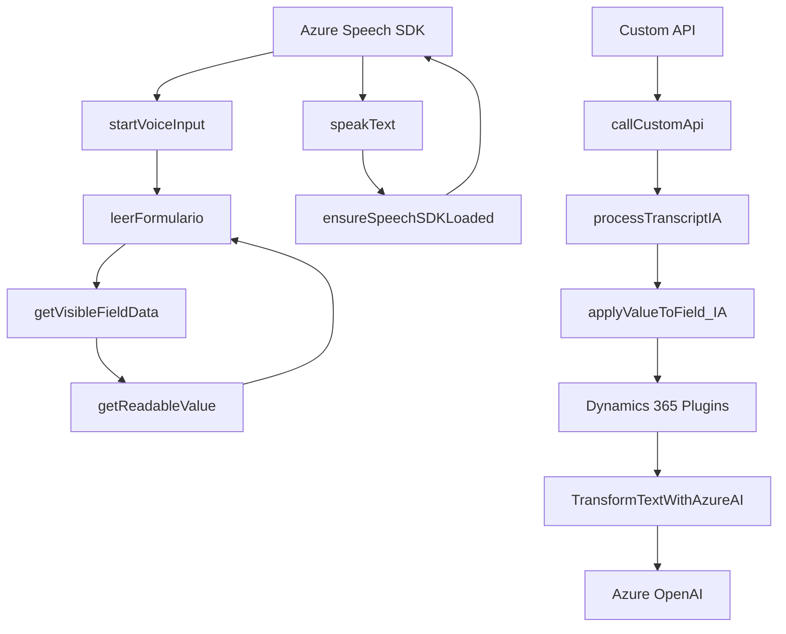

### Breve resumen técnico
El repositorio contiene un conjunto de archivos enfocados en la implementación de funcionalidades relacionadas con formulación dinámica, síntesis y reconocimiento de voz, y transformación de texto usando servicios externos como Azure Speech SDK y Azure OpenAI. La solución está integrada con Microsoft Dynamics CRM y sigue principios de modularidad, encapsulación de responsabilidades específicas y patrones para la carga dinámica de dependencias externas.

---

### Descripción de arquitectura
- **Tipo de solución**: Es una combinación de un **frontend** en JavaScript que interactúa directamente con SDKs de Azure para voz/IA, y de componentes backend para potenciar la interacción con Dynamics CRM mediante plugins y servicios API.
- **Arquitectura general**: El diseño puede clasificarse como híbrido:
  - **Frontend**: Es modular con componentes individuales que manejan síntesis de voz, entrada de voz, y procesamiento dinámico de formularios.
  - **Backend**: Sigue una arquitectura basada en eventos, extendiendo funcionalidades CRM mediante plugins que interactúan con servicios externos (Azure OpenAI). Esto está enmarcado dentro del patrón de **Integración de API externa** y **plug-ins dinámicos**.
- **Patrones utilizados**:
  - Modularidad (frontend): Cada funcionalidad está encapsulada como una función diseñada para realizar tareas de forma independiente.
  - Lazy Loading: El SDK de Azure Speech se carga dinámicamente solo cuando es necesario para optimizar el rendimiento.
  - Dependency Injection: Claves, regiones y configuraciones necesarias para interactuar con APIs externas se inyectan directamente.
  - Transformation Pipeline (backend): El plugin aplica reglas de transformación a entrada textual, procesándola externamente con Azure OpenAI.

---

### Tecnologías usadas
1. **Frontend**:  
   - **JavaScript ES6**: utilizado para definición de funciones modulares y procesamiento dinámico de datos.
   - **Azure Speech SDK**: para reconocimiento y síntesis de voz.
   - **Dynamics 365 Context API (Xrm)**: integrado para obtener, manipular y actualizar datos del formulario CRM.
  
2. **Backend**:  
   - **C# (.NET)**: para implementación del plugin extendido en Dynamics CRM.
   - **Azure OpenAI**: API utilizada para transformación avanzada de texto basado en GPT-4.
   - **Newtonsoft.Json**: librería de manipulación y serialización JSON.
   - **System.Net.Http**: para integración HTTP con servicios externos.

---

### Diagrama Mermaid válido para GitHub Markdown

---

### Conclusión final
El repositorio implementa una solución completa para reconocimiento de voz, síntesis y procesamiento de datos en ambientes CRM (Dynamics 365). Utiliza Azure Speech SDK en el frontend para interactuar de manera inteligente con formularios, mientras que en el backend emplea Azure OpenAI para transformación avanzada de texto. La arquitectura sigue principios de modularidad y escalabilidad, aprovechando patrones modernos como lazy loading, inyección de dependencias y procesamiento externo vía API.

Se recomienda optimizar la configuración dinámica para los servicios externos (clave Azure OpenAI, regiones dinámicas para Speech SDK) para facilitar despliegues multiambiente y evitar la rigidez en producción. La solución es eficaz para entornos corporativos que buscan automatizar tareas relacionadas con voz y texto utilizando plataformas CRM.