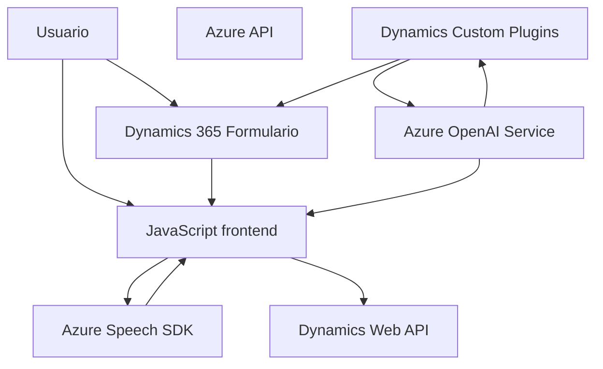

### Análisis Técnico del Repositorio

#### 1. **Tipo de Solución**
Este repositorio es un **integrador para Dynamics 365** que combina funciones mediante un frontend en JavaScript para interacción en formularios, junto con **plugins backend en C#**. Además, utiliza servicios externos (Azure Speech SDK y Azure OpenAI Service) para síntesis de voz y procesamiento de texto. Esto lo clasifica como una solución híbrida orientada a **extensiones** de un sistema como Dynamics 365.

---

#### 2. **Tecnologías, Frameworks y Patrones**
**Tecnologías Utilizadas**:
- **Frontend**:
  - **JavaScript** para lógica de interacción y discurso.
  - **Azure Speech SDK**: Como biblioteca para síntesis de voz y transcripciones.
  - Interacción directa con **Dynamics 365 Web APIs**.
  
- **Backend**:
  - **C# Plugins**: Extensiones integradas en Dynamics 365.
  - **SDK de Microsoft Dynamics CRM** para manejar entidades y lógica del sistema.
  - **Azure OpenAI Service API** para manipulación y transformación del texto.
  - **System.Net.Http** para solicitudes HTTP.

**Patrones de Diseño Implementados**:
- **Event-Driven Architecture**: El sistema reacciona basado en eventos como entrada de voz o campos visibles detectados.
- **Facade Pattern**: En el frontend, métodos como `ensureSpeechSDKLoaded` encapsulan la interacción con el SDK externo.
- **Adapter Pattern**: En el backend, se acopla el CRM con Azure OpenAI Service para interoperabilidad.
- **Modular Design**: Cada archivo y función procesa responsabilidades independientes.

---

#### 3. **Arquitectura**
El sistema presenta una arquitectura de **n capas**:
1. **Capa de Integración Frontend (JavaScript)**:
   - Actúa en el navegador, interactuando directamente con el usuario y los formularios de Dynamics.
   - Procesa síntesis de voz y manipulación de datos formateados.
   
2. **Capa de Integración Backend (Plugins en C#)**:
   - Extensión directa de Dynamics CRM mediante plugins para lógica personalizada.
   - Comunicación con Azure OpenAI Service para procesar comandos y ejecutarlos dentro del sistema.
   
3. **Capa de Servicios Externos**:
   - Integración a través de HTTP hacia APIs externas como Azure APIs.

En resumen, la solución es de naturaleza híbrida, combinando módulos frontend con extensiones backend de Dynamics 365, operando bajo una arquitectura **n capas** que incluye integración cloud (SOA).

---

#### 4. **Dependencias y Componentes Externos**
- **Azure Speech SDK**: Para transcripción de voz y síntesis de texto en sonido.
- **Azure OpenAI Service**: Motor de procesamiento de texto para transformar comandos en JSON estructurado.
- **Dynamics 365 Web APIs**: Para interacción interna con la plataforma CRM.
- **C# Dynamics Plugin SDK**: Extensiones para lógica de negocio en el backend del sistema.
- **Librerías .NET**:
  - `System.Net.Http`: Comunicación HTTP con Azure OpenAI Service.
  - `Newtonsoft.Json.Linq` para serialización JSON.

---

#### 5. **Diagrama Mermaid**

---

### Conclusión Final
Este repositorio implementa una solución robusta de extensiones para Dynamics 365, interactuando simultáneamente con servicios de Azure. La arquitectura es de tipo n capas, apoyada por patrones de modularización y acoplamiento bajo demandas específicas del sistema. Aunque presenta una integración eficiente, puede beneficiarse de más configurabilidad para entornos con múltiples claves o regiones. Además, áreas como manejo avanzado de errores o autenticación externa con roles específicos podrían ser puntos clave para futuras mejoras.