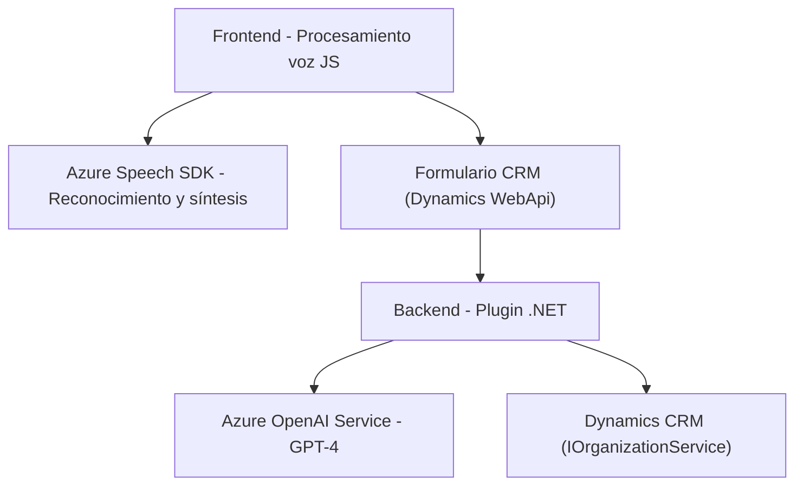

### Breve resumen técnico

El repositorio descrito implementa funcionalidad para gestionar procesamiento de datos basado en voz y texto, enlazado con formularios CRM. Utiliza tecnologías de reconocimiento de voz, integración con APIs externas como Azure Speech y Azure OpenAI GPT-4, y patrones arquitectónicos para el manejo robusto de flujos de datos.

### Descripción de arquitectura

#### Tipo de solución:
Este repositorio combina múltiples componentes que sugieren una solución orientada a una arquitectura **n capas**, que incluye:
1. **Frontend web (JavaScript)**: Procesamiento de voz y datos interactivos.
2. **Integración con servicios externos**:
   - APIs de Azure Speech para reconocimiento y síntesis.
   - Azure OpenAI para transformación de textos con IA.
3. **Backend dinámico en CRM**: Plugins (.NET) que actúan como extensiones dentro de Dynamics CRM para procesar datos de manera especializada.

#### Arquitectura:
- La solución tiene una **arquitectura distribuida**:
   - **Frontend interactivo** con procesamiento en el navegador.
   - **Capas de servicios**: Integración directa con APIs externas (Azure Speech, OpenAI).
   - **Extensiones Backend tipo plugin**, acopladas al CRM mediante interfaces como `IPlugin`.

#### Patrones:
- **Callback y Promesas** para gestión de flujo asíncrono en JS.
- **Plugin Pattern** en el backend .NET (dentro de una estructura de CRM).
- Modulares y orientados a propósito específico:
   - Captura y procesamiento de datos según contexto.
   - Gestión condicional de tipos y estructuras de datos.
   - Transformación de texto vía IA.

### Tecnologías usadas
1. **Frontend (JavaScript):**
   - **Azure Speech SDK**:
     - Reconocimiento de voz.
     - Síntesis de texto en audio.
   - **Promesas async/await** para operaciones asíncronas.
   - **Xrm.WebApi**: Funciones para interactuar con datos del CRM.
   
2. **Plugins Backend (.NET):**
   - **Microsoft Dynamics SDK**:
     - Extensiones CRM mediante Microsoft.Xrm.Sdk.
     - Manejo del contexto organizacional CRM.
   - **Azure OpenAI**:
     - Uso de GPT-4 para transformación avanzada de texto.
   - **Libraries JSON**:
     - Newtonsoft.Json y System.Text.Json para manejo de datos JSON.
     - System.Net.Http para interacción con APIs externas.

3. **Servicios externos:**
   - Azure Speech API.
   - Azure OpenAI API.

### Diagrama Mermaid

### Conclusión

Este sistema se centra en el enriquecimiento de formularios interactivos mediante voz y procesamiento de texto en CRM. Colabora con servicios cloud integrales como Azure Speech y OpenAI GPT-4 para proporcionar funcionalidades avanzadas. Adopta una arquitectura modular y distribuida con **procesamiento descentralizado** entre frontend y plugins backend, asegurando escalabilidad y adaptabilidad en contextos CRM.