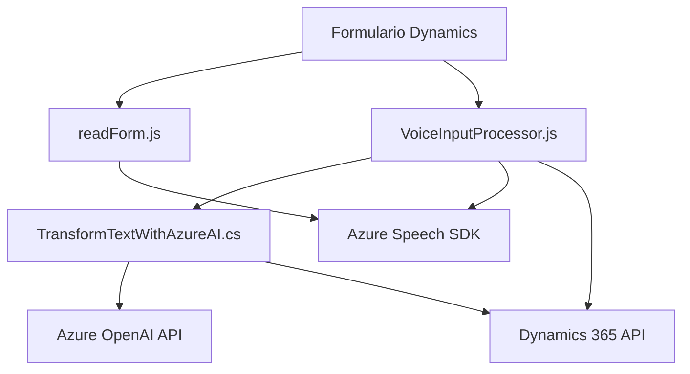

### Breve resumen técnico
Este repositorio implementa una solución robusta para la integración de capacidades de entrada y salida de voz con formularios en Microsoft Dynamics 365, utilizando Azure Speech SDK y un plugin personalizado para transformar texto mediante Azure OpenAI. La solución está repartida entre varias capas, incluyendo una para el frontend y otra para el backend, que interactúan de manera armónica.

---

### Descripción de arquitectura
La solución sigue una arquitectura **n capas**, donde los módulos están organizados en lógica de frontend (manipulación del DOM y llamadas a SDKs externos), integración con APIs externas (Azure Speech SDK), y una capa backend para lógica empresarial en forma de plugins sobre Dynamics CRM. También se observa el uso de componentes reutilizables y la integración con servicios en la nube como Azure OpenAI y Azure Speech SDK.

---

### Tecnologías usadas
1. **Frontend**
   - **JavaScript**: Para el manejo del DOM, integración con Azure Speech SDK y gestión del contexto del formulario de Dynamics 365.
   - **Azure Speech SDK**: Para la síntesis de voz y el reconocimiento de voz.
   - **Dynamics 365 SDK**: API para manipular datos y formularios en Dynamics 365.

2. **Backend**
   - **C#**: Lógica para el plugin de Dynamics CRM.
   - **Azure OpenAI API**: Transformación de texto en JSON estructurado.
   - **Newtonsoft.Json y System.Text.Json**: Librerías para el manejo avanzado de JSON.
   - **HttpClient**: Para integraciones con APIs externas.

3. **Patrones**
   - **Encapsulación y modularidad**: Funciones bien definidas y separadas por responsabilidad específica.
   - **Service Integration**: Uso de SDKs y APIs externos para extender capacidades del sistema.
   - **Event-driven**: Invocaciones basadas en eventos (callbacks, contextos de ejecución).
   - **Lógica plugin-based**: Extensión mediante `IPlugin` de Dynamics CRM.

---

### Diagrama Mermaid válido para GitHub

---

### Conclusión final
Esta solución representa una arquitectura sólida y perfectamente integrada para extender las capacidades de Microsoft Dynamics 365 con reconocimiento y síntesis de voz mediante Azure Speech SDK, y transformación avanzada de texto mediante Azure OpenAI. La organización de la solución en diferentes capas asegura modularidad, escalabilidad y reusabilidad, alineándose con los mejores principios de desarrollo de software empresarial. Sin embargo, se puede mejorar la seguridad al externalizar claves y configuraciones sensibles a un archivo de configuración seguro o a un servicio de gestión de secretos.