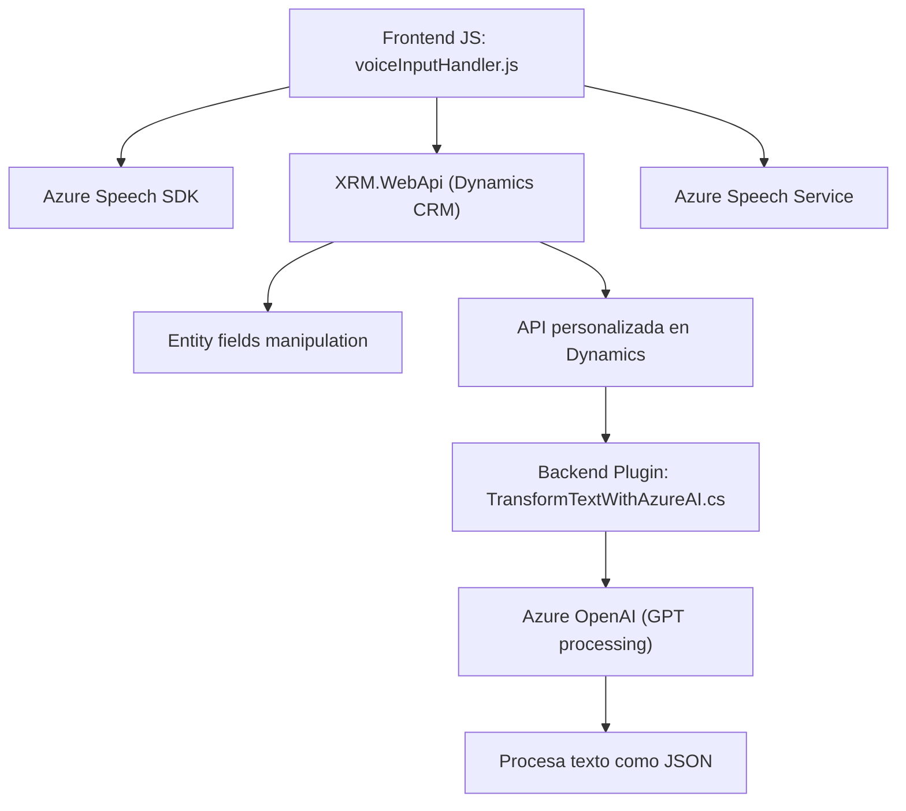

### Breve resumen técnico
El repositorio corresponde a una solución que implementa funcionalidades relacionadas con entrada de voz, síntesis de voz, y procesamiento de texto con inteligencia artificial. Utiliza servicios externos como Azure Speech SDK y Azure OpenAI, y se integra con Dynamics CRM para manipulación y actualización de formularios. La solución combina lógica de frontend (JavaScript) con un plugin backend (C#) para habilitar estas capacidades avanzadas.

---

### Descripción de la arquitectura
La arquitectura es **n-capas**:
- **Capa de presentación con frontend en JS:** Gestiona los eventos relacionados con la entrada/salida de voz y procesa datos provenientes del SDK y del usuario.
- **Capa lógica backend:** Desarrollada como un plugin de Dynamics CRM (`TransformTextWithAzureAI.cs`) para realizar operaciones avanzadas de transformación de texto mediante Azure OpenAI y proporcionar los resultados al sistema.
- **Capa de servicios externos:** Se integra con Azure Speech SDK para la entrada de voz y síntesis de texto en voz, y con Azure OpenAI para procesamiento de texto y generación de respuestas.

La solución tiene un enfoque modular, desacoplando las funcionalidades principales en componentes individuales para facilitar la reutilización de funcionalidades (por ejemplo, métodos de síntesis y reconocimiento de voz).

---

### Tecnologías usadas
1. **Frontend:**
   - JavaScript: Implementación modular y asíncrona para realizar la lógica del cliente.
   - Azure Speech SDK: Utilizado para entrada y salida de voz.
   - Dynamics CRM API (XRM.WebApi): Para manipulación de datos del formulario.

2. **Backend:**
   - C# (.NET Framework): Desarrollo del plugin `TransformTextWithAzureAI`.
   - Azure OpenAI: Procesamiento de texto con GPT.
   - Newtonsoft.Json: Manejo de JSON para serialización en el plugin.
   - HTTP Libraries (System.Net.Http): Para llamadas a servicios externos.

3. **Servicios externos:**
   - Azure Speech: Procesamiento y generación de voz.
   - Azure OpenAI: Uso de GPT para procesamiento, normalización y mejorar datos.

4. **Patrones y diseño:**
   - Diseño modular y orientado a eventos.
   - N-capas (Frontend, Backend, Servicios externos).
   - Desacoplamiento mediante SDKs externos y APIs.
   - SRP (Principio de responsabilidad única) aplicado en funciones y métodos.

---

### Diagrama Mermaid válido para GitHub

---

### Conclusión final
La solución presentada es una implementación **n-capas** que conecta un frontend (JavaScript) para la interacción del usuario con un backend (C#) manejado por Dynamics CRM. Integra servicios avanzados de Microsoft Azure como Speech SDK y OpenAI para funcionalidad de voz y procesamiento inteligente de datos.

Este diseño modular y desacoplado aprovecha buenas prácticas como el principio de responsabilidad única y comunicación síncrona/asíncrona entre capas y servicios, haciendo de esta una solución altamente extensible y adecuada para los requerimientos de un sistema de CRM con capacidades cognitivo-inteligentes.