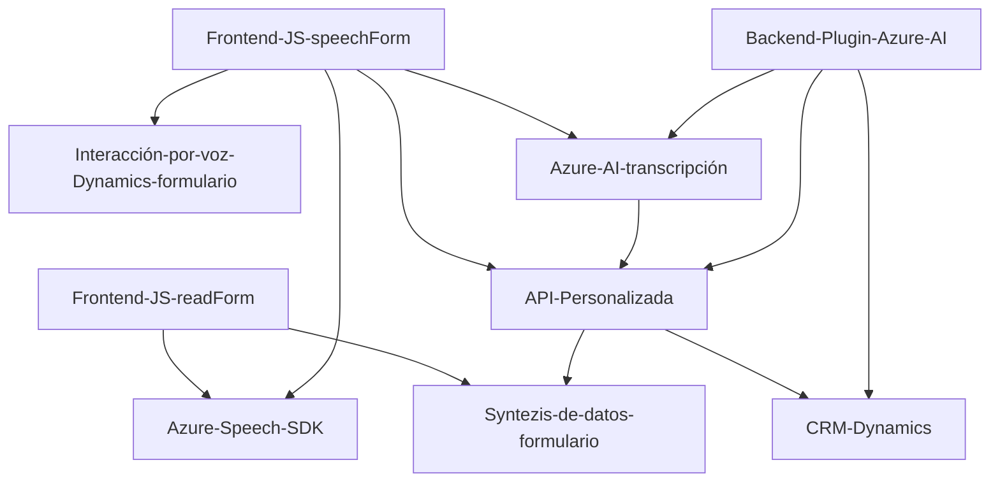

## Breve resumen técnico

El repositorio contiene varios archivos que indican una solución orientada a la interacción de voz y texto en un entorno CRM como Dynamics 365. Los componentes principales incluyen:

1. **Frontend/JS/readForm.js**: Proporciona funcionalidades para la síntesis de datos visibles en formularios utilizando Azure Speech SDK.
2. **Frontend/JS/speechForm.js**: Encapsula lógica de entrada y reconocimiento de voz, además de interactuar con Custom APIs para procesamiento avanzado de las transcripciones mediante Azure OpenAI.
3. **Plugins/TransformTextWithAzureAI.cs**: Define un plugin de Dynamics 365 que transforma textos en estructuras JSON utilizando Azure OpenAI.

---

## Descripción de arquitectura

La arquitectura del sistema tiene características modulares que dividen responsabilidades de manera lógica:

- **Frontend**:
  - Contiene lógica client-side para la síntesis y reconocimiento de voz, y solicitudes HTTP a Custom APIs para procesamiento adicional mediante inteligencia artificial.
  - Se observa un patrón de modularidad y uso eficiente de servicios externos dentro del entorno de Azure.

- **Backend**:
  - Usa plugins personalizados de Dynamics 365 para procesamiento avanzado y Transformación de datos textuales, con un enfoque centralizado en lógica de negocio dentro del CRM.

Esta solución se alinea con una arquitectura **n capas**, donde las responsabilidades están organizadas entre:
- **Capa de presentación**: Interacción con el usuario (sistemas frontend, lectura de formularios).
- **Capa de negocio**: Plugins personalizados para integrar procesamiento con servicios de Azure.
- **Capa de datos**: Interacción con el CRM Dynamics 365 y posibles servicios externos como Azure Speech SDK y OpenAI.

---

## Tecnologías usadas

1. **Azure Speech SDK**:
   - Síntesis de voz desde formularios y reconocimiento de voz usando capacidades de Azure, cargado dinámicamente en el frontend.

2. **Azure OpenAI**:
   - Utilizado en plugins para transformar textos según normas predefinidas, obteniendo estructuras JSON optimizadas.

3. **Dynamics 365 CRM**:
   - Interacción directa con formularios y entidades vía `Microsoft.Xrm.Sdk`.

4. **JavaScript**:
   - Carga dinámica de SDKs, gestión de datos en frontend y comunicación con APIs.

5. **C#**:
   - Implementación de plugins para extender las capacidades del CRM.

---

## Diagrama Mermaid válido para GitHub

---

## Conclusión final

La solución está diseñada para integrar funcionalidades avanzadas de reconocimiento de voz y procesamiento de lenguaje natural con un CRM como Dynamics 365. Utiliza un enfoque **n capas** eficiente, donde cada nivel cumple con responsabilidades específicas sin generar dependencia directa entre módulos. Esto mejora la modularidad y la escalabilidad del sistema.

Los patrones detectados, como **Facade**, **Data Mapper** y **Dependency Injection**, indican un diseño sólido y reutilizable para el procesamiento de datos y generación de valor en entornos corporativos como Dynamics 365.

Con una combinación de tecnologías modernas, este repositorio aprovecha las capacidades de Azure AI y Azure Speech SDK para crear una experiencia enriquecida orientada al usuario.