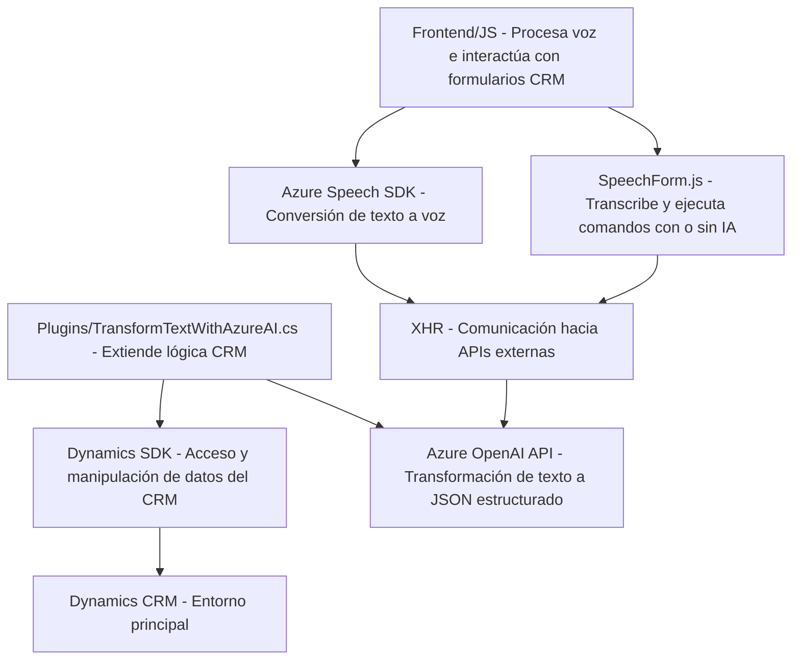

## Breve resumen técnico

El repositorio tiene archivos diseñados para integrar funcionalidades de reconocimiento y síntesis de voz con Azure Speech SDK y procesamiento de comandos mediante APIs en un entorno Dynamics 365 CRM. Además, utiliza Azure IA (OpenAI) para transformar texto en un formato estructurado. Combina tecnologías de frontend (JavaScript), backend basado en plugins .NET y servicios de IA alojados en Azure.

---

## Descripción de arquitectura

La arquitectura sigue un modelo **n-capas**:
1. **Capa de presentación**: Los archivos en la carpeta `FRONTEND` interactúan con formularios web del CRM y procesan voz usando AJAX y Azure Speech SDK. También manejan la lógica de mapeo y procesamiento de datos de entrada.
2. **Capa de negocio**: El archivo `TransformTextWithAzureAI.cs` actúa como un plugin que transforma texto de entrada mediante Azure OpenAI y ejecuta reglas de negocio específicas dentro de Dynamics CRM.
3. **Capa de integración**: Tanto los archivos del frontend como el plugin en .NET dependen de APIs externas (Azure Speech y Azure OpenAI) para interactuar con servicios de IA y convertir texto en voz o JSON estructurados.

Esta estructura fomenta la separación de responsabilidades y modularidad.

---

## Tecnologías usadas

1. **Frontend**:
   - **HTML DOM API**: Manipulación dinámica de formularios en el CRM utilizando JavaScript para interactuar con Azure Speech SDK.
   - **Azure Speech SDK**: Reconocimiento y síntesis de voz.
   - **AJAX XMLHttpRequest**: Para integrarse con APIs externas.

2. **Backend**:
   - **Microsoft Dynamics SDK** (namespace `Microsoft.Xrm.Sdk`): Extensión de lógica de negocio en el CRM.
   - **Azure OpenAI**: Modelo GPT-4 para transformar texto.
   - **C#** para el desarrollo de plugins.

3. **Servicios externos**:
   - Azure resources (Speech y OpenAI APIs).

4. **Patrones**:
   - **Dynamic Loader Pattern**: Dinámica al cargar scripts externos en `ensureSpeechSDKLoaded`.
   - **Plugin Pattern**: En la implementación de extensiones en el archivo C# para Dynamics CRM.

---

## Diagrama Mermaid válido para GitHub Markdown

---

## Conclusión final

La solución está diseñada para integrar capacidades de voz e inteligencia artificial con un entorno CRM basado en Dynamics 365. Combina funcionalidades de frontend dinámico con elementos de backend en forma de plugins. La arquitectura es modular (n-capas), utilizando tecnologías modernas como Azure Speech SDK y servicios de OpenAI para enriquecer las interacciones con comandos de voz y reglas de negocio dentro del CRM. Esto permite que el sistema sea extensible y evolutivo para escenarios de automatización y procesamiento avanzados.