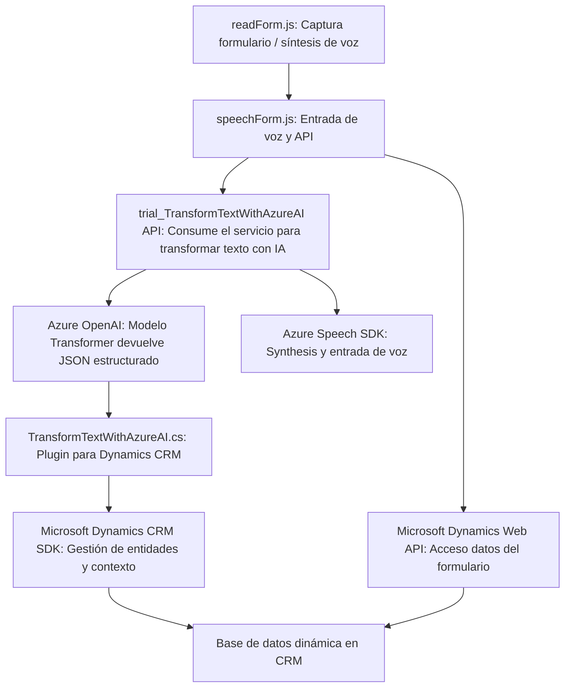

### **Análisis técnico del repositorio:**

#### **1. Tipo de solución**
La solución parece ser un sistema **integrado con Microsoft Dynamics 365**, compuesto por una **parte de front-end para la interacción con usuarios** y una **API/plugin en el backend para procesamiento avanzado con Azure OpenAI**. Principalmente:
- **Frontend (`readForm.js`, `speechForm.js`)**: Enfocado en la captura directa de datos desde un formulario y el uso del reconocimiento de voz basado en **Azure Speech SDK** para interactuar con los campos del formulario y generar acciones en Dynamics 365. También se realiza el consumo de una API personalizada alojada en Azure.
- **Backend (`TransformTextWithAzureAI.cs`)**: Implementa un plugin para Dynamics CRM que habilita interacciones con **Azure OpenAI** para transformar texto dinámicamente y devolver un JSON estructurado.

---

#### **2. Tecnologías, frameworks y patrones**
##### **Tecnologías utilizadas:**
- **Frontend:**
  - **Microsoft Dynamics 365**: La solución interactúa con formularios dinámicos de la plataforma.
  - **Azure Speech SDK**: Para la entrada y síntesis de voz.
  - **Dynamics Web API (`Xrm.WebApi`)**: Acceso a datos de entidades en Dynamics 365 desde el frontend.
  - **Custom API**: Proporciona procesamiento avanzado del texto mediante una integración con **Azure AI**.

- **Backend:**
  - **Microsoft Dynamics CRM SDK (IPlugin, IOrganizationService)**: Se usa programación basada en plugins para implementaciones específicas dentro del sistema CRM.
  - **Azure OpenAI API**: Para transformar texto y devolver un JSON estructurado.
  - **Newtonsoft.Json**: Para el manejo y procesamiento de datos JSON en C#.
  - **System.Net.Http**: Para realizar solicitudes HTTP.
  - **System.Text.Json**: Para serialización y deserialización de objetos en C#.

##### **Patrones utilizados:**
- **Modularización Funcional**: El código tanto del frontend como del backend está dividido en funciones y métodos con alta cohesión y responsabilidad única.
- **Delegación Asíncrona**:
  - Frontend: `ensureSpeechSDKLoaded` delega al callback la lógica principal tras cargar dinámicamente el SDK.
  - Backend: `GetOpenAIResponse` maneja las interacciones externas encapsuladas en su lógica.
- **Microservicio de Backend y API Gateway**:
  - El backend actúa como un servicio o gateway para Azure OpenAI, transformando texto y devolviendo resultados.
  - La API personalizada `trial_TransformTextWithAzureAI` se consume desde el frontend.
- **Event-driven Architecture**:
  - En el frontend, muchos procesos como reconocimiento de voz o síntesis están impulsados por eventos.
- **Plugin Pattern (Backend)**: Uso de la interfaz `IPlugin` para extender funcionalidades dentro de Dynamics CRM.
- **Facade Pattern**: El plugin encapsula la interacción con Azure OpenAI mediante una lógica bien definida.

---

#### **3. Tipo de arquitectura**
Esta solución tiene componentes con arquitectura mixta:
- **N-capas**:
  - El frontend interactúa con botones y formularios en Dynamics 365, mientras el backend proporciona procesamiento en Azure OpenAI.
  - Cada capa comunica a través de APIs (como Dynamics Web API, Azure Speech SDK y el plugin en Dynamics).
- **Microservicios**:
  - El plugin actúa como un microservicio, siendo invocado desde el frontend o Dynamics CRM para transformar texto utilizando OpenAI.
- **Basado en Eventos y Servicios Externos**:
  - Las interacciones dinámicas (voz, AI, reconocimiento) dependen de servicios externos como Azure Speech SDK y Azure OpenAI.

---

#### **4. Dependencias o componentes externos presentes**
1. **Microsoft Dynamics 365**:
   - Contexto de formulario (`executionContext`) que encapsula datos dinámicos.
   - API de plataformas (`Xrm.WebApi`).
2. **Azure Speech SDK**: Implementación de reconocimiento y síntesis de voz en JavaScript.
3. **Azure OpenAI**:
   - Usada en el backend para realizar procesamiento avanzado del texto.
   - Autenticación basada en clave y región (Azure Key y Azure Region).
4. **Custom API**:
   - API personalizada llamada con el método `callCustomApi()` en el frontend para la transformación del texto con IA.
5. **Newtonsoft.Json**: Manejo del procesamiento de JSON en el backend.
6. **System.Net.Http** y **System.Text.Json**: Para manejo de HTTP y serialización en C#.

---

#### **5. Diagrama Mermaid compatible con GitHub Markdown**

---

### **Conclusión final**
Esta solución está diseñada como un **componente de entrada de voz y procesamiento avanzado de texto** integrado con **Microsoft Dynamics 365**. Combina tecnologías modernas de Azure (Speech SDK y OpenAI) y patrones arquitectónicos que optimizan la modularidad, delegación y consumo de servicios externos. 
La arquitectura puede ser clasificada como **híbrida (N-capas + Microservicios)**, con un fuerte enfoque en servicios impulsados por eventos. Esto permite aprovechar plataformas como Dynamics y Azure mediante un flujo funcional cohesivo y adaptable.