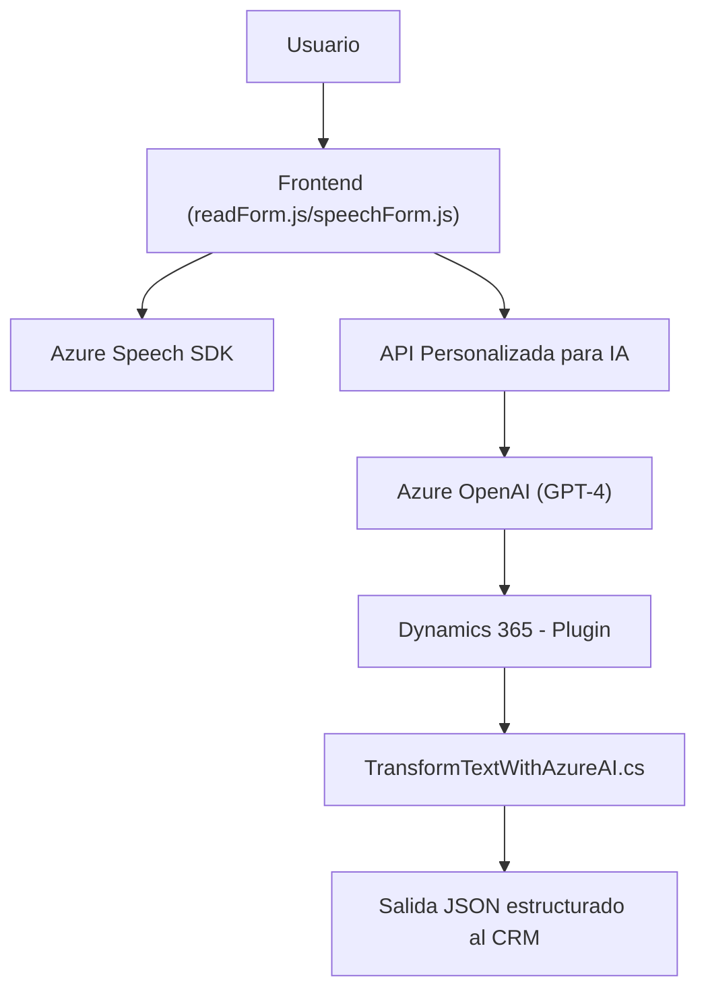

**Breve resumen técnico:**

El repositorio contiene varios archivos que implementan funcionalidades relacionadas con la interacción usuario-sistema mediante voz y texto. Utiliza servicios externos como **Azure Speech SDK** y **Azure OpenAI Service** (GPT-4), y permuta entre escritura y verbalización de datos de formularios en una aplicación web conectada a Dynamics 365. Adicionalmente, define un plugin para Dynamics CRM que interactúa con Azure OpenAI para transformar texto en un formato estructurado (JSON).

---

### **Descripción de la arquitectura:**

1. **Tipo de solución:**  
   Este es un sistema de **aplicación híbrida basada en formularios** que combina partes de **frontend web** con capacidades avanzadas de procesamiento cognitivo (reconocimiento de voz y texto mediante servicios de Azure Speech y OpenAI). Incluye interacción directa con un **CRM (Dynamics 365)**.

2. **Arquitectura**:  
   La arquitectura del sistema es principalmente **n-capas** con una interacción **modular**. Está distribuida en:
   - **Frontend**: Gestiona la lógica del reconocimiento, síntesis de voz y preprocesamiento de datos contextuales mediante **Azure Speech SDK**.
   - **Backend CRM (Plugins)**: Extiende operaciones en Dynamics 365 mediante plugins que interactúan con el **Azure OpenAI Service** para transformación avanzada de datos.
   - **Integración externa**: Uso de **Azure Speech SDK** para reconocimiento/síntesis de voz y **Azure OpenAI** para inteligencia cognitiva. La comunicación entre las capas ocurre mediante APIs.

---

### **Tecnologías usadas:**
- **Frontend:**
  - **JavaScript** para la gestión de formularios, voz y reconocimiento.
  - **Azure Speech SDK** como dependencia externa para servicios relacionados con voz.
  - **API personalizada** integrada para procesar texto contextualizado basado en reglas o IA.

- **Backend:**
  - **Plug-ins de Dynamics 365 CRM** desarrollados en **C#** con integración personalizada.
  - **Azure OpenAI Services (GPT)** para transformación de texto a JSON estructurado.
  - **Newtonsoft.Json** y **System.Text.Json** para manejo avanzado de JSON.

- **Patrones/Conceptos:**
  - **Modularización**: Separación por responsabilidades (frontend funciones de síntesis/reconocimiento, backend transformación y lógica externa).
  - **Single Responsibility Principle (SRP)**: En el diseño de funciones/métodos modulares.
  - **Integración orientada a servicios**: Uso de servicios externos para ampliar capacidades cognitivas (voz e IA).

---

### **Diagrama Mermaid:**

---

### **Conclusión final:**
Este sistema representa una solución híbrida moderna enfocada en aplicaciones web conectadas a CRM (Dynamics 365), que busca optimizar la experiencia del usuario mediante tecnologías avanzadas como **síntesis/reconocimiento de voz** y **procesamiento de lenguaje natural (IA)**. Está claramente dividido entre sus componentes de frontend y backend, manteniendo una arquitectura **modular y extensible**, y haciendo uso de servicios externos (Azure Speech, Azure OpenAI).