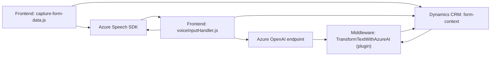

### Breve resumen técnico
La solución presentada implementa una integración modular entre una interfaz de usuario basada en frontend, un servicio de input de voz/audio asociado a Dynamics CRM, y un plugin .NET que extiende la funcionalidad del backend para interactuar con Azure OpenAI y Azure Speech SDK. Está diseñada con elementos de servicios externos y adaptabilidad a contexto CRM.

---

### Descripción de arquitectura
La solución tiene una arquitectura **orientada a servicios en capas**, con separación clara de responsabilidades:
1. **Frontend**: Encargado de capturar y procesar datos visuales y auditivos (Azure Speech SDK).
2. **Middle Layer (Plugins)**: Dinamiza y extiende el modelo de Dynamics CRM mediante plugins personalizados para transformar información textual (Azure OpenAI).
3. **Backend/Servicios externos**: Delegación de procesamiento a servicios dedicados de Azure, integrados en puntos clave como la síntesis y la inteligencia artificial.

Patrones utilizados:
- **Carga dinámica de SDK** y APIs externas.
- **Separación de capas funcionales**: Ejemplo: procesamiento de audio y mapeo de datos en frontend, transformación IA en el plugin.
- **Modularidad**: Cada funcionalidad encapsulada en funciones específicas.
- **Integración de servicios externos**: Uso de Azure OpenAI y Azure Speech SDK.

---

### Tecnologías usadas
1. **Frontend**: 
   - Lenguaje: JavaScript.
   - SDK: Azure Speech SDK.
   - Principios orientados a modularidad y servicios.
2. **Middleware (Plugins/Backend)**:
   - Framework: Dynamics CRM extensiones .NET.
   - Lenguaje: C#.
   - Integración con Azure OpenAI.
   - HTTP Client APIs para comunicación externa.
   - Serialización JSON con `System.Text.Json` o `Newtonsoft.Json`.

---

### Diagrama Mermaid

---

### Conclusión final
La solución tiene una arquitectura orientada a capas que combina microinteracciones con servicios externos y extensiones específicas de Dynamics CRM. Está diseñada para ofrecer procesamiento ágil de datos en frontend y capacidades avanzadas a través de Azure Speech SDK y Azure OpenAI en el backend. La implementación modular mejora la separación de responsabilidades y facilita futuras extensiones.