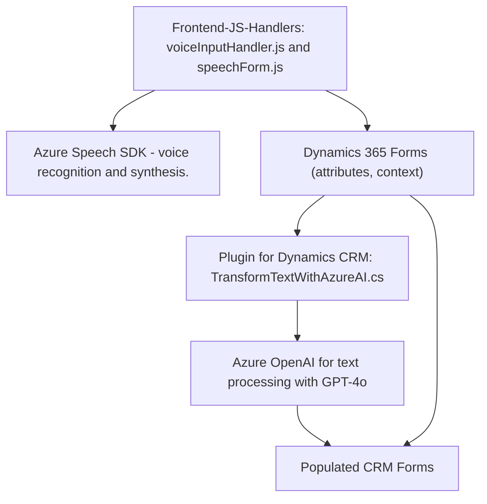

### Resumen Técnico

Este repositorio contiene componentes para un sistema empresarial basado en una aplicación CRM configurada sobre Microsoft Dynamics 365. La solución implementa funcionalidad avanzada de entrada, procesamiento y síntesis de voz utilizando el Azure Speech SDK y Azure OpenAI API. Destaca por su integración con servicios externos y la interacción personalizada con formularios de datos en Dynamics 365.

---

### Descripción de la Arquitectura

La arquitectura del sistema es **Modular con integración a través de servicios externos**. Estas son las características principales del diseño:
- **Frontend:** Compuesto por JavaScript y archivos manipuladores para gestionar la interfaz en formularios del cliente. Incluye lógica para la entrada y salida de datos a través de texto y voz. Utiliza un método basado en eventos y asincronía.
- **Plugin Backend:** Funciona como una extensión de Dynamics CRM, implementando un plugin en .NET Framework que actúa como middleware entre el CRM y servicios de Azure OpenAI.
- **Externa:** Uso extensivo de APIs de Azure (Speech SDK y Azure OpenAI) para habilitar la síntesis de voz y procesamiento inteligente de texto en tiempo real.

Este diseño está orientado a una arquitectura **modular dependiente del CRM**, con componentes que adaptan lógica específica para los formularios de Dynamics. Se integran servicios externos con flujos asincrónicos y transformación basada en inteligencia artificial.

---

### Tecnologías y Frameworks Usados

1. **Frontend:** 
   - **JavaScript:** Implementación de lógica para captura, síntesis y manejo de datos en formularios.
   - **Azure Speech SDK:** para síntesis de texto a voz y reconocimiento de voz.

2. **Backend/Plugin:** 
   - **Microsoft Dynamics CRM SDK:** para gestión de eventos de plugin y contexto del CRM.
   - **System.Net.Http:** para realizar llamadas HTTP al servicio externo (Azure OpenAI).
   - **JSON Libraries:** 
     - `Newtonsoft.Json.Linq` para manejo avanzado de JSON.
     - `System.Text.Json` para serialización y deserialización.

3. **Servicios Externos:** 
   - **Azure OpenAI API:** Transformación de texto con inteligencia artificial (GPT-4o).
   - **Azure Speech SDK:** Síntesis y reconocimiento de voz en múltiples idiomas.

---

### Dependencias o Componentes Externos

1. **Azure Speech SDK**:
   - Permite traducción de texto a voz y viceversa.
   - Uso en la capa frontend para síntesis y reconocimiento de voz.

2. **Azure OpenAI API**:
   - Procesamiento avanzado de texto basado en IA (GPT-4).
   - Estrecha integración en el plugin del CRM.

3. **Dynamics 365 Context (FormContext):**
   - Los archivos frontend interactúan directamente con el contexto del formulario generado por Dynamics, incluyendo la gestión de atributos y datos de las entidades.

4. **Dynamics CRM SDK**:
   - Utilizado en el plugin para captar eventos del sistema y permitir integración con servicios externos.

---

### Diagrama **Mermaid**

---

### Conclusión Final

El análisis del repositorio sugiere que la solución es un **integration-oriented CRM enhancement system** que utiliza servicios externos de voz y procesamiento de lenguaje con inteligencia artificial (Azure Speech SDK y OpenAI) para integrarse en formularios de datos de Dynamics 365. La arquitectura del sistema es modular y utiliza características del contexto CRM para extender su funcionalidad a través de un plugin y archivos frontend.

Si bien el sistema aprovecha las capacidades asincrónicas y de servicios externos, es una arquitectura **n-dimensional**, y aunque tiene modularidad, aún depende de Dynamics CRM como núcleo. Es recomendable prestar atención a la seguridad en el manejo de conexiones y claves API, dado que varios momentos del flujo interactúan con servicios externos críticos.