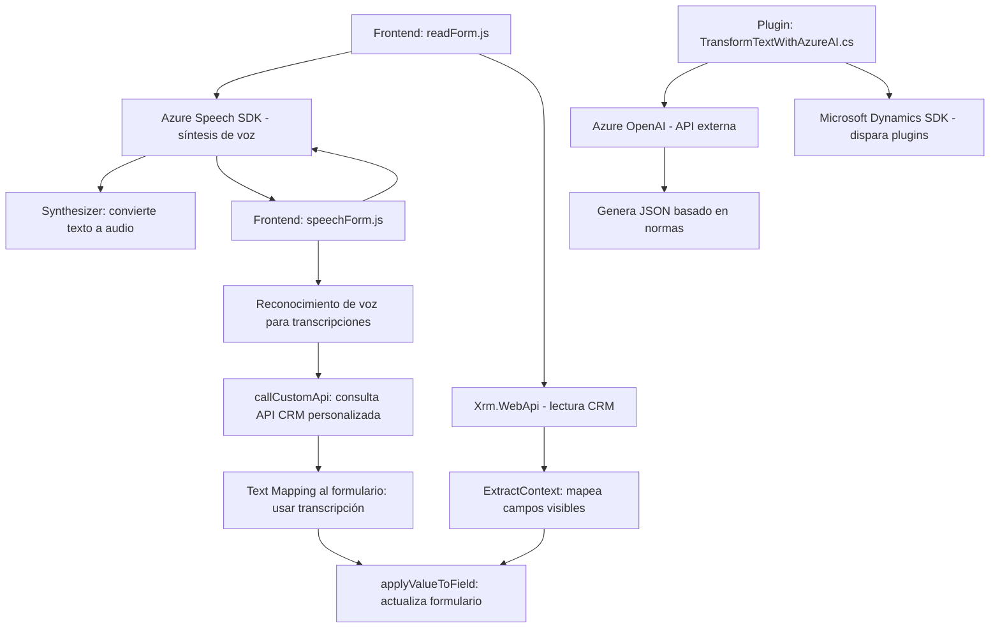

### Breve resumen técnico
El repositorio parece contener componentes de una solución híbrida que integra un **frontend para aplicaciones web** (en una arquitectura de CRM) y un **backend plug-in** para Dynamics CRM utilizando tecnologías de Azure en ambas capas. Los módulos principales trabajan con entrada/salida de voz y procesamiento de texto a través de servicios cognitivos, como el **Azure Speech SDK** y **Azure OpenAI**.

### Descripción de arquitectura
La solución presenta una **arquitectura cliente-servidor orientada a eventos**:  
- **Frontend:** Módulos JS trabajan en el navegador/CRM del cliente, con el propósito de interactuar con formularios y procesar entrada de voz. Los diversos métodos delegan tareas específicas como reconocer voz, mapear datos y consumir APIs externas.  
- **Backend:** El componente C# extiende Dynamics CRM mediante una implementación del interfaz `IPlugin`, que actúa como disparador para transformar y estructurar texto en JSON, delegando la lógica avanzada a Azure OpenAI.

La arquitectura general combina elementos de un **patrón de n capas**:
1. **Capa de presentación:** Archivos JavaScript (`readForm.js`, `speechForm.js`) y manipulación DOM.  
2. **Capa lógica:** SDK de Azure para procesamiento de voz y API personalizada para transformar o consultar datos.  
3. **Capa de servicios:** Llamadas HTTP a Azure (Speech y OpenAI) en frontend y backend.  
4. **Capa de datos:** Dynamics CRM organiza y gestiona elementos persistentes como entidades, atributos y valores.

### Tecnologías usadas
1. **Frontend:**  
   - **JavaScript:** Base para manipulación de DOM y lógica del cliente.  
   - **Azure Speech SDK:** Reconocimiento de voz y síntesis desde texto.  
   - **Xrm.WebApi:** Acceso a APIs personalizadas en Dynamics CRM.  
   - **Dynamics CRM UI:** Manipulación de formularios y datos.  

2. **Backend:**  
   - **C#:** Desarrollo del plugin `TransformTextWithAzureAI`.  
   - **Microsoft Dynamics CRM SDK:** Framework para manipulación directamente en CRM.  
   - **Azure OpenAI API:** Procesamiento avanzado de lenguaje natural.  
   - **Newtonsoft.Json, System.Text.Json:** Serialización/deserialización de texto en formato JSON.  

3. **En ambos:**  
   - **HTTP APIs:** Para comunicación con Azure Speech y OpenAI.

### Dependencias o componentes externos
1. **Azure Speech SDK:** Procesamiento de voz.
2. **Azure OpenAI API:** Procesamiento y transformación avanzada de texto.
3. **Xrm.WebApi**: Interacción con CRM.
4. **Newtonsoft.Json y Amazon.Json:** Gestión JSON en backend.
5. **Dinamismo de dependencias:** Frontend carga SDK mediante `ensureSpeechSDKLoaded` para optimizar tiempos y evitar conflictos.

### Diagrama Mermaid (100% válido para GitHub Markdown)

### Conclusión final
El proyecto ofrece una integración sólida entre tecnologías frontales (Azure Speech SDK, manipulación de formularios) y las capacidades de un backend basado en Dynamics CRM mediante plug-ins y servicios cognitivos de Azure. Su enfoque modular asegura un diseño escalable y reusable, aunque podría beneficiarse de configuraciones mejor abstraídas en ciertos puntos, como la dinámica de normas en el plugin o un servicio central para APIs en el frontend.