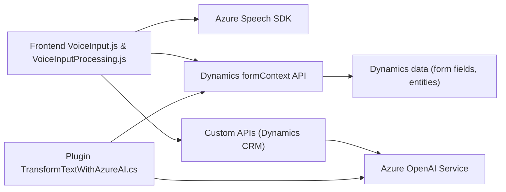

## Breve resumen técnico
El repositorio contiene dos componentes principales:
1. **Frontend/JS**: Scripts en JavaScript que gestionan entrada por voz, síntesis de texto y su vinculación con formularios de Dynamics CRM a través del SDK de Azure Speech y consumo de APIs.
2. **Plugins/TransformTextWithAzureAI.cs**: Un plugin de backend para Dynamics CRM que utiliza Azure OpenAI para transformar texto según reglas predefinidas.

## Descripción de la arquitectura
El repositorio plantea una arquitectura **híbrida** basada en las siguientes características:
- **Multicapa**, con separación entre el frontend (procesamiento de voz y actualización de formularios) y el backend (ejecución de lógica avanzada dentro de Dynamics CRM).
- **Integración con servicios cloud**, utilizando el SDK de Azure Speech en el frontend y el servicio Azure OpenAI en el backend.
- **Desacoplamiento modular**, con funciones y clases dedicadas a tareas específicas (procesamiento de voz en frontend, transformación de texto en backend).

## Tecnologías usadas
1. **Frontend**:
   - Lenguaje: JavaScript.
   - Servicio cloud: Azure Speech SDK.
   - Framework: Dynamics CRM/Power Platform (para manipulación de formularios y datos).

2. **Backend**:
   - Lenguaje: C#.
   - Framework: .NET Framework (Microsoft.Xrm.Sdk).
   - Servicio cloud: Azure OpenAI.
   - Librerías adicionales: Newtonsoft.Json.Linq y System.Text.Json para manejo de JSON.

## Dependencias y componentes externos
1. **Azure Speech SDK**: Comunicación con Azure para síntesis y reconocimiento de voz.
2. **Azure OpenAI API**: Transformación de texto mediante IA avanzada.
3. **Dynamics CRM/Power Platform**: Modelo de datos y contexto de formularios.
4. **Otras utilidades nativas/library**:
   - HTTP requests (`System.Net.Http`) para llamadas REST.
   - Operaciones con JSON (`Newtonsoft.Json.Linq` y `System.Text.Json`).
   - Manipulación DOM en scripts frontend.

## Diagrama Mermaid válido para GitHub

## Conclusión final
El repositorio está diseñado para ofrecer funcionalidades de entrada por voz y transformación de texto en un entorno de Dynamics CRM. Utiliza una arquitectura multicapa con integración de servicios externos (Azure Speech SDK y Azure OpenAI). Presenta una buena estructuración y modularidad, pero debe prestar atención a la seguridad, como externalizar las claves y configuraciones sensibles hacia un almacenamiento protegido. Además, su dependencia de servicios y elementos de Dynamics CRM sugiere que esta solución está destinada a empresas o aplicaciones basadas en la plataforma Microsoft.