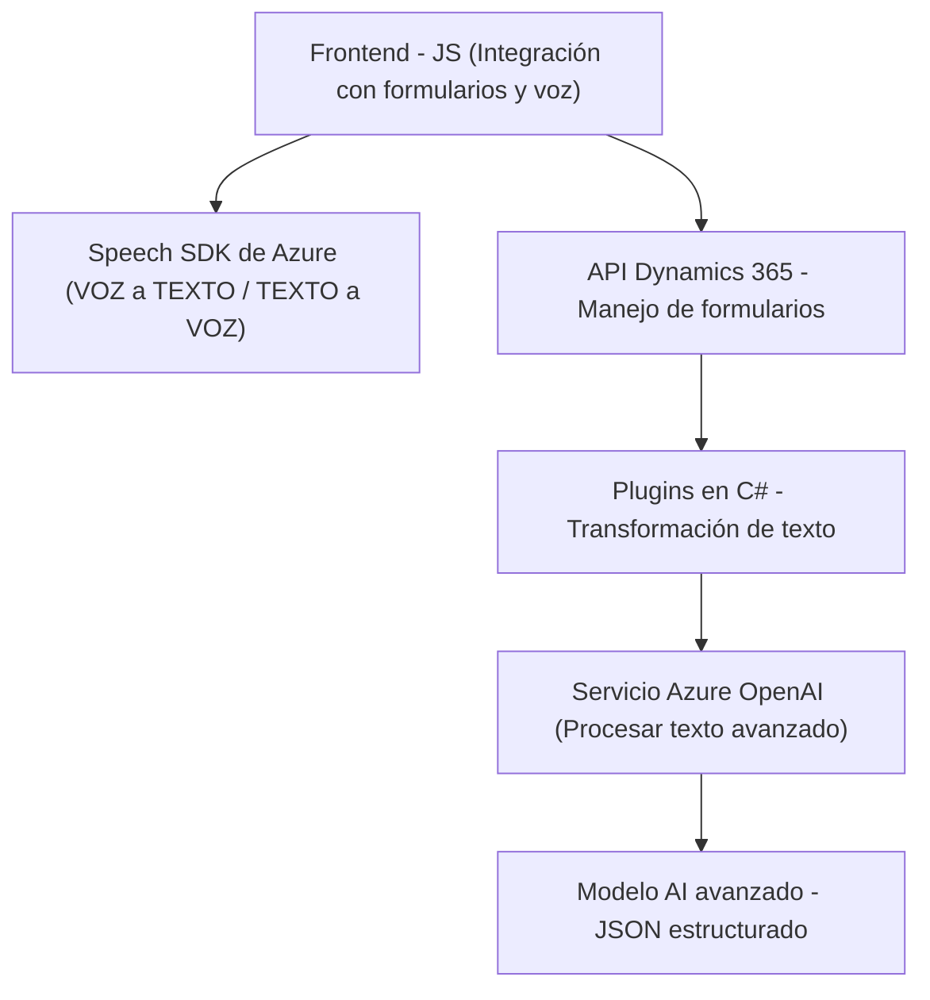

### Breve resumen técnico
El código aportado representa una solución basada principalmente en la integración entre Microsoft Dynamics 365 y servicios de Azure (Azure Speech SDK y Azure OpenAI). Está diseñada para facilitar la interacción de usuarios con un sistema CRM mediante voz (lectura de formularios y reconocimiento de voz) y para realizar transformaciones avanzadas de texto con IA. Este sistema busca mejorar la experiencia de usuario mediante accesibilidad, integración de servicios cloud y procesamiento de lenguaje natural usando AI.

---

### Descripción de arquitectura
La solución tiene las siguientes características arquitectónicas:
1. **Tipo de solución:** Integra varias capas:
   - *Frontend:* Scripts JavaScript utilizados para interactuar con formularios (lectura y asignación de valores).
   - *Backend:* Plugin en C# que extiende la funcionalidad de Microsoft Dynamics CRM, aprovechando Azure OpenAI para procesar texto avanzado.
   - *Cloud Integration:* Dependencia directa de Azure Speech SDK y Azure OpenAI.
2. **Arquitectura:** 
   - **Basada en capas:**
     - Frontend: Procesa datos de usuario desde el formulario y funciones de reconocimiento/lectura por voz.
     - Backend: Ejecuta transformaciones avanzadas de texto a través de plugins dedicados.
     - Integración con Servicios Cloud: Comunica dinámicamente con APIs externas como Azure Speech y Azure OpenAI.

   - **Desacoplada:** Los módulos (frontend y plugin) tienen responsabilidades distribuidas, y dependen de servicios externos para lógica específica. Además, el patrón usado sigue principios de *hexagonal*:
     - *Ports and Adapters:* El plugin actúa como una capa de entrada y salida que conecta API externas con la lógica funcional del CRM.
     
---

### Tecnologías usadas
1. **Frontend:**
   - *JavaScript*: Lenguaje principal para la interacción con los formularios.
   - *Azure Speech SDK:* Reconocimiento y síntesis de voz.
   - *Microsoft Dynamics 365 API*: Un API CRM que permite modificar registros dinámicamente en los sistemas de CRM.
2. **Backend:**
   - *C# y Microsoft Dynamics SDK*: Para implementar el plugin extendiendo la funcionalidad del CRM.
   - *Azure OpenAI*: Lógica avanzada para procesar texto basado en inteligencia artificial.
   - *JSON:* Manipulación eficiente del formato estructurado.
3. **Patrones arquitectónicos y diseño:**
   - *Carga diferida (Lazy Loading)*: SDK de Azure Speech se carga dinámicamente cuando se necesita.
   - *Facade:* Centralización de lógicas complejas en funciones específicas.
   - *Hexagonal Architecture Port and Adapter*: Plugin hace de interfaz entre Dynamics CRM y la solución AI de Azure.
   - *Single Responsibility Principle:* Parcelización de acciones dentro de funciones o métodos dedicados.

---

### Diagrama Mermaid válido para GitHub

---

### Conclusión final
La solución representa una integración bien estructurada entre un sistema CRM avanzado como Microsoft Dynamics 365 y servicios cloud de Azure (Speech SDK y OpenAI). Su diseño busca facilitar la interacción por voz con formularios en el contexto de CRM y el procesamiento avanzado de texto mediante modelos de AI. En términos generales:
- La arquitectura de capas (Frontend, Backend y Cloud Integration) asegura escalabilidad y desacople para futuras extensiones.
- Los patrones empleados y dependencias externas robustas (Azure) hacen de esta solución un caso de uso eficiente para accesibilidad y optimización de procesos empresariales mediante IA.
