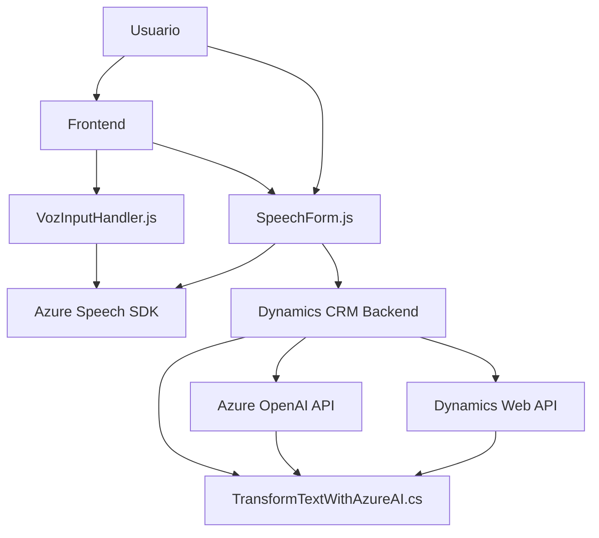

### Breve resumen técnico:

Analizando los archivos proporcionados y su contexto, la solución parece orientada hacia una integración de **Microsoft Dynamics 365** con servicios de **Azure Speech SDK** y **Azure OpenAI API**. Los archivos gestionan tanto entradas de voz/texto en el frontend como procesamiento avanzado mediante un plugin backend en Dynamics CRM.

---

### Descripción de Arquitectura:
La solución emplea una arquitectura **modular en capas**.
- **Frontend:** Se encarga de capturar y procesar entradas (voz y datos de formularios visibles) vía funciones organizadas y dependencias dinámicas.
- **Backend:** Plugins en Dynamics CRM extienden la funcionalidad transformando datos mediante servicios externos como Azure OpenAI. Las interacciones se basan en un modelo de entrada/salida donde la lógica de negocio se separa claramente del procesamiento específico (OpenAI, Speech SDK).
- **Dependencias externas:** Azure Speech SDK para síntesis de voz en el cliente y Azure OpenAI API para procesamiento de texto avanzado en el servidor.

---

### **Tecnologías usadas:**
1. **Frontend**:
   - **Lenguajes:** JavaScript
   - **Frameworks/Centros tecnológicos:** Dynamics 365 UI
   - **SDK:** Microsoft Azure Speech SDK
   - **Patrones tecnológicos:** Modularidad, carga dinámica de dependencias.

2. **Backend**:
   - **Lenguajes:** C#
   - **SDK:** Microsoft Dynamics CRM SDK
   - **Integraciones:** Azure OpenAI API (AI/ML), HttpClient para comunicación HTTP.
   - **Patrones arquitectónicos:** Plugin extensible (Dynamics CRM), cliente HTTP para integrar el servicio externo de procesamiento de texto.

---

### Diagrama Mermaid válido para GitHub:
A continuación, se presenta el diagrama que captura la conexión entre los componentes principales:

---

### Conclusión final:
Este repositorio representa una solución híbrida que integra frontend y backend para gestionar datos provenientes de formularios y voz, utilizando capacidades avanzadas como síntesis de voz y procesamiento de texto impulsado por IA. La solución muestra una arquitectura **modular en capas** donde el frontend interactúa con SDKs dinámicamente, mientras el backend utiliza extensiones en Dynamics CRM con conectividad hacia Azure OpenAI. Las tecnologías empleadas permiten un flujo completo de datos desde captura hasta procesamiento utilizando servicios de integración en la nube.